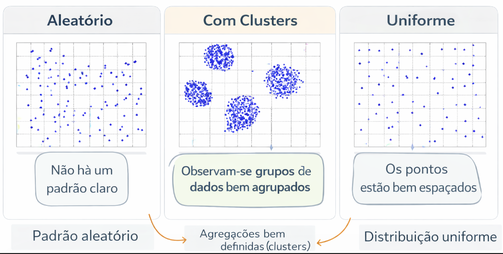
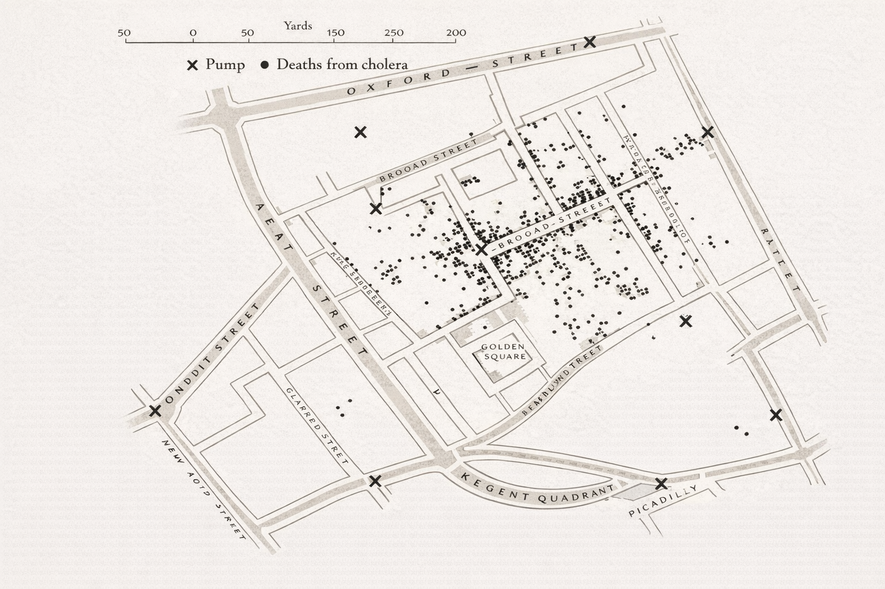

# Introdução à Estatística Espacial

::: {.callout-tip}
## Objetivos do Capítulo
Ao final deste capítulo, o estudante deverá ser capaz de:

- Compreender o conceito de análise estatística espacial e sua importância;
- Conhecer a origem histórica da disciplina;
- Identificar as principais ferramentas computacionais disponíveis;
- Instalar e carregar as bibliotecas R necessárias para o curso.
:::

# Introdução à Estatística Espacial 

## O que é Análise Estatística Espacial ?

- São métodos estatísticos que levam em consideração a localização espacial do fenômeno estudado;

- Segundo Bailey & Gatrell (1995), *"A análise estatística espacial é aplicada quando os dados possuem localização geográfica e quando o arranjo espacial desses dados é considerado relevante para a análise e interpretação dos resultados."*

- A primeira questão a ser considerada é: os dados seguem um padrão aleatório ou indicam a presença de agregações bem definidas (*clusters*) ?

```{r echo=FALSE, fig.align="center", out.width="80%", fig.cap="<span style='font-size:9px'>Fonte: Elaboração própria com auxílio do ChatGPT (OpenAI, 2026).</span>"}

```

## Origem da Estatística Espacial

O uso de dados espaciais na saúde teve um marco histórico com John Snow, que em 1854 mapeou um surto de cólera em Londres, desafiando a teoria miasmática* ao identificar a contaminação da água como causa da doença. Ao mapear as mortes por cólera no Soho, John Snow identificou um foco ao redor da bomba de água da Broad Street, apoiando sua hipótese de transmissão hídrica.

<span style="font-size: 10px;">
*"Miasmática" refere-se à teoria que defendia que as doenças eram causadas por vapores ou odores nocivos (miasmas) provenientes de matéria orgânica em decomposição, particularmente em áreas úmidas ou com má higiene.
</span>


```{r echo=FALSE, fig.align="center", out.width="80%", fig.cap="<span style='font-size:9px'>Fonte: Elaboração própria com auxílio do ChatGPT (OpenAI, 2026).</span>"}

```
<span style="font-size: 13px;">
- Mapeamento dos casos de coléra ($\bullet$) e as bombas de água (X) em Londres, 1854.
</span>

- Dr. John Snow (1813-1858) $\rightarrow$ Considerado pai da Epidemiologia Moderna

```{r echo=F, fig.align="center", out.width= "40%", fig.show='hold'}
knitr::include_graphics('figuras/snow_2019.png')
```
\

A imagem mostra homenagens a John Snow em Soho, Londres: um retrato na fachada de um pub, a réplica da bomba de água da Broad Street, e uma placa que marca a descoberta de que a cólera era transmitida pela água contaminada em 1854.

## Objetivos da Estatística Espacial

1) Investigar padrões espaciais e espaço-temporais, por meio de técnicas como a Análise Exploratória de Dados Espaciais (AEDE) e medidas de correlação espacial, visando identificar estruturas, agrupamentos e dependências nos dados geográficos.

2) Modelar fenômenos espaciais utilizando modelos estatísticos apropriados, como regressões espaciais (ex: SAR, CAR, GWR) e modelos espaço-temporais, que permitem controlar efeitos de vizinhança (dependência espacial) e heterogeneidade geográfica, com o objetivo de explicar e/ou prever fenômenos influenciados pela localização geográfico.

## Dependência Espacial ou Autocorrelação Espacial

- Segundo Cressie (1991), embora a suposição de independência entre observações torne a teoria estatística mais tratável, modelos que incorporam *dependência estatística* costumam ser mais realistas, especialmente em contextos espaciais. Nesse tipo de dado, a *dependência entre observações ocorre em múltiplas direções* e tende a diminuir conforme aumenta a distância entre os locais amostrados. Em outras palavras, valores próximos no espaço tendem a ser mais semelhantes entre si do que valores distantes, o que caracteriza a autocorrelação espacial.

- *"Todas as coisas se parecem, porém coisas mais próximas tendem a ser mais semelhantes do que aquelas mais distantes."*  (Tobler, 1979). <span style="color:red; font-weight:bold;"> **Também conhecida como $1^a$ Lei da Geografia**</span>

# 🛠️ Algumas Ferramentas para Estatística Espacial
  
## SiG QGIS
  
```{r echo=F, fig.align="center", out.width="80%"}
knitr::include_graphics('figuras/QGIS.png')
```
  
[QGIS: Um Sistema de Informação Geográfica livre e aberto](https://www.qgis.org/pt_BR/site/)
  
## GEODA
  
```{r echo=F, fig.align="center", out.width="80%"}
knitr::include_graphics('figuras/GEODA.png')
```
  
[GEODA: AN INTRODUCTION TO SPATIAL DATA ANALYSIS](https://spatial.uchicago.edu/geoda)
  
  
## R
  
```{r echo=FALSE, fig.align="center", out.width="80%", fig.cap="<span style='font-size:9px'>Fonte: Elaboração própria com auxílio do modelo de IA Gemini (GOOGLE, 2026).</span>"}
knitr::include_graphics('figuras/logo_ubuntu.png')
```
  
Fonte: [Dicas para integração e instalação do R 4.2 no Ubuntu 22.04 LTS e os pacotes espaciais](https://rtask.thinkr.fr/installation-of-r-4-2-on-ubuntu-22-04-lts-and-tips-for-spatial-packages/)
  
  
## Python
  
```{r echo=F, fig.align="center", out.width="60%"}
knitr::include_graphics('figuras/geopandas.png')
```
  
Fonte: [Github Geopandas](https://geopandas.org/en/stable/)
  
  
# 📚 Bibliotecas R utilizadas no curso

### 📦 Manipulação e Leitura de Dados
| Biblioteca     | Funcionalidade                                                              |
  |----------------|------------------------------------------------------------------------------|
  | `dplyr`        | Manipulação eficiente de dados (filtrar, agrupar, resumir, etc.)             |
  | `readr`        | Leitura rápida de arquivos `.csv`, `.tsv`, etc.                              |
  | `tidyverse`    | Conjunto de pacotes para ciência de dados (inclui `ggplot2`, `dplyr`, etc.)  |
  
---
  
### 📊 Visualização Gráfica (Gráficos, Mapas e Paletas)
  
  | Biblioteca       | Funcionalidade                                                                 |
  |------------------|---------------------------------------------------------------------------------|
  | `ggplot2`        | Sistema gráfico baseado em camadas para criação de gráficos sofisticados        |
  | `tmap`           | Criação de mapas temáticos estáticos e interativos                              |
  | `leaflet`        | Geração de mapas interativos baseados em JavaScript                             |
  | `leaflet.extras2`| 	Extensões avançadas para leaflet, mini mapas e outros widgets                             |
  | `leafem`         | Funcionalidades adicionais ao leaflet, como coordenadas do mouse, zoom por camada etc.                             |
  | `ggspatial`      | Adiciona elementos cartográficos ao `ggplot2` (ex: escalas, bússolas)           |
  | `vioplot`        | Geração de gráficos do tipo violin plot                                         |
  | `RColorBrewer`   | Paletas de cores predefinidas para mapas e gráficos                             |
  | `colorspace`     | Manipulação e criação de paletas de cores                                       |
  
  
---
  
  
### 🌍 Dados Espaciais e Geoprocessamento
  | Biblioteca     | Funcionalidade                                                                  |
  |----------------|----------------------------------------------------------------------------------|
  | `sf`           | Manipulação de dados espaciais com o padrão Simple Features                     |
  | `sp`           | Estrutura clássica para dados espaciais (anterior ao `sf`)                       |
  | `geobr`        | Importa mapas do Brasil (IBGE, municípios, estados, etc.)                        |
  | `maptools`     | Leitura e manipulação de dados espaciais vetoriais                              |
  | `raster`       | Leitura e análise de dados geográficos em formato raster                         |
  | `lattice`      | Sistema gráfico útil para visualização multivariada com suporte espacial         |
  
  ---
  
### 📈 Estatística Espacial e Modelagem
  | Biblioteca     | Funcionalidade                                                                         |
  |----------------|-----------------------------------------------------------------------------------------|
  | `spatstat`     | Análise de padrões de pontos no espaço bidimensional                                   |
  | `spdep`        | Cálculo de dependência e autocorrelação espacial (ex: Moran, Geary)                     |
  | `spatialreg`   | Modelagem de regressão espacial (ex: SAR, SEM, SDM)                                     |
  | `spgwr`        | Regressão ponderada geograficamente (GWR)                                               |
  | `gstat`        | Geoestatística e krigagem                                                               |
  | `automap`      | Krigagem automatizada com ajuste automático de variogramas     


<!-- 🌐 **Site oficial do pacote `queimadasR`**  -->
<!--   👉 [Acessar documentação](https://wtassinari.github.io/queimadasR/) -->


