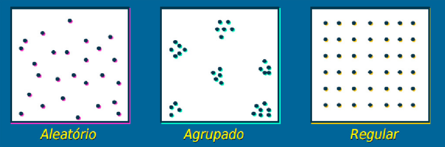
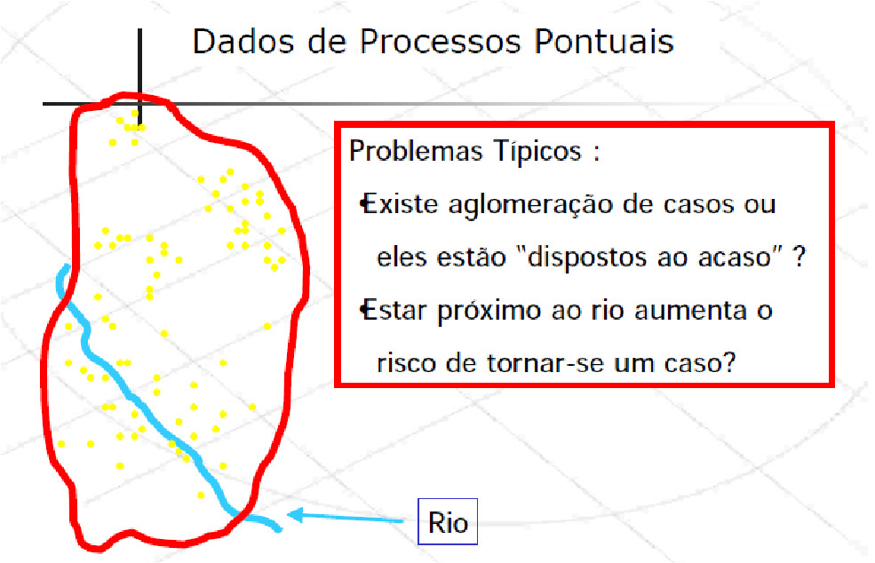
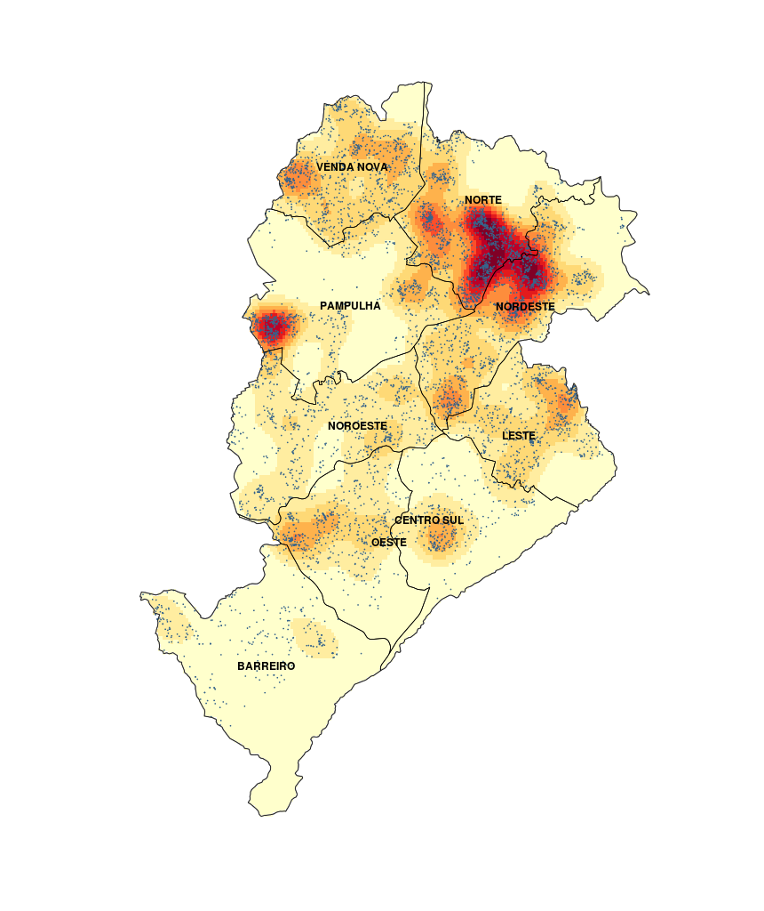
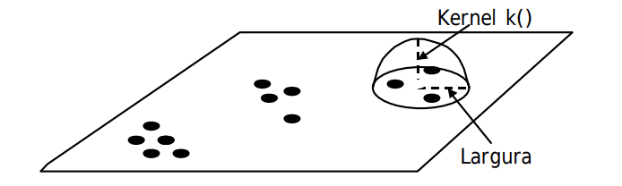
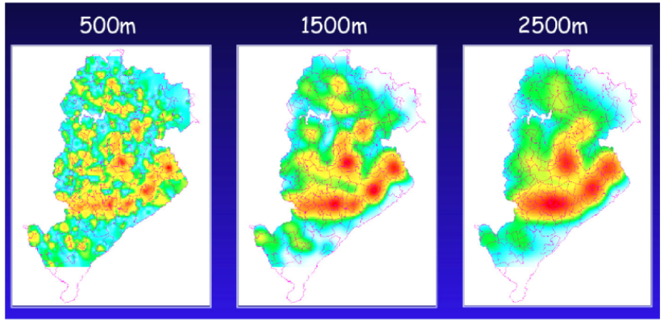

# Dados de Padrões Pontuais

::: {.callout-tip}
## Objetivos do Capítulo
Ao final deste capítulo, o estudante deverá ser capaz de:

- Compreender a estrutura dos dados de padrões pontuais;
- Testar hipóteses sobre a aleatoriedade espacial completa (CSR);
- Aplicar estimativas de densidade de Kernel (mapas de calor);
- Realizar análises de padrões pontuais com dados reais.
:::

::: {.callout-note}
## Slides do Capítulo
[Clique aqui para acessar a apresentação em Slides](apresentacoes/03-padroes_pontuais_slides.html){target="_blank"}
:::

Os dados de padrões pontuais referem-se a eventos que ocorrem em localizações discretas e aleatórias no espaço, como casos de doenças, crimes, acidentes ou ocorrências ambientais. O objetivo principal é investigar se esses eventos seguem um padrão aleatório, regular ou agrupado (*clustered*).

#### Possíveis distribuições dos pontos
  
```{r echo=F, fig.align="center", out.width= "80%", fig.show='hold'}

```
  
#### Investigando os padrões pontuais
  
  
```{r echo=F, fig.align="center", message=FALSE, warning=FALSE, comments=NA, out.width="80%", comment=NA}

```

## Definição dos Processos Pontuais

i) **Processo de primeira ordem:** Considerados globais ou de larga escala, que correspondem a variações no valor médio do processo no espaço.  Tal processo pode ser representado por mensurações da intensidade baseado na densidade dos pontos (média dos eventos) na área de estudo (ex: Estimativa de Kernel).

ii) **Processo de segunda ordem:** Denominados locais ou de pequena escala, é o processo representado pela interação entre dois pontos arbitrários. O objetivo desse processo é a mensuração da dependência espacial baseado na distância entre os pontos (ex: Vizinhos mais próximos, Função K).

## Processo de primeira ordem

### Estimativas de Kernel (ou Mapas de Calor)
  
As estimativas de densidade kernel são uma técnica amplamente utilizada para **representar visualmente a concentração espacial de eventos pontuais**, como casos de doenças, crimes ou ocorrências de focos de calor. Essa abordagem transforma um conjunto de pontos em uma superfície contínua de intensidade, evidenciando áreas com maior ou menor densidade (nesse caso a frequencia) de eventos.
  
```{r echo=FALSE, fig.align="center", out.width="60%", fig.cap="Localização da ocorrência de casos de dengue em Belo Horizonte/MG"}
  
```
  
A técnica foi aplicada para identificar áreas de maior risco de dengue em Belo Horizonte/MG. O mapa resultante revela zonas de alta concentração de casos, o que pode subsidiar ações de controle vetorial e políticas públicas de saúde mais direcionadas.
  
O objetivo principal é estimar a função de intensidade espacial $\hat{\lambda}_{\tau}(u)$, que descreve a probabilidade de ocorrência de eventos em diferentes locais da região de estudo.
  
  
```{r echo=F, fig.align="center", out.width= "45%", fig.show='hold'}

```
  
* Estimador de intensidade de distribuição de pontos: 
    
$$\hat{\lambda}_{\tau}(u) = \dfrac{1}{\tau^2}\sum k(\dfrac{d(u_i , u)}{\tau}) \text{   ,   } d(u_i , u) \leq \tau$$
 
::: box-dica11

Sabendo que:
    
- $\hat{\lambda}_{\tau}(u)$: estimativa da intensidade do processo pontual no ponto $u$.
  
- $u_i$: coordenadas dos pontos observados no plano (ex.: localização dos eventos).
  
- $\tau$: parâmetro de suavização (largura de banda), define o raio de influência dos pontos ao redor de $u$.
  
- $d(u_i, u)$: distância entre o ponto observado $u_i$ e o ponto de avaliação $u$. Normalmente, a distância euclidiana.
  
- Condição $d(u_i, u) \leq \tau$: garante que apenas os pontos dentro da vizinhança (de raio $\tau$) contribuam para a estimativa.
  
- $k(\cdot)$: função kernel que define o peso atribuído a cada ponto com base na distância. Exemplos:
:::

i) **Kernel gaussiano**: atribui maior peso aos pontos mais próximos.
ii) **Kernel uniforme**: todos os pontos dentro do raio recebem o mesmo peso.
iii) **Kernel Epanechnikov**: pesos decrescem com a distância, chegando a zero na borda.


#### Como funciona:

- Para cada ponto no espaço, é aplicado um funil de suavização (kernel) que distribui "peso" ao redor do ponto, atribuindo maior peso às áreas próximas e menor peso conforme a distância aumenta.

- Ou seja, esse peso decresce com o aumento da distância a partir do centro, de acordo com uma função $k(\cdot)$, e é controlado por um parâmetro chamado largura de banda ($\tau$).

- O resultado é uma superfície contínua de densidade, onde regiões com cores mais quentes (vermelho, laranja) indicam maior concentração de eventos.

::: box-dica13

🌧️ **Analogia intuitiva:**
  
  O kernel atua como um *limpador de para-brisa*, pesando mais os eventos próximos e menos os eventos muito distantes. A escolha do tamanho do limpador ($\tau$) e do tipo de movimento (forma da função kernel) define o quanto você vê ao redor do ponto onde está focando.
:::
  
#### **Localização da ocorrência de roubo em Belo Horizonte/MG**
  
```{r echo=F, fig.align="center", out.width= "70%", fig.show='hold'}

```

A figura acima mostra como diferentes larguras de banda ($500 m$, $1.500 m$ e $2.500 m$) alteram o grau de suavização:
  
A imagem mostra a distribuição espacial dos casos de dengue em Belo Horizonte (MG) em três larguras de banda ($\tau$) diferentes: 500 m, 1500 m e 2500 m. As cores indicam a intensidade da ocorrência, sendo azul/verde áreas com menor concentração e amarelo/vermelho áreas com maior concentração de casos.

No mapa de 500 metros, observam-se muitos pequenos focos, com maior detalhamento local. Essa escala é útil para ações pontuais e operacionais, mas pode apresentar mais variações muito específicas do território. No de 1500 metros, os padrões tornam-se mais contínuos e estáveis, facilitando a identificação de áreas prioritárias em nível regional. Já no de 2500 metros, aparecem apenas grandes zonas de maior concentração, sendo mais adequado para decisões estratégicas em nível municipal.

O importante é notar que a escala de análise influencia a forma como enxergamos o problema. O fenômeno é o mesmo, mas sua interpretação muda conforme a “lente” utilizada, algo fundamental para o planejamento e a tomada de decisão na gestão pública.


[*Fonte: Referência científica: Druck, S.; Carvalho, M.S.; Câmara, G.; Monteiro, A.V.M. (eds) "Análise Espacial de Dados Geográficos". Brasília, EMBRAPA, 2004](http://www.dpi.inpe.br/gilberto/livro/analise/cap2-eventos.pdf)


## Processo de segunda ordem

### Completa Aletoriedade Espacial (CSR - *Complete Spatial Randomness*)

O princípio da **Completa Aleatoriedade Espacial (CSR – *Complete Spatial Randomness*)** assume que os pontos seguem um processo de Poisson homogêneo na área de estudo. Com base nisso, podemos formular as hipóteses do teste:

- **$H_0$:** Os pontos estão distribuídos aleatoriamente no espaço  
- **$H_1$:** Os pontos não seguem aleatoriedade, podendo apresentar **agregação (clusters)** ou **dispersão (regularidade)**  

O teste `quadrat.test()` avalia essas hipóteses comparando as contagens observadas de pontos em subáreas (quadrantes) com aquelas esperadas sob CSR, por meio da estatística qui-quadrado:

$$ X^2 = \sum_{i=1}^{k}\frac{(O_i - E_i)^2}{E_i} $$

onde $O_i$ é o número observado de pontos no quadrante $i$ e $E_i$ é o número esperado sob aleatoriedade.


#### Vamos simular dados de padrões pontuais para ilustrar os conceitos:

```{r, echo=T, out.width='90%'}
library(splancs)

set.seed(9999)
# Criando uma caixa envoltoria
caixa <- rbind(c(0,0),c(0,1),c(1,1),c(1,0),c(0,0))

# Simulando um processo espacial aletaorio
alea.spp <- csr(caixa,100)

# Processo de poisson clusterizado
clu.spp <- pcp.sim(rho=20,m=10,s2=0.005, region.poly=caixa)
# rho= intensidade do processo de poisson "pai"(gerador)
# m=media 
# s2=variancia 

# Distribuicao regular
uni.spp <- jitter(gridpts(caixa,100),2)
# o comando jitter cria uma flutuacao aleatoria sobre os valores
# o comando gridpts gera uma grade regular
# 2 é o fator de confusao adicionado ao grid regular
```

```{r, echo=T, out.width='90%'}
par(mfrow=c(1, 3))
plot(alea.spp, main="Aleatório")
plot(uni.spp, main="Regular")
plot(clu.spp, main="Agregado")
```

Esses três gráficos mostram padrões clássicos de processos pontuais espaciais: Aleatório (CSR), Regular e Agregado (Clusterizado). O padrão aleatório apresenta pontos distribuídos sem um padrão aparente, o regular mostra uma distribuição mais uniforme, enquanto o agregado evidencia a presença de clusters ou agrupamentos de pontos.


#### Verificando a distribuição dos pontos por quadrantes

```{r, echo=T, out.width='90%'}
# Convertendo para a class ppp
library(spatstat)
alea.ppp <- as.ppp(alea.spp, c(0,1,0,1))
uni.ppp <- as.ppp(uni.spp, c(0,1,0,1))
clu.ppp <- as.ppp(clu.spp, c(0,1,0,1))

# Construindo os quadrantes com as respectivas contagens
aleatorioQ <- quadratcount(alea.ppp, nx = 4, ny = 4)
regularQ <- quadratcount(uni.ppp, nx = 4, ny = 4)
agregadoQ <- quadratcount(clu.ppp, nx = 4, ny = 4)


par(mfrow=c(1, 3))
plot(aleatorioQ, main="Aleatório")
plot(alea.ppp, add = TRUE)

plot(regularQ, main="Regular")
plot(uni.ppp, add = TRUE)

plot(agregadoQ, main="Agregado")
plot(clu.ppp, add = TRUE)
```

Esta figura vai além de uma simples inspeção visual ao apresentar uma quantificação da heterogeneidade espacial por meio da contagem em quadrantes (`quadratcount`).

- **Aleatório:** As contagens variam entre quadrantes, mas sem padrão definido, refletindo apenas flutuações ao acaso.

- **Regular:** As contagens são semelhantes entre os quadrantes, indicando distribuição homogênea e repulsão entre os pontos.

- **Agregado:** As contagens são muito desiguais, com alguns quadrantes concentrando muitos pontos e outros quase vazios, evidenciando clusterização.

#### Testando a Completa Aletoriedade Espacial (CSR - *Complete Spatial Randomness*)

```{r, echo=T, out.width='90%'}
quadrat.test(aleatorioQ)
```

Não rejeitamos $H_0$, o padrão é compatível com completa aleatoriedade espacial (CRS), e as variações observadas entre quadrantes parecem ser explicadas por flutuações ao acaso.

```{r, echo=T, out.width='90%'}
quadrat.test(agregadoQ)
```

Rejeitamos $H_0$, o padrão apresenta forte heterogeneidade espacial, com evidência de **clusterização**, ou seja, podem existir evidências de concentração de pontos em determinadas regiões.

```{r, echo=T, out.width='90%'}
quadrat.test(regularQ)
```

Rejeitamos $H_0$, apesar do valor baixo de $X^2$, o resultado indica que as contagens são **mais homogêneas do que o esperado sob CSR**, podendo caracterizar um padrão **regular**, com evidência de repulsão entre os pontos.

<!-- Em termos intuitivos, o teste verifica o quanto as contagens por quadrantes diferem do esperado:   -->
<!-- - variação “normal” $\rightarrow$ padrão aleatório   -->
<!-- - variação maior  $\rightarrow$ padrão agregado   -->
<!-- - variação menor  $\rightarrow$ padrão regular   -->


### Função K de Ripley (ou apenas função K)

A **função K de Ripley** é uma ferramenta usada para analisar padrões espaciais, considerando não apenas a distribuição geral dos pontos, mas também como eles se comportam em diferentes **distâncias**, ou seja, basicamente essa função mede o número médio de pontos dentro de uma distância \(h\) de um ponto qualquer, ajustado pela intensidade do processo.

Podemos dizer então, que a função K responde basicamente à pergunta "Quantos pontos existem, em média, dentro de um raio $h$ ao redor de um ponto qualquer ?" Mas com um detalhe importante, ela compara isso com o que seria esperado sob aleatoriedade espacial (CSR).


$$ K(h) = \frac{1}{\lambda} \, E[\text{número de pontos a distância } \leq h]$$

::: box-dica12

Sendo:

- $h$ $=$ distância  
- $\lambda$ $=$ intensidade (número médio de pontos por unidade de área)

:::

No caso e aleatoriedade (CSR), os pontos seguem um padrão completamente aleatório:

$$K(h) = \pi h^2$$

Ou seja, o valor esperado é simplesmente a área de um círculo de raio $h$.

Na prática, a função K é estimada a partir dos dados:

$$\hat{K}(h) = \frac{1}{\lambda^2 |R|} \sum_{i \neq j} I(d_{ij} \leq h)$$

::: box-dica12

Sendo:

- $d_{ij}$ $=$ distância entre os pontos $i$ e $j$  
- $I(\cdot)$ $=$ função indicadora (vale 1 se a condição for verdadeira, 0 caso contrário)  
- $|R|$ = área da região de estudo  
:::

::: box-dica13

#### Interpretação

A função K é sempre comparada com o que seria esperado sob **aleatoriedade espacial completa (CSR)**.

-  **Agregação (clusters)**: $K(h) > \pi h^2$ $\rightarrow$ Se houver **mais pontos próximos do que o esperado**  

- **Regularidade (repulsão)**: $K(h) < \pi h^2$ $\rightarrow$ Se houver **menos pontos próximos** 

- **Aleatoriedade (CSR)**: $K(h) \approx \pi h^2$ $\rightarrow$ Se estiver próximo do esperado 

:::

::: box-dica11

Na prática o raciocínio é simples:

1. Escolhe-se um ponto  
2. Desenha-se um círculo de raio $h$ ao redor dele  
3. Conta-se quantos outros pontos caem dentro desse círculo  
4. Repete-se isso para todos os pontos  
5. Calcula-se uma média  
:::

```{r, echo=T, out.width='90%'}
# Função K de Ripley 
# Estimar a função K para cada padrão
K.alea <- Kest(alea.ppp, correction="border")
K.uni <- Kest(uni.ppp, correction="border")
K.clu <- Kest(clu.ppp, correction="border")

# Função teórica para processo aleatório (CSR)
# K(r) = π*r²
K.teor <- function(r) { pi * r^2 }
```

```{r, echo=T, out.width='90%'}
# Plotar as funções K

par(mfrow=c(1, 3), mar=c(5, 5, 3, 1))

# Gráfico 1: Processo Aleatório
plot(K.alea, main="K(r) - Padrão Aleatório", 
     xlim=c(0, 0.35), ylim=c(0, 0.08),
     xlab="Distância (r)", ylab="K(r)")
curve(K.teor, from=0, to=0.35, col="red", lty=2, lwd=2, add=TRUE)
legend("topleft", c("K estimada", "K teórica (CSR)"), 
       col=c("black", "red"), lty=c(1, 2), lwd=2)
grid()

# Gráfico 2: Processo Regular
plot(K.uni, main="K(r) - Padrão Regular", 
     xlim=c(0, 0.35), ylim=c(0, 0.08),
     xlab="Distância (r)", ylab="K(r)")
curve(K.teor, from=0, to=0.35, col="red", lty=2, lwd=2, add=TRUE)
legend("topleft", c("K estimada", "K teórica (CSR)"), 
       col=c("black", "red"), lty=c(1, 2), lwd=2)
grid()

# Gráfico 3: Processo Agregado
plot(K.clu, main="K(r) - Padrão Agregado", 
     xlim=c(0, 0.35), ylim=c(0, 0.08),
     xlab="Distância (r)", ylab="K(r)")
curve(K.teor, from=0, to=0.35, col="red", lty=2, lwd=2, add=TRUE)
legend("topleft", c("K estimada", "K teórica (CSR)"), 
       col=c("black", "red"), lty=c(1, 2), lwd=2)
grid()

```

::: box-dica13

Os gráficos mostram a comparação entre:

- **Linha preta:** $\hat{K}(r)$ (estimada a partir dos dados)  
- **Linha vermelha tracejada:** $K(r) = \pi r^2$ (esperado sob aleatoriedade – CSR)

:::

::: box-dica14

A interpretação é feita comparando essas duas curvas.


- **Padrão Aleatório**: A curva estimada $\hat{K}(r)$ acompanha de perto a curva teórica (CSR). O padrão é compatível com **completa aleatoriedade espacial**.  Não há evidência de interação entre os pontos (nem atração nem repulsão).

- **Padrão Regular**: A curva estimada $\hat{K}(r)$ fica **abaixo** da curva teórica. 
Há **menos pontos próximos do que o esperado** sob aleatoriedade. Isso indica **repulsão entre os pontos**, ou seja, um padrão **regular** (disperso).

- **Padrão Agregado**: A curva estimada $\hat{K}(r)$ fica **acima** da curva teórica. Há **mais pontos próximos do que o esperado**. Isso caracteriza **clusterização (agregação)**, com formação de grupos no espaço.
:::

```{r, echo=T, out.width='90%'}
# Gráfico comparativo
par(mfrow=c(1, 1), mar=c(5, 5, 3, 1))

plot(K.alea$r, K.alea$border, type="l", 
     xlim=c(0, 0.35), ylim=c(0, 0.08),
     xlab="Distância (r)", ylab="K(r)",
     main="Comparação da Função K - Três Padrões",
     col="black", lwd=2)

lines(K.uni$r, K.uni$border, col="green", lwd=2)
lines(K.clu$r, K.clu$border, col="blue", lwd=2)
curve(K.teor, from=0, to=0.35, col="red", lty=2, lwd=2, add=TRUE)

legend("topleft", 
       c("K - Aleatório", "K - Regular", "K - Agregado", "K teórica (CSR)"),
       col=c("black", "green", "blue", "red"), 
       lty=c(1, 1, 1, 2), lwd=2, cex=1)

grid()

```

::: box-dica14

#### Por que usar a função K ?

- Analisa padrões em **múltiplas escalas (vários valores de $h$**  
- Não depende de dividir o espaço em quadrantes  
- Detecta tanto **agregação quanto dispersão**

:::


::: box-dica13  

#### Resumo geral

A função K avalia o número de vizinhos dentro de uma distância $r$:

- $\hat{K}(r) \approx K_{CSR}(r)$ $\rightarrow$ **Aleatório**  
- $\hat{K}(r) < K_{CSR}(r)$ $\rightarrow$ **Regular (repulsão)**  
- $\hat{K}(r) > K_{CSR}(r)$ $\rightarrow$ **Agregado (cluster)** 


- Menos vizinhos → pontos se evitam $\rightarrow$ **regular**  
- Mais vizinhos → pontos se agrupam $\rightarrow$ **agregado**  
- Igual ao esperado $\rightarrow$ **aleatório**
:::

## Aplicação I: Análise dos pontos de ocorrência de focos de queimadas no estado do Rio de Janeiro/Brasil em dezembro de 2025

#### Lendo os dados

```{r, echo=T, out.width='90%'}
library(readxl)
  
# Carregar o arquivo
dados_pontos <- read_excel("dados/queimadas/queimadas_pontos.xlsx")
```
  
```{r, echo=T, out.width='90%'}
library(sf)
pontos_sf <- st_as_sf(dados_pontos, 
                      coords = c("longitude", "latitude"),
                       crs = 4326)

# Converter para UTM Zona 23S
pontos_utm <- st_transform(pontos_sf, crs = 32723)

```

#### Baixando o mapa

```{r, echo=T, out.width='90%', message=FALSE, warning=FALSE, comments=NA}
library(geobr)

# Baixar polígono do RJ (código IBGE = 33)
rj <- read_state(code_state = 33, year = 2020)

# Converter para UTM
rj_utm <- st_transform(rj, crs = 32723)

# Extrair coordenadas do contorno do RJ para usar com lines()
rj_coords <- st_coordinates(rj_utm)[, 1:2]

# 3. EXTRAIR COORDENADAS UTM DOS PONTOS ==================================
coords_utm <- st_coordinates(pontos_utm)

queimadas_coords <- data.frame(
  x = coords_utm[, 1],
  y = coords_utm[, 2]
)
```
  

```{r, echo=T, out.width='90%', message=FALSE, warning=FALSE, comments=NA}
plot(rj_utm, title = "Contorno no estato do Rio de Janeiro")
```

  
```{r, echo=T, out.width='90%'}
# Mapa com focos
library(ggplot2)
ggplot() +
  geom_sf(data = rj_utm, fill = "lightgreen", color = "black") +
  geom_sf(data = pontos_sf, color = "red", size = 1, alpha = 0.7) +
  labs(title = paste("Focos de Queimadas RJ (n =", nrow(pontos_sf), ")"),
       caption = "Fonte: INPE") +
  theme_minimal()
```
#### Investigando os processos de primeira ordem

```{r, echo=T, out.width='90%'}
# Função Kernel
calc_kernel <- function(coords, bandwidth, n = 150) {
  kde2d(
    coords$x,
    coords$y,
    h = bandwidth,
    n = n,
    lims = c(range(coords$x), range(coords$y))
  )
}

# Bandwidths (em metros)
kernel_10km  <- calc_kernel(queimadas_coords, 10000)
kernel_50km <- calc_kernel(queimadas_coords, 50000)
kernel_100km <- calc_kernel(queimadas_coords, 100000)

```

::: box-dica13

- A função `kde2d()` estima a **densidade de pontos em 2D** (mapa de calor).
- **`h` (bandwidth)*  
   Controla o **suavizamento**:
   - pequeno → mais detalhado (mais “rugoso”)  
   - grande → mais suave (mais generalizado)
- **`n`**  
   Define a **resolução da grade**:
   - `n = 25` → baixa resolução  
   - `n = 100+` → mais detalhado  
   ⚠️ Não altera a densidade, só a qualidade visual
:::

```{r, echo=T, out.width='90%'}
# Convertendo a imagem do kernel apra o formato raster
library(terra)
kernel_to_rast <- function(kernel_obj) {
  rast(
    list(
      x = kernel_obj$x,
      y = kernel_obj$y,
      z = kernel_obj$z
    )
  )
}

r_10km  <- kernel_to_rast(kernel_10km)
r_50km <- kernel_to_rast(kernel_50km)
r_100km <- kernel_to_rast(kernel_100km)

# Definir CRS
crs(r_10km)  <- "EPSG:32723"
crs(r_50km) <- "EPSG:32723"
crs(r_100km) <- "EPSG:32723"
```

```{r, echo=T, out.width='90%'}
# Recortando o raster para a área do estado do RJ
rj_vect <- vect(rj_utm)

process_raster <- function(r) {
  r_crop <- crop(r, rj_vect)
  r_mask <- mask(r_crop, rj_vect)
  return(r_mask)
}

r_10km_mask  <- process_raster(r_10km)
r_50km_mask <- process_raster(r_50km)
r_100km_mask <- process_raster(r_100km)
```


```{r}
# Plotando os mapas de calor
plot(r_10km_mask,
     main = "Kernel 10 km",
     col = viridis(50))
lines(rj_vect, lwd = 2)
points(queimadas_coords$x, queimadas_coords$y,
       pch = ".", cex = 0.6)

plot(r_50km_mask,
     main = "Kernel 50 km",
     col = viridis(50))
lines(rj_vect, lwd = 2)
points(queimadas_coords$x, queimadas_coords$y,
       pch = ".", cex = 0.6)

plot(r_100km_mask,
     main = "Kernel 100 km",
     col = viridis(50))
lines(rj_vect, lwd = 2)
points(queimadas_coords$x, queimadas_coords$y,
       pch = ".", cex = 0.6)

```

#### Interpretação dos mapas de Densidade - Kernel 10, 50 e 100 km

- **Kernel 10 km:** Mostra focos de queimadas fragmentados e dispersos por toda a região. Muitos pequenos hotspots isolados (pontos verde-claro) aparecem espalhados, revelando que em escala local existem várias áreas de queimadas pontuais sem um padrão bem definido.

- **Kernel 50 km:** Conforme aumenta-se a largura de banda do kernel para 50 km, a estrutura espacial se torna mais evidente, revelando três principais hotspots de queimadas (regiões com cores mais claras) localizados aproximadamente no centro, leste e sudeste da área de estudo, enquanto as regiões periféricas mostram menor intensidade. 

- **Kernel 100 km:** Com o kernel de 100 km, há uma suavização ainda maior que integra os focos em uma estrutura regional mais ampla, confirmando que a concentração de queimadas não é uniforme, mas apresenta uma tendência de aglomeração em zonas específicas, particularmente na porção oriental e sudeste, enquanto a região oeste e noroeste apresentam menor atividade de queimadas. 

Essa progressão de escalas é fundamental para identificar padrões em diferentes níveis de detalhe: desde focos pontuais até estruturas regionais.


#### Investigando os processos de segunda ordem

```{r, echo=T, out.width='90%'}
# Conversão do formato sf (simple features) para o formato ppp (point pattern process)

library(spatstat.geom)

# Convertendo o polígono do RJ (em sf) em uma janela espacial (owin)
rj_window <- as.owin(rj_utm)

# Extraindo as coordenadas (X, Y em metros)
coords <- st_coordinates(pontos_utm)

# Crindo um objeto tipo processo pontual (ppp) com as coordenadas dos pontos e a janela do RJ
queimadas_ppp <- ppp(
  x = coords_utm[,1],
  y = coords_utm[,2],
  window = rj_window
)

```

```{r}
# Teste chi-quadrado com grid 4x4
chi_test <- quadrat.test(queimadas_ppp, nx = 4, ny = 4)

# Ver resultado
print(chi_test)

# Extrair p-valor
p_valor <- chi_test$p.value
p_valor
```

```{r}
# 4. INTERPRETAR
alpha <- 0.05
if (p_valor < alpha) {
  cat("\n✗ REJEITA H₀ (p < 0.05)\n")
  cat("→ Padrão NÃO é aleatório (CSR)\n")
  cat("→ Há estrutura espacial\n")
} else {
  cat("\n✓ ACEITA H₀ (p ≥ 0.05)\n")
  cat("→ Padrão é aleatório (CSR)\n")
  cat("→ Compatível com Poisson\n")
}

# 5. VISUALIZAR QUADRATS
quad_count <- quadratcount(queimadas_ppp, nx = 4, ny = 4)
plot(quad_count, main = "Contagem por Quadrante")
plot(queimadas_ppp, add = TRUE, pch = 16, cex = 0.5, col = "red")
```


```{r, echo=T, out.width='90%'}
# Calculando envelope da função K com simulações de Monte Carlo
K_env <- envelope(queimadas_ppp, 
                  Kest, 
                  correction = "border", 
                  nsim = 49, 
                  verbose = FALSE)

# Plotando resultado
plot(K_env, legend = FALSE, main = "Função K de Ripley com Envelope de Simulações")

```

O gráfico da Função K de Ripley revela que os focos de queimadas apresentam um forte padrão de aglomeração espacial (clustering) em distâncias menores (até aproximadamente $r = 42.000$ km), uma vez que a linha preta (valores observados) encontra-se significativamente acima do envelope de simulações (área cinza) e da linha teórica de completa aleatoriedade espacial (linha tracejada vermelha). No entanto, a partir dessa distância, observa-se uma queda abrupta na curva observada, que passa a se situar abaixo do envelope de simulações, indicando que, em escalas espaciais maiores (acima de $r = 42.000$ km), os focos de queimadas tendem a um padrão de dispersão ou regularidade.


## Aplicação II: Estudo de John Snow

- Segue algumas aplicações com os dados do pacote `cholera`, que contêm as localizações das mortes por cólera no famoso estudo de John Snow (Londres, 1854).

```{r, echo=T, out.width='90%'}
library(threejs)
# install.packages("cholera")
library(cholera)

#  Mortes por cólera
head(fatalities[,1:3])
```

```{r, echo=T, out.width='90%'}
# Dados das Bombas de Água
head(pumps[,1:4])
```


```{r, echo=T, out.width='90%'}
# Visualizar mapa 
snowMap(add.cases = TRUE, add.pumps = TRUE, case.col = "darkred")

```

```{r, echo=T, out.width='90%'}
# Instalar e carregar pacotes necessários
# install.packages(c("spatstat", "MASS", "sf", "raster"))
library(spatstat)
library(MASS)
library(sf)
library(raster)
library(viridis)

# Carregar dados
data(fatalities)
data(pumps)
data(roads)
```

```{r, echo=T, out.width='90%'}
# Kernel 2D simples
kernel_simple <- kde2d(fatalities$x, fatalities$y, 
                       n = 100,  # Resolução
                       lims = c(range(fatalities$x), 
                                range(fatalities$y)))

# Plotar
par(mfrow = c(1, 2))

# Contorno
contour(kernel_simple, 
        main = "Densidade de Kernel - Contorno",
        xlab = "Coordenada X", 
        ylab = "Coordenada Y",
        col = "darkred",
        lwd = 2)
points(fatalities$x, fatalities$y, pch = ".", col = "red")
points(pumps$x, pumps$y, pch = 4, col = "blue", cex = 1.5, lwd = 2)

# Imagem de calor
image(kernel_simple, 
      main = "Densidade de Kernel - Heatmap",
      col = heat.colors(50))
contour(kernel_simple, add = TRUE, col = "white")
points(pumps$x, pumps$y, pch = 4, col = "blue", cex = 1.5, lwd = 2)
```


```{r, echo=T, out.width='90%'}
#  Comparação de Diferentes Bandwidths
# Criar diferentes kernels
# Calcular cada kernel individualmente
kernel_02 <- kde2d(fatalities$x, fatalities$y, h = 0.2, n = 100,
                   lims = c(range(fatalities$x), range(fatalities$y)))

kernel_05 <- kde2d(fatalities$x, fatalities$y, h = 0.5, n = 100,
                   lims = c(range(fatalities$x), range(fatalities$y)))

kernel_1 <- kde2d(fatalities$x, fatalities$y, h = 1, n = 100,
                  lims = c(range(fatalities$x), range(fatalities$y)))

kernel_2 <- kde2d(fatalities$x, fatalities$y, h = 2, n = 100,
                  lims = c(range(fatalities$x), range(fatalities$y)))


# --- Plot 1: bandwidths 0.2 e 0.5 ---
par(mfrow = c(1, 2))

image(kernel_02, main = "Bandwidth = 0.2", col = terrain.colors(50), xlab = "X", ylab = "Y")
contour(kernel_02, add = TRUE, col = "white", lwd = 0.5)
points(pumps$x, pumps$y, pch = 4, col = "blue", cex = 1.2, lwd = 1.5)
mtext(paste("Mortes:", nrow(fatalities)), side = 3, line = 0.3, cex = 0.8)

image(kernel_05, main = "Bandwidth = 0.5", col = terrain.colors(50), xlab = "X", ylab = "Y")
contour(kernel_05, add = TRUE, col = "white", lwd = 0.5)
points(pumps$x, pumps$y, pch = 4, col = "blue", cex = 1.2, lwd = 1.5)
mtext(paste("Mortes:", nrow(fatalities)), side = 3, line = 0.3, cex = 0.8)


# --- Plot 2: bandwidths 1 e 2 ---
par(mfrow = c(1, 2))

image(kernel_1, main = "Bandwidth = 1", col = terrain.colors(50), xlab = "X", ylab = "Y")
contour(kernel_1, add = TRUE, col = "white", lwd = 0.5)
points(pumps$x, pumps$y, pch = 4, col = "blue", cex = 1.2, lwd = 1.5)
mtext(paste("Mortes:", nrow(fatalities)), side = 3, line = 0.3, cex = 0.8)

image(kernel_2, main = "Bandwidth = 2", col = terrain.colors(50), xlab = "X", ylab = "Y")
contour(kernel_2, add = TRUE, col = "white", lwd = 0.5)
points(pumps$x, pumps$y, pch = 4, col = "blue", cex = 1.2, lwd = 1.5)
mtext(paste("Mortes:", nrow(fatalities)), side = 3, line = 0.3, cex = 0.8)

```


```{r, echo=T, out.width='90%'}
# Kernel 3D 

library(plotly)

# Calcular kernel
kernel_3d <- kde2d(fatalities$x, fatalities$y, n = 50)

# Criar plot 3D
plot_ly() |>
  add_surface(
    x = kernel_3d$x,
    y = kernel_3d$y,
    z = kernel_3d$z,
    colorscale = list(c(0, "white"), c(1, "red")),
    opacity = 0.8,
    name = "Densidade"
  ) |>
  add_markers(
    x = fatalities$x,
    y = fatalities$y,
    z = rep(0, nrow(fatalities)),
    marker = list(size = 3, color = "black", symbol = "circle"),
    name = "Mortes"
  ) |>
  add_markers(
    x = pumps$x,
    y = pumps$y,
    z = rep(0, nrow(pumps)),
    marker = list(size = 8, color = "blue", symbol = "x"),
    name = "Bombas"
  ) |>
  layout(
    title = "DENSIDADE 3D DO SURTO DE CÓLERA",
    scene = list(
      xaxis = list(title = "Coordenada X"),
      yaxis = list(title = "Coordenada Y"),
      zaxis = list(title = "Densidade"),
      camera = list(eye = list(x = 1.5, y = 1.5, z = 1.5))
    ),
    showlegend = TRUE
  )
```


