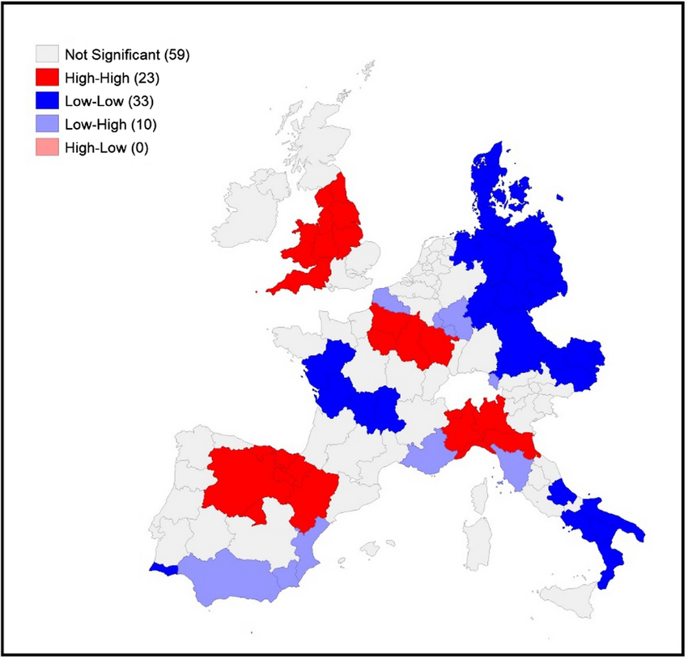
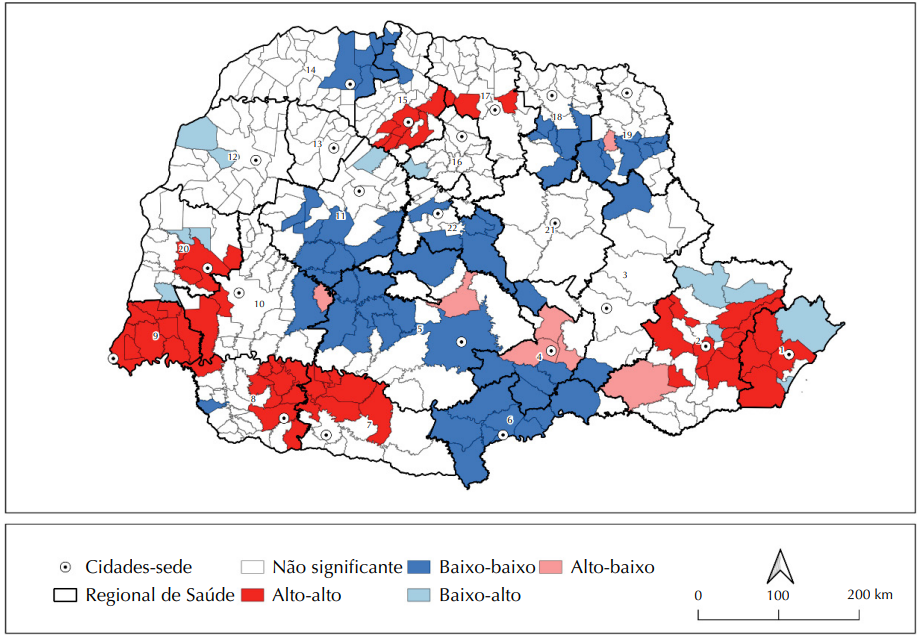
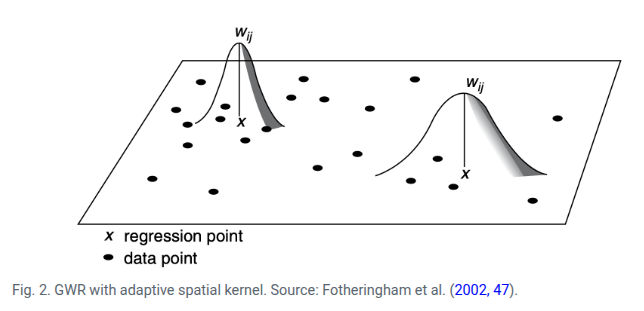

# Dados de Área

::: {.callout-tip}
## Objetivos do Capítulo
Ao final deste capítulo, o estudante deverá ser capaz de:

- Construir e interpretar mapas temáticos (coropléticos);
- Calcular e interpretar medidas de autocorrelação espacial global (I de Moran);
- Aplicar a análise de autocorrelação espacial local (LISA);
- Utilizar o estimador de Bayes Empírico para suavização de taxas;
- Ajustar modelos de regressão espacial (SAR, CAR e GWR).
:::

::: {.callout-note}
## Slides do Capítulo
[Clique aqui para acessar a apresentação em Slides](apresentacoes/04-dados_area_slides.html){target="_blank"}
:::

Os dados de área representam fenômenos agregados por unidades geográficas discretas, como municípios, estados, distritos censitários ou setores epidemiológicos. Neste capítulo, apresentamos as principais técnicas de análise para esse tipo de dado, com aplicações práticas em saúde pública.

## Mapa Temático

### Mapa Temático Mundial da Expectativa de Vida entre os Países

O mapa temático tem como principal objetivo visualizar e analisar a distribuição espacial de um fenômeno específico.

```{r, echo=T, out.width='90%'}
library(tmap)
data(World)
tmap_style("classic")
# Desenhando um rápido mapa temático mundial para esperança de vida.
qtm(World, fill = "life_exp")
```

## Matriz de Vizinhança

A matriz de vizinhança é um instrumento fundamental da Estatística Espacial utilizado para representar formalmente quais áreas são consideradas vizinhas entre si. Em termos simples, ela transforma o mapa em uma estrutura matemática que indica quem é vizinho de quem.

Imagine os municípios de um estado. No mapa, visualmente conseguimos perceber quais compartilham fronteiras. A matriz de vizinhança traduz essa informação em números: se dois municípios são vizinhos, atribuímos valor $1$; se não são, atribuímos $0$. O resultado é uma tabela quadrada $(n \times n)$, onde $n$ é o número de municípios analisados.

```{r echo=F, fig.align="center", out.width="55%"}
knitr::include_graphics('figuras/vizinhanca.png')
```

#### **Exemplo Simplificado de Matriz de Vizinhança**

**Municípios analisados:**  
  Rio de Janeiro, Niterói, São Gonçalo, Duque de Caxias, Nova Iguaçu  

**Critério:** Contiguidade do tipo *Rainha*  
  (considera vizinhos os municípios que compartilham qualquer ponto de fronteira)


|            | Rio | Niterói | S. Gonçalo | D. Caxias | N. Iguaçu |
  |:-----------|:---:|:-------:|:----------:|:---------:|:---------:|
  | **Rio**        |  0  |    1    |     1      |     1     |     1     |
  | **Niterói**    |  1  |    0    |     1      |     0     |     0     |
  | **S. Gonçalo** |  1  |    1    |     0      |     0     |     0     |
  | **D. Caxias**  |  1  |    0    |     0      |     0     |     1     |
  | **N. Iguaçu**  |  1  |    0    |     0      |     1     |     0     |
  

::: box-dica13

Notas:
  
- **1** = municípios são vizinhos (compartilham fronteira)  
- **0** = municípios não são vizinhos  
A **diagonal principal é zero**, pois um município não é vizinho de si mesmo.

:::

Essa matriz é essencial porque muitos fenômenos da gestão pública apresentam dependência espacial. Ou seja, o que acontece em um município pode influenciar municípios vizinhos. Exemplos incluem:
  
- Propagação de doenças (como dengue);
- Dinâmica do desemprego;
- Criminalidade;
- Poluição ambiental;
- Expansão urbana.

Sem a matriz de vizinhança, os métodos estatísticos utilizados tratariam cada município como independente. Com ela, conseguimos incorporar a ideia de que “o território importa”.

Existem diferentes critérios para definir vizinhança, e a escolha do critério depende do problema de pesquisa a ser analisado. Para doenças transmissíveis, por exemplo, a contiguidade territorial pode ser adequada. Já para fluxos econômicos, a distância ou conectividade pode fazer mais sentido. particularmente

::: box-dica14

**Tipos de Matrizes de Vizinhança no R**

 o R (principalmente através do pacote `spdep`) oferece vários tipos de matrizes de vizinhança para análise espacial:

1. Vizinhança por Contiguidade (Adjacência)
   - Rainha (Queen): `poly2nb(polygons, queen=TRUE)` considera vizinhos os municípios que compartilham qualquer ponto de fronteira (lateral ou diagonal).
   - Torre (Rook): `poly2nb(polygons, queen=FALSE)` considera vizinhos apenas os municípios que compartilham uma fronteira lateral.
   
2. Vizinhança por Distância
   - Raio Fixo: `dnearneigh(coords, d1, d2)` define vizinhos como aqueles dentro de uma distância mínima (d1) e máxima (d2).
   - k-Vizinhos Mais Próximos: `knn2nb(knearneigh(coords, k))` define vizinhos como os k mais próximos, independentemente da distância real.

3. Vizinhança por Gráficos Geométricos
   - Delaunay: `tri2nb(coords)` define vizinhos com base na triangulação de Delaunay.
   - Voronoi: `voronoi.nb(coords)` define vizinhos com base nas células de Voronoi.

4. Personalizadas/Customizadas
    - Definir manualmente os vizinhos
    - Combinar diferentes tipos

:::

## Autocorrelação espacial

### **Moran Global**

O Moran Global é uma medida sintética que avalia se existe autocorrelação espacial em todo o território analisado. Em outras palavras, ele indica se municípios vizinhos tendem a apresentar valores semelhantes para determinado indicador, como renda, taxa de mortalidade ou incidência de dengue. Quando o índice é positivo e estatisticamente significativo, significa que áreas próximas apresentam padrões semelhantes (alto com alto, baixo com baixo), revelando a existência de agrupamentos espaciais. Quando é próximo de zero, sugere ausência de padrão espacial. 

O Moran Global é importante porque permite verificar se o fenômeno analisado possui organização territorial, indicando a necessidade de políticas regionais integradas em vez de intervenções isoladas.

$$I = \frac{ \sum_{i=1}^{n} \sum_{j=1}^{n} w_{ij} (y_i - \bar{y})(y_j - \bar{y}) }{ \sum_{i=1}^{n} (y_i - \bar{y})^2 }$$
  
::: box-dica4

* $I > 0$: valores similares estão próximos (agrupamento positivo).

* $I < 0$: valores diferentes estão próximos (dispersão).

* $I \approx 0$: padrão aleatório.

:::
  
Sabendo que:
  
- \( I \): valor do índice de Moran global.
- \( n \): número total de unidades espaciais (regiões).
- \( y_i \): valor da variável de interesse na região \( i \).
- \( \bar{y} \): média dos valores de \( y \) em todas as regiões.
- \( w_{ij} \): elemento da matriz de vizinhança que representa a relação espacial entre as regiões \( i \) e \( j \).
- \( w_{ij} = 1 \) se \( i \) e \( j \) são vizinhos, 0 caso contrário (ou ponderado).
- O numerador mede a covariância espacial ponderada, e o denominador é a variância total de \( y \).


### **Moran Local (LISA)**

O Moran Local, também conhecido como LISA (*Local Indicators of Spatial Association*), aprofunda a análise ao avaliar a autocorrelação espacial em cada unidade territorial individualmente. Diferentemente do Moran Global, que fornece um único valor para todo o estado ou país, o Moran Local identifica onde exatamente estão os agrupamentos espaciais e possíveis áreas atípicas. Ele permite classificar cada município como parte de um cluster de valores altos, um cluster de valores baixos ou como um ponto fora do padrão em relação aos seus vizinhos. Essa análise é fundamental para identificar territórios prioritários e direcionar recursos de forma mais estratégica.

Avalia a autocorrelação espacial **local**, permitindo identificar regiões com agrupamentos (clusters) ou comportamentos atípicos.

$$I^{(i)} = \frac{n}{\sum_{j=1}^{n} (z_j - \bar{z})^2} \sum_{j=1}^{n} w_{ij} (z_i - \bar{z})(z_j - \bar{z})$$
  
Sabendo que:
  
- \( I^{(i)} \): índice de Moran local para a região \( i \).
- \( n \): número total de regiões.
- \( z_i \): valor padronizado (ou original, dependendo da convenção) da variável na região \( i \).
- \( \bar{z} \): média da variável \( z \).
- \( w_{ij} \): peso espacial entre as regiões \( i \) e \( j \).
- A soma considera a influência dos vizinhos \( j \) sobre o ponto \( i \), ponderada pela matriz de vizinhança.


### **LISA Map**

O LISA Map é um mapa temático que representa graficamente os resultados do Índice de Moran Local, ele identifica:
  
- Clustering local (agrupamento de valores semelhantes)

- Outliers espaciais (valores discrepantes em relação aos vizinhos)

- Regiões não significativas (sem padrão espacial detectável)


| Tipo de Associação        | Descrição                                                | Interpretação Espacial                                                |
  | ------------------------- | -------------------------------------------------------- | --------------------------------------------------------------------- |
  | 🔴 **Alto-Alto (High-High)** | Valor alto cercado por vizinhos também com valores altos | Indica **cluster de altas magnitudes**, também chamado de **hotspot** |
  | 🔵 **Baixo-Baixo (Low-Low)** | Valor baixo cercado por vizinhos com valores baixos      | Indica **cluster de baixas magnitudes**, ou **coldspot**              |
  | 🟠 **Alto-Baixo (High-Low)** | Valor alto cercado por valores baixos                    | Indica um **outlier espacial positivo**                               |
  | 🟡 **Baixo-Alto (Low-High)** | Valor baixo cercado por valores altos                    | Indica um **outlier espacial negativo**                               |
  | ⚪ **Não significativo**     | Sem associação espacial relevante                        | O valor na região não apresenta padrão espacial detectável            |
  
  
* Os valores do Moran Local são testados por permutação para verificar se o padrão observado é estatisticamente significativo ou poderia ocorrer por acaso.

* Apenas as regiões significativas (p-valor < 0.05) costumam ser coloridas nos mapas.

Esse mapa abaixo pertence ao artigo ["Are regions equal in adversity? A spatial analysis of the spread and dynamics of COVID-19 in Europe", de Amdaoud, Arcuri e Levratto (2021)](https://www.researchgate.net/publication/349729379_Are_regions_equal_in_adversity_A_spatial_analysis_of_the_spread_and_dynamics_of_COVID-19_in_Europe). O artigo realiza uma análise espacial detalhada da mortalidade por COVID-19 em 125 regiões europeias durante a primeira onda da pandemia (março a maio de 2020). 

```{r echo=F, fig.align="center", out.width="80%"}

```

Utilizando o índice de Moran Local (LISA), o estudo identifica padrões de autocorrelação espacial na mortalidade por COVID-19 entre as regiões europeias durante a primeira onda da pandemia. O resultado evidencia clusters espaciais significativos, com destaque para regiões High-High (altas taxas de mortalidade cercadas por outras com altas taxas), como o norte da Itália, Madrid e a região da Alsácia, na França. Ao mesmo tempo, regiões Low-Low, como o sul da Itália, Dinamarca e partes da Alemanha Oriental, apresentaram baixa mortalidade em vizinhança igualmente baixa. Esses padrões persistentes ao longo do tempo indicam que a disseminação da pandemia seguiu lógicas regionais, reforçando a importância de políticas públicas que considerem as desigualdades territoriais na resposta à crise sanitária.

**Autocorrelação espacial dos casos confirmados de covid-19 em municípios sede de regionais
de saúde e vizinhos, segundo a análise do Índice Local de Moran (LISA) Univariado. Paraná, Brasil,
março de 2020 a janeiro de 2021.**

```{r echo=F, fig.align="center", out.width="90%"}

```

[COVRE, Eduardo Rocha et al. Correlação espacial da covid-19 com leitos de unidades de terapia intensiva no Paraná. Revista de Saúde Pública, v. 56, p. 14, 2022.](https://www.scielo.br/j/rsp/a/NDB7dYnVxgbtWPFskqxMgKR/?lang=pt)

Na figura acima, observamos que o valor do Índice de Moran Global foi de $0,404$, com $p-valor < 0,001$, indicando uma autocorrelação espacial positiva moderada e estatisticamente significativa. Isso significa que a distribuição dos casos não ocorreu de forma aleatória no território paranaense – pelo contrário, municípios com taxas semelhantes de COVID-19 tenderam a se agrupar no espaço.

Observando o mapa LISA (Indicadores Locais de Associação Espacial), podemos identificar diferentes padrões regionais. As áreas em vermelho (Alto-Alto) representam municípios com altas taxas da doença cercados por vizinhos igualmente afetados, formando verdadeiros "clusters de transmissão" que exigiam intervenções coordenadas e prioritárias. Por outro lado, as áreas em azul escuro (Baixo-Baixo) mostram regiões onde tanto o município quanto seus vizinhos mantiveram baixas taxas, sugerindo que estratégias de controle podem ter sido mais eficazes nessas localidades.

As áreas em rosa (Alto-Baixo) e azul claro (Baixo-Alto) revelam situações de transição ou exceção, onde um município destoa do padrão de seus vizinhos. Estes são pontos de atenção para a vigilância em saúde, pois podem indicar locais onde a doença se comporta de forma diferente da região de entorno. Já as áreas em cinza (Não significante) não apresentaram padrão espacial definido, podendo refletir maior heterogeneidade local ou dinâmicas de transmissão mais complexas.

::: box-dica13

🎯 Diferença resumida

* Moran Global → Existe padrão espacial no estado como um todo ?

* Moran Local (LISA) → Onde estão esses padrões ?

* LISA Map → Visualização espacial desses agrupamentos.

:::

::: box-dica2

🗺️ Resumindo

- **Moran Global** indica se há padrão geral de autocorrelação espacial (positivo, negativo ou aleatório).

- **Moran Local** revela **onde** esses padrões ocorrem: clusters de alto/alto (*hotspots*), baixo/baixo (*coldspots*), alto/baixo (*outliers*), etc.

:::


## Aplicação I: Análise exploratória espacial da incidência de dengue no estado do Rio de Janeiro

```{r, echo=T, out.width='90%'}
# ============================================================================
# LER A PLANILHA
# ============================================================================
library(readxl)
library(dplyr)

dengue <- read_excel("dados/dengue/dengue2025.xlsx") |>
    mutate(code_muni  = as.character(code_muni),
           casos  = as.numeric(casos),
           pop2022 = as.numeric(pop2022), 
           incidencia = round(casos / pop2022 * 100000, 1))

head(dengue)
```

#### Lendo o Mapa {.tabset}

##### Baixando via `geobr`

Para acessar os dados dos limites territoriais de todos os estados brasileiros é necessário utilizar a função `read_state`.

```{r, echo=T, out.width='90%', message=FALSE, warning=FALSE, comments=NA}
# ============================================================================
# BAIXAR MALHA MUNICIPAL DO RJ
# ============================================================================
library(geobr)

# Baixar a malha municipal do estado do Rio de Janeiro
# code_muni = 33 (código do estado do RJ)

mapa_rj <- read_municipality(code_muni = 33, year = 2024) |>
        mutate(code_muni = as.character(code_muni))
```

##### Lendo o `arquivo.shp`

Supondo o `shape file` já estar em algum diretório.

```{r, echo=T, eval=FALSE, message=FALSE, warning=FALSE, comments=NA}
library(sf)
mapa_rj <- st_read("malhas/mapa_rj.shp")
```

Renomeando as variáveis para ser semelhante ao objeto proveniente do `geobr`:

```{r, echo=T, eval=FALSE, message=FALSE, warning=FALSE, comments=NA, }

mapa_rj <- mapa_rj %>%
  rename(
    code_muni   = code_mn,
    name_muni = name_mn,
    code_state = cod_stt,
    abbrev_state = abbrv_s,
    name_state   = nam_stt,
    code_region  = cod_rgn,
    name_region  = nam_rgn,
    geom         = geometry
  )
```

#### Primeiro, vamos fazer um gráfico apenas com as geometrias.

```{r, echo=T, out.width='90%'}
library(ggplot2)
# Visualizar rapidamente o mapa
ggplot(mapa_rj) + 
  geom_sf()
```


```{r, echo=T, out.width='90%'}
# ============================================================================
# Left Join mapa_rj + planilha casos dengue
# ============================================================================
mapa_rj <- mapa_rj |>
  mutate(code_muni = as.character(code_muni)) |>
  left_join(dengue, by = "code_muni") |> 
  select(code_muni, municipio, pop2022, casos, incidencia)  
```

```{r, echo=T, out.width='90%'}
# ============================================================================
# Mapa Temático com as incidências de dengue por município de forma contínua
# ============================================================================
library(ggplot2)

ggplot() +
  geom_sf(data = mapa_rj, aes(fill = incidencia), color = "white", size = 0.2) +
  scale_fill_viridis_c(option = "plasma", 
                       name = "Incidência\n(por 100.000 hab)",
                       direction = -1) +  # direction = -1 inverte a escala
  theme_minimal() +
  labs(title = "Incidência de Casos nos Municípios do RJ - 2025",
       subtitle = "Escala Contínua",
       caption = "Fonte: Dados Simulados") +
  theme(legend.position = "right",
        plot.title = element_text(hjust = 0.5, face = "bold"),
        plot.subtitle = element_text(hjust = 0.5),
        axis.text = element_blank(),
        axis.title = element_blank())     
```

```{r, echo=T, out.width='90%'}
# Sumário estatístico da incidência de dengue por município
summary(mapa_rj$incidencia)
```

```{r, echo=T, out.width='90%'}
# ============================================================================
# Mapa Temático com as incidências de dengue por município de forma categórica
# ============================================================================
# Criar categorias usando 5 classes com método quantil
library(viridis)

map_data <- mapa_rj %>%
  mutate(
    incidencia_cat = cut(incidencia,
                         breaks = c(0, 51.7, 723.5, 1791.9, 2375.7, 3779.5, 7458.7, Inf),
                         labels = c("Mín - 51.7", 
                                   "51.7 - 723.5", 
                                   "723.5 - 1791.9", 
                                   "1791.9 - 2375.7", 
                                   "2375.7 - 3779.5", 
                                   "3779.5 - 7458.7",
                                   "> 7458.7"),
                         include.lowest = TRUE,
                         right = FALSE)
  )

ggplot() +
  geom_sf(data = map_data, aes(fill = incidencia_cat), color = "white", size = 0.2) +
  scale_fill_manual(values = viridis(7, option = "plasma", direction = -1),
                    name = "Incidência\n(por 100.000 hab)",
                    na.translate = FALSE) +
  theme_minimal() +
  labs(title = "Incidência de Casos nos Municípios do RJ",
       subtitle = "Classificação por Quantis",
       caption = "Fonte: Dados Simulados") +
  theme(legend.position = "right",
        plot.title = element_text(hjust = 0.5, face = "bold"),
        plot.subtitle = element_text(hjust = 0.5),
        axis.text = element_blank(),
        axis.title = element_blank())  
```


```{r, echo=T, out.width='90%'}
# ============================================================================
# Mapa Temático com as incidências de dengue por município de forma categórica
# ============================================================================
library(classInt)

# Calcular breaks Jenks
jenks_breaks <- classIntervals(mapa_rj$incidencia, n = 7, style = "jenks")$brks

# Criar labels com os intervalos (formato igual ao da imagem, mas com os valores)
jenks_labels <- c(
  paste0(round(jenks_breaks[1], 1), " - ", round(jenks_breaks[2], 1)),
  paste0(round(jenks_breaks[2], 1), " - ", round(jenks_breaks[3], 1)),
  paste0(round(jenks_breaks[3], 1), " - ", round(jenks_breaks[4], 1)),
  paste0(round(jenks_breaks[4], 1), " - ", round(jenks_breaks[5], 1)),
  paste0(round(jenks_breaks[5], 1), " - ", round(jenks_breaks[6], 1)),
  paste0(round(jenks_breaks[6], 1), " - ", round(jenks_breaks[7], 1)),
  paste0("> ", round(jenks_breaks[7], 1))
)

# Criar a variável categórica
mapa <- mapa_rj %>%
  mutate(
    incidencia_cat = cut(incidencia,
                         breaks = jenks_breaks,
                         labels = jenks_labels,
                         include.lowest = TRUE,
                         right = FALSE)
  )

# Plotar o mapa
ggplot() +
  geom_sf(data = mapa, aes(fill = incidencia_cat), color = "white", size = 0.2) +
  scale_fill_manual(values = viridis(7, option = "plasma", direction = -1),
                    name = "Incidência\n(por 100.000 hab)",
                    na.translate = FALSE) +
  theme_minimal() +
  labs(title = "Incidência de Casos nos Municípios do RJ",
       subtitle = "Classificação por Quebras Naturais (Jenks)",
       caption = "Fonte: SINAN") +
  theme(legend.position = "right",
        plot.title = element_text(hjust = 0.5, face = "bold"),
        plot.subtitle = element_text(hjust = 0.5),
        axis.text = element_blank(),
        axis.title = element_blank())
```


```{r, echo=T, out.width='90%'}
# ============================================================================
# MATRIZ DE VIZINHANÇA DOS MUNICÍPIOS DO RIO DE JANEIRO
# ============================================================================

library(spdep)
# ============================================================================
# 1. CRIAR A MATRIZ DE VIZINHANÇA
# ============================================================================

# Converter para objeto sp (formato exigido por alguns pacotes)
# Mas o spdep também aceita sf diretamente
rj_sp <- as(mapa_rj, "Spatial")

# Criar lista de vizinhos baseada em contiguidade (critério "rainha" - queen)
# queen = TRUE considera vizinhos que compartilham qualquer ponto da fronteira
vizinhos_rainha <- poly2nb(mapa_rj, queen = TRUE)

# Criar lista de vizinhos baseada em contiguidade (critério "torre" - rook)
# queen = FALSE considera apenas vizinhos com fronteira lateral
vizinhos_torre <- poly2nb(mapa_rj, queen = FALSE)

# Verificar o resultado
summary(vizinhos_rainha)
summary(vizinhos_torre)

```

| Item do Output                   | O que representa |
  |----------------------------------|------------------|
  | Number of regions               | Número total de unidades territoriais analisadas (ex.: municípios). |
  | Number of nonzero links         | Total de conexões de vizinhança existentes entre as áreas. |
  | Percentage nonzero weights      | Percentual de conexões existentes em relação ao total possível de conexões. |
  | Average number of links         | Número médio de vizinhos por unidade territorial. |
  | Link number distribution        | Distribuição do número de vizinhos entre as áreas analisadas. |
  | Least connected regions         | Unidades territoriais com menor número de vizinhos. |
  | Most connected regions          | Unidades territoriais com maior número de vizinhos. |
  
  
```{r, echo=T, out.width='90%'}
# ============================================================================
# 2. CONVERTER PARA MATRIZ DE VIZINHANÇA (FORMATO TABELA)
# ============================================================================

# Converter lista de vizinhos para matriz binária
matriz_vizinhos_rainha <- nb2mat(vizinhos_rainha, style = "B", zero.policy = TRUE)
matriz_vizinhos_torre <- nb2mat(vizinhos_torre, style = "B", zero.policy = TRUE)

# Visualizar as primeiras linhas e colunas da matriz
print(matriz_vizinhos_rainha[1:10, 1:10])

# Verificar dimensões (deve ser 92x92, pois são 92 municípios)
dim(matriz_vizinhos_rainha)

```

#### Verificando a malha de conectividade da vizinhança da cidade do Rio de Janeiro/RJ

* Iremos precisar da coordenadas dos centróides para montar a malha de conectividade.

```{r, echo=T,  out.width="70%"}
library(sp)
mapa_rj.sp <- as(mapa_rj, 'Spatial') # convertendo em formato sp
coord <- coordinates(mapa_rj.sp) # coordenadas dos centroides dos poligonos do RJ
class(mapa_rj.sp)
```

```{r, echo=T}
viz.sf <- as(nb2lines(vizinhos_rainha, coords = coord), 'sf')
viz.sf <- st_set_crs(viz.sf, st_crs(mapa_rj))
```

::: box-dica2
- `st_set_crs()` define o sistema de referência de coordenadas (CRS) do objeto `viz.sf`.

- Ele está copiando o CRS do objeto `setor.sf`, garantindo que os dois objetos estejam no mesmo sistema de coordenadas.
:::

```{r, echo=T,  out.width="80%"}
# Plotando o grafo de conectividade por contiguidade
mapa.viz <- ggplot(mapa_rj) + 
  geom_sf(fill = 'lightpink', color = 'white') +
  geom_sf(data = viz.sf) +
  theme_minimal() +
  ggtitle("Vizinhança por conectividade (vizinhos_rainha)") +
  ylab("Latitude") +
  xlab("Longitude")
mapa.viz
```

  
#### Autocorrelação espacial dos casos de dengue nos municípios/RJ

```{r, echo=T, out.width='90%'}
pesos.viz <- nb2listw(vizinhos_torre)
moran.test(mapa$casos, pesos.viz)
```

O resultado do teste de Moran’s I indicou autocorrelação espacial positiva estatisticamente significativa $(I = 0,0324; Z = 2,88; p = 0,0019)$. Como o valor observado é superior ao valor esperado $(E[I] = −0,0109)$ e o p-valor é inferior a $0,05$, rejeita-se a hipótese nula de ausência de dependência espacial. Isso sugere que municípios vizinhos tendem a apresentar valores semelhantes da variável analisada, caracterizando um padrão de agrupamento espacial. Contudo, apesar de estatisticamente significativo, o valor do índice é de baixa magnitude, indicando que a intensidade da autocorrelação espacial é relativamente fraca.

#### Autocorrelação espacial para incidências de dengue nos municípios/RJ

```{r, echo=T, out.width='90%'}
moran.test(mapa$incidencia, pesos.viz)
```

O teste de Moran indicou ausência de autocorrelação espacial significativa na incidência analisada $(I = −0,055; p-valor = 0,71)$. Como o valor do índice é próximo de zero e o $p-valor$ é superior a $0,05$, não há evidências para rejeitar a hipótese de aleatoriedade espacial. Assim, os dados não apresentam padrão de agrupamento ou dispersão no espaço, sugerindo que a variação observada não está associada à localização geográfica das áreas estudadas.

#### Mapeando os polígonos que tiveram os p-valores mais significativos no Moran Local para os casos.

```{r, echo=T,  out.width="70%"}
mapa$pval <- localmoran(mapa$casos, pesos.viz)[,5]

library(tmap)

tmap_mode("plot")  # modo estático

tm_shape(mapa) + 
  tm_polygons(
    col = "pval",
    title = "p-valores",
    breaks = c(0, 0.01, 0.05, 0.10, 1),
    style = "fixed",
    palette = "-Red"
  )

```


#### Moran Local dos casos de dengue no Rio de Janeiro/RJ

```{r, echo=T}
resI <- localmoran.sad(lm(mapa$casos ~ 1), 1:length(vizinhos_torre), vizinhos_torre, style = "W")
summary(resI)[1:10,]
```

::: box-dica2 

- A função `localmoran.sad()` calcula o Moran Local `(Iᵢ)` e algumas outras estatísticas associadas para cada polígono (setor).

- `lm(setor.sf$tx ~ 1)`:  cria um modelo linear sem preditores (apenas o intercepto), ou seja, considera a variável `casos` como resposta a ser analisada.

- `1:length(viz)`: identifica o índice de cada área/setor.

- `viz`: é a estrutura de vizinhança (do tipo `nb`), que define quem é vizinho de quem.

- `style = "W"`: define o estilo de normalização dos pesos espaciais (padronização row-standardized).

:::

- A está mostrando:

  * `Local Morans I`:	Valor do I de Moran local `(Iᵢ)`, indicando se o valor do setor e seus vizinhos são semelhantes (positivo) ou diferentes (negativo).
  
  * `Stand. dev. (N)`:	Desvio padrão padronizado da estatística de Moran local.
  
  * `Pr. (N)`:	p-valor do teste de significância para o valor de `Iᵢ` (baseado na dist. normal).
  
  * `Saddlepoint`:	Valor do I de Moran local corrigido.
  
```{r, echo=T,  out.width="70%"}
mapa$MoranLocal <- summary(resI)[,1] 

library(scales)

ggplot(mapa) + 
  geom_sf(aes(fill = MoranLocal), color = 'black') +
  scale_fill_gradientn(colours=c("blue", "white", "red"), 
                       values=rescale(c(min(mapa$MoranLocal), 0,   max(mapa$MoranLocal))), guide="colorbar") + 
  ggtitle("Moran local") + 
  theme_void()
```

Neste mapa, podemos observar:

- Valores altos de Local Morans I com p-valor pequeno indicam clusters estatisticamente significativos:

  * Positivo + significativo $\rightarrow$ cluster alto-alto ou baixo-baixo.

  * Negativo + significativo $\rightarrow$ outlier (ex: um valor alto cercado por baixos, ou o contrário).
  
#### **LISA Map dos casos de dengue na cidade do Rio de Janeiro/RJ**

  
```{r, echo=T}
library(spdep)

#  Convertendo uma estrutura de vizinhança (objeto nb) em uma matriz de pesos espaciais padronizada
w <- nb2listw(vizinhos_torre, style = "W")

# Matriz de pesos espaciais padronizada (row-standardized)
resI <- localmoran(mapa$casos, nb2listw(vizinhos_torre, style = "W"))

# Armazena estatísticas no objeto espacial
mapa$Ii       <- resI[,1]   # valor de Moran Local
mapa$pvalue   <- resI[,5]   # p-valor

# Valor padronizado da variável tx
mapa$z_casos <- scale(mapa$casos)[, 1]

# Média dos vizinhos (lagged value)
lag_casos <- lag.listw(w, mapa$z_casos)

# Classificação dos tipos de associação local dos clusters
mapa$cluster_type <- "Não significativo"

mapa$cluster_type[mapa$pvalue <= 0.05 & mapa$z_casos > 0 & lag_casos > 0] <- "Alto-Alto"
mapa$cluster_type[mapa$pvalue <= 0.05 & mapa$z_casos < 0 & lag_casos < 0] <- "Baixo-Baixo"
mapa$cluster_type[mapa$pvalue <= 0.05 & mapa$z_casos > 0 & lag_casos < 0] <- "Alto-Baixo"
mapa$cluster_type[mapa$pvalue <= 0.05 & mapa$z_casos < 0 & lag_casos > 0] <- "Baixo-Alto"


```
  
```{r, echo=T,  out.width="80%"}
library(tmap)

# Modo estático (ideal para relatórios impressos ou PDF)
tmap_mode("plot")

# Tema visual limpo com fundo branco
tmap_style("white")

# Geração do mapa LISA
tm_shape(mapa) +
  tm_fill(
    col = "cluster_type",
    palette = c(
      "Alto-Alto"         = "#E60000",  # vermelho forte
      "Baixo-Baixo"       = "#0033CC",  # azul escuro
      "Baixo-Alto"        = "#9999FF",  # azul claro
      "Alto-Baixo"        = "#FF9999",  # rosa claro
      "Não significativo" = "#FFFFFF"   # branco
    ),
    title = "Cluster Local (LISA)",
    legend.is.portrait = TRUE
  ) +
  tm_borders(col = "gray40", lwd = 0.4) +
  tm_layout(
    main.title = "Mapa LISA - Clusters Locais dos Casos",
    main.title.size = 1.2,
    legend.outside = TRUE,
    frame = FALSE,
    bg.color = "white"
  )

```

## Modelos de Regressão Espacial

Além das análises exploratórias para os dados espaciais de área, é possível avançar na modelagem estatística dos dados por meio de modelos espaciais que consideram a dependência espacial dos dados. Entre os mais utilizados estão os modelos de autocorrelação espacial global, como o **SAR (Simultaneous Autoregressive Model)** e o **CAR (Conditional Autoregressive Model)** (CRESSIE, 1993). O modelo SAR incorpora a dependência espacial diretamente no valor da variável dependente, assumindo que o valor observado em uma região é influenciado pelos valores das regiões vizinhas. Já o modelo CAR considera essa dependência na estrutura do erro, sendo muito utilizado em abordagens bayesianas para modelagem de risco em áreas geográficas.

Outra abordagem é a dos modelos com efeitos espaciais locais, como a **Regressão Geograficamente Ponderada (GWR)** (FOTHERINGHAM et al., 2002). Diferente dos modelos SAR e CAR, que assumem relações espaciais globais, o GWR permite que os coeficientes da regressão variem ao longo do espaço, ajustando uma equação específica para cada localidade. Isso possibilita identificar como os efeitos de uma variável explicativa sobre a resposta mudam de acordo com a localização, sendo especialmente útil em contextos onde há forte heterogeneidade espacial. 

#### Na prática

* <span style="color:orange; font-weight:bold;"> Hipótese de independência das observações em geral é Falsa </span> $\rightarrow$  Existe dependência espacial, ou seja, o valor observado em uma localização tende a se parecer com os valores observados em locais vizinhos.

* Efeitos Espaciais $\rightarrow$ Se existir dependência ou correlação espacial significativa, devemos incluir no modelo os <span style="color:darkpurple; font-weight:bold;"> Efeitos Espaciais </span>, caso contrário, as estimativas geradas pelo modelo de regressão podem ficar enviesadas, criando associações espúrias (isto é, sugerindo relações estatísticas onde elas não existem de fato, ou mascarando relações reais);

* <span style="color:darkred; font-weight:bold;">**Como verificar ?** </span> $\rightarrow$ Para detectar a dependência espacial, podemos analisar os resíduos da regressão tradicional (OLS), utilizando indicadores como o índice de Moran dos resíduos. Se os resíduos mostrarem autocorrelação espacial significativa, isso indica que há estrutura espacial não modelada.

* <span style="color:darkblue; font-weight:bold;">**Detectada a autocorrelação espacial: e agora ?** </span> $\rightarrow$  É necessário adotar modelos de regressão que incorporem explicitamente os efeitos espaciais, evitando vieses nas estimativas dos coeficientes.


### Modelos Globais: 

* Esses modelos assumem que a estrutura espacial é constante em todo o espaço geográfico. Utilizam um único parâmetro para captar a autocorrelação.

* Um exemplo é o **Modelo de Erro Espacial** (*Spatial Error Model* - **CAR**), representado por:
  
  $$y_i = \beta_0 + \sum^{p}_{k} \beta_k x_{ik}  + \varepsilon_i \text{    , sendo  }  \varepsilon_i = \lambda  W + \xi$$
  
::: box-dica4

Sendo:
  
- $y_i$: valor observado da variável dependente na unidade $i$;

- $\beta_0$: intercepto da regressão;

- $\beta_k$: coeficiente da $k$-ésima variável explicativa;

- $x_{ik}$: valor da $k$-ésima variável explicativa para a unidade $i$;

- $\varepsilon_i$: erro com estrutura de autocorrelação espacial;


- $\lambda$: coeficiente de autocorrelação espacial;

- $W$: matriz de vizinhança espacial (define como cada unidade está conectada às outras);

- $\xi$: erro aleatório normal (sem autocorrelação).
:::
  
$\rightarrow$ Podemos observar que os efeitos da autocorrelação espacial são associados ao termo de erro.

::: box-dica2

🧠 Interpretação:
  
  - Se $\lambda \ne 0$, há evidência de dependência espacial nos erros, ou seja, o erro em uma localidade está correlacionado com os erros em localidades vizinhas.

- Se $\lambda = 0$, o modelo reduz-se a uma regressão tradicional, e não há autocorrelação espacial significativa.
:::
  
  
  
### Modelos Locais: 
  
* Enquanto os modelos globais assumem uma relação espacial uniforme, os modelos locais admitem que os parâmetros da regressão variam ao longo do espaço geográfico.

* Um exemplo clássico é o Modelo **Geograficamente Ponderado** (*Geographically Weighted Regression* - **GWR**), expresso por:
  
  
\[
    y_i = \beta_{0}(u_i, v_i) + \sum_{k=1}^{p} \beta_k(u_i, v_i) \cdot x_{ik} + \varepsilon_i,
    \\
    \quad \text{com } \beta_k(u_i, v_i) \text{ estimado via } 
    \sum_{j=1}^{n} K(d_{ij}) \cdot x_{jk}
    \]

::: box-dica4

Onde:
  
- $(u_i, v_i)$: coordenadas geográficas da observação $i$;

- $\beta_k(u_i, v_i)$: coeficiente local da variável explicativa $x_k$, estimado para a posição $i$;

- $K(d_{ij})$: função kernel que atribui um peso à observação $j$ com base na distância $d_{ij}$ entre as localizações $i$ e $j$;
:::
  
  
**Efeito da vizinhança no GWR**: No GWR, para estimar os coeficientes de regressão em cada local, utiliza-se um "kernel espacial". O objetivo do kernel é dar mais peso para observações próximas e menos peso para as distantes. A forma e o alcance desse kernel são definidos por um parâmetro chamado largura de banda (*bandwidth*).

```{r echo=F, fig.align="center", out.width= "80%", fig.show='hold'}

```

$\rightarrow$ Quanto menor $d_{ij}$, maior é o peso de $j$ na estimação de $\beta_k(u_i, v_i)$.

[Fonte: ARDILLY, Pascal et al. Manuel d’analyse spatiale. 2018.](https://ec.europa.eu/eurostat/documents/3859598/9462709/INSEE-ESTAT-SPATIAL-ANA-18-EN.pdf)


## Aplicação II: Utilizando dos modelos de regressão espaciais nos dados de queimadas no estado do Rio de Janeiro.


#### Lendo os dados de queimadas no estado do Rio de Janeiro em 2025 

```{r, echo=T,  out.width="70%"}
# lendo a base de queimadas
dados <- readxl::read_excel("dados/queimadas/queimadas_area.xlsx")
```

#### Lendo o mapa do Rio de Janeiro e fazendo o merge com os dados de queimadas

```{r, echo=TRUE, out.width="70%", warning=FALSE, message=FALSE}
# lendo o mapa do Rio de Janeiro
library(sf)

# Ler o arquivo
mapa_rj <- st_read("malhas/mapa_rj.shp")
```

```{r, echo=T,  out.width="70%"}
library(dplyr)
# Padronizar os nomes dos municípios em ambos os dataframes
mapa_rj <- mapa_rj %>%
  mutate(name_mn = tolower(name_mn))

dados <- dados %>%
  mutate(name_mn = tolower(name_mn))

# Fazer o left join usando as novas colunas padronizadas
mapa_rj <- mapa_rj %>%
  left_join(dados, by = "name_mn")
```

#### Checando a variável resposta a presença de autocorrelação.

```{r, echo=T,  out.width="70%"}
mapa_seq <- ggplot(mapa_rj) +
  geom_sf(aes(fill = media_frp), color = "black", size = 0.1) +
  scale_fill_gradientn(
    colors = c("#2c7bb6", "#abd9e9", "#ffffbf", "#fdae61", "#d7191c"),
    name = "FRP Médio"
  ) +
  labs(title = "Média do FRP - Personalizado") +
  theme_void()


mapa_seq


```

#### Moran Global do FRP Médio

```{r, echo=T,  out.width="70%"}
moran.test(mapa_rj$media_frp, pesos.viz)
```

#### Ajustando o modelo de regressão linear simples vazio

```{r, echo=T,  out.width="70%"}
queimadas.lm <- lm(media_frp ~ 1, data = mapa_rj)
summary(queimadas.lm)
```

#### Colocando a variável `media_dias_sem_chuva` no modelo

```{r, echo=T,  out.width="70%"}
# Ajustando o modelo de regressão linear simples
queimadas.lm2 <- lm(media_frp ~ media_dias_sem_chuva, data = mapa_rj)
summary(queimadas.lm2)
```

#### Checando os residuos para verificar a presença de autocorrelação.

```{r, echo=T,  out.width="70%"}
library(spdep)
queimadas.lm$lmresid <- residuals(queimadas.lm)
moran.test(queimadas.lm$lmresid, pesos.viz)

```

#### Ajustando o modelo CAR (Spatial Error Model) vazio

O **Modelo de Erro Espacial** (*Spatial Error Model* - **CAR**), representado por:
    
$$y_i = \beta_0 + \sum^{p}_{k} \beta_k x_{ik}  + \varepsilon_i$$
$$\varepsilon_i = \lambda  W + \xi$$

```{r, echo=T,  out.width="70%"}
library(spatialreg)
queimadas.car <- errorsarlm(media_frp ~ 1, data = mapa_rj, listw = pesos.viz, Durbin = FALSE)
summary(queimadas.car)
```

::: box-dica1

* O Intercepto: $3,982$ ($p < 0.001$), representa a média estimada de `media_frp` na ausência de preditores.

* Lambda ($λ =  0,28059$) é o parâmetro de autocorrelação espacial dos erros. Quanto mais próximo de $0$ (zero) for o valor valor de lambda, pouca ou nenhuma autocorrelação espacial nos erros, ou seja, nesse caso podemos observar uma dependência espacial moderada.

* Testes de Significância do Lambda

| Teste | Estatística | p-valor | Interpretação |
|-------|------------|---------|---------------|
| **LR test** | 4.5504 | 0.0329 | O modelo espacial é superior ao OLS |
| **z-value** | 2.1836 | 0.0290 | Lambda significativamente diferente de 0 |
| **Wald** | 4.7681 | 0.0290 | Confirma a significância do parâmetro espacial |


* A variância residual estimada é de $3,8661$.

* O modelo espacial tem AIC menor que o modelo clássico (lm):
AIC spatial $=$  $393,28$ $<$ AIC lm $=$ $395,83$, o que indica que o modelo com erro espacial se ajusta melhor aos dados.

:::

#### Colocando a variável `media_dias_sem_chuva` no modelo

```{r, echo=T,  out.width="70%"}
queimadas.car2 <- errorsarlm(media_frp ~ media_dias_sem_chuva, data = mapa_rj, listw = pesos.viz, Durbin = FALSE)
summary(queimadas.car2)
```

::: box-dica1

* Media de Dias Sem Chuva: $0,1585$ ($p < 0,001$), representa a cada aumento de 1 dia na média sem chuva, a intensidade das queimadas (FRP) aumenta **0.1585 unidades**

* Lambda ($\lambda =  0,24717$), fazendo uma comparação com modelo nulo ($\lambda = 0.28059$), apresenta uma
redução de $0,28059 \rightarrow 0,24717$ $(\downarrow 11.9\%)$. Podemos dizer que a variável `media_dias_sem_chuva` explicou parte da dependência espacial.

* Testes de Significância do Lambda

| Teste | Estatística | p-valor | Interpretação |
|-------|------------|---------|---------------|
| **LR test** | 3.1804 | 0.0745 | Marginalmente não significativo |
| **z-value** | 1.8851 | 0.0594 | Tendência à significância |
| **Wald** | 3.5537 | 0.0594 | Confirma a tendência |

* A variância residual estimada é de $2,96$.

* O modelo espacial com a variável `media_dias_sem_chuva` tem AIC menor que o modelo espacial vazio:
AIC spatial $=$  $370,39$ $<$ AIC vazio $=$ $393,28$, o que indica que o modelo com erro espacial com a variável `media_dias_sem_chuva` se ajusta melhor aos dados.

:::

#### Checando os residuos para verificar a presença de autocorrelação

```{r, echo=T,  out.width="70%"}
queimadas.car2$carresid <- residuals(queimadas.car2)
moran.test(queimadas.car2$carresid, pesos.viz)
```

Como o $p-valor = 0,467 > 0,05$, não rejeitamos a hipótese nula de ausência de autocorrelação espacial nos resíduos. Isso indica que o modelo `errorsarlm` com a variável `media_dias_sem_chuva` eliminou adequadamente a autocorrelação espacial presente nos dados. 

Esse é exatamente o objetivo do modelo `errorsarlm`, capturar a estrutura espacial nos erros. E a ausência de autocorrelação nos resíduos valida a adequação desse modelo para os seus dados.

#### Ajustando o modelo GWR (Geographically Weighted Regression)

- Primeiro vamos extrair as coordenadas dos centróides dos municípios do estado do Rio de Janeiro

```{r, echo=T,  out.width="70%"}

# Método 1: Converter para Spatial explicitamente
mapa_rj_sp <- as(mapa_rj, "Spatial")

# Calcular centróides
centroides <- coordinates(mapa_rj_sp)
colnames(centroides) <- c("X", "Y")
centroides <- as.data.frame(centroides)
```


```{r, echo=T,  out.width="70%"}
# Biblioteca para ajustar o modelos GWR
library(spgwr)

# Estimando a largura de banda “ideal” para o kernel
GWRbanda <- gwr.sel(media_frp ~ media_dias_sem_chuva, data = mapa_rj, coords = cbind(centroides$X, centroides$Y), adapt = T)
```

::: box-dica2

- Carregando o pacote `spgwr`, que é usado para rodar regressões ponderadas geograficamente (GWR). Essa técnica permite que os coeficientes variem no espaço, ou seja, ela mostra como o efeito de uma variável muda de lugar para lugar.

- `gwr.sel()` é uma função que ajuda a escolher a largura de banda (bandwidth) "ideal" para o modelo GWR. A largura de banda controla o raio de influência espacial ao redor de cada ponto (quais vizinhos têm mais peso).

  * Quanto menor a banda $rightarrow$ modelo mais local (mais sensível ao espaço).

  * Quanto maior $rightarrow$ modelo mais global (menos sensível ao espaço).

**OBS:** Esse valor de `q` representa a proporção de vizinhos usada para construir o kernel. Depois, ao ajustar o modelo com a função `gwr()`, será calculada internamente a distância física real correspondente em metros para cada ponto com base nas coordenadas UTM.  
:::


```{r, echo=T,  out.width="70%"}
# Ajustando o modelo GWR
queimadas.gwr = gwr(media_frp ~ media_dias_sem_chuva, data = mapa_rj, coords = cbind(centroides$X, centroides$Y), adapt = GWRbanda, hatmatrix = TRUE, se.fit = TRUE)

queimadas.gwr
```

::: box-dica2

- `coords = cbind(X, Y)`:	Coordenadas dos pontos onde será ajustado o modelo (em nosso caso são os centroides dos setores).

- `adapt = GWRbanda`:	Usando a largura de banda adaptativa "ideal" já estimada (GWRbanda), que define o raio de influência espacial.

- `hatmatrix = TRUE`:	Retorna a matriz com estimativas usadas para cálculos como AIC e diagnóstico de resíduos.

- `se.fit = TRUE`:	Calcula os erros padrão das estimativas locais dos coeficientes.

:::


Esse modelo permite analisar como o efeito da variável `media_dias_sem_chuva` sobre `media_frp` muda de um município para outro no estado do Rio de Janeiro. Em vez de um único coeficiente como na regressão tradicional, o GWR estima um coeficiente diferente para cada município.

::: box-dica1

* `Kernel function: gwr.Gauss` → O modelo usou um kernel gaussiano, que atribui mais peso a vizinhos próximos.

* `Adaptive quantile: 0,07608438` → Como `adapt = TRUE`, a largura de banda representa uma proporção dos pontos vizinhos.

- Quanto aos coeficientes do modelo, cada linha refere-se à distribuição dos coeficientes locais estimados em cada ponto do espaço (284 no total). 

  * Por exemplo, o impacto da variável `media_dias_sem_chuva` sobre `media_frp` varia bastante no espaço, onde os municípios poder ter coeficientes de inclinação podem variar de $0,4216$ até $0.9927$.
  
  * A coluna `Global` mostra o coeficiente que seria obtido numa regressão tradicional (OLS).
  
- `Sigma (residual)`:	Desvio padrão dos resíduos do modelo GWR.

- `AIC (GWR)`: 	Critério de informação de Akaike (quanto menor, melhor). Útil para comparar com OLS.

- `AICc (corrigido)`: Versão do AIC corrigida para modelos com muitos parâmetros.

- `Residual sum of squares`: Soma dos quadrados dos resíduos (menor = melhor ajuste).

- `Quasi-global R²`: Explica $~48%$ da variabilidade de `media_frp`. Excelente ajuste para dados espaciais.

:::

✅  Podemos observar  através do ajuste do modelo que:

* O modelo GWR encontrou variações espaciais significativas na relação entre `media_dias_sem_chuva` e `media_frp`.

* Os coeficientes de lixo mudam no espaço, variando de fortemente negativos a levemente positivos.

* O Quasi-R² de $74\%$ indica que o modelo explica bem os dados.

* A redução do AIC em relação ao modelo OLS (que tinha $AIC ≈ 371,57$) reforça a adequação do GWR ($AIC ≈ 346,07$).


```{r, echo=T,  out.width="70%"}
# Colocando a saída do modelo dentro de um objeto dataframe.
results <- as.data.frame(queimadas.gwr$SDF)
head(results)
```

#### Verificando a distribuição dos coeficientes de regressão para a variável `media_dias_sem_chuva`

```{r, echo=T,  out.width="80%"}
hist(results$media_dias_sem_chuva)
abline(v = median(results$media_dias_sem_chuva), col = "red")
```

#### Verificando a distribuição dos *localR2*

```{r, echo=T,  out.width="80%"}
hist(results$localR2)
abline(v = median(results$localR2), col = "blue")
```

#### Incorporando alguns parâmetros de saída do modelo na tabela *setor.sf*

```{r, echo=T,  out.width="70%"}
mapa_rj$coef_dias_sem_chuva <- results$media_dias_sem_chuva
mapa_rj$localR2 <- results$localR2
mapa_rj$pred.gwr <- results$pred
```

#### Mapa dos coeficientes de regressão para a variável lixo

```{r, echo=T,  out.width="80%"}
map.dias_sem_chuvas <- ggplot(mapa_rj) +
  geom_sf(aes(fill = coef_dias_sem_chuva), color = "black", size = 0.1) +
  scale_fill_gradient2(
    low = "blue",      # para coeficientes negativos
    mid = "white",     # para valores próximos de zero
    high = "darkred",      # para coeficientes positivos
    midpoint = 0,      # centraliza a escala no zero
    name = "Coef. dias sem chuva"
  ) +
  ggtitle("Coef locais da variável dias sem chuva") +
  theme_void()

map.dias_sem_chuvas

```

#### Checando os residuos para verificar a presença de autocorrelação para o modelo GWR.

```{r, echo=T,  out.width="70%"}
# Calculando os resíduos para o modelo GWR
results$residuos <- mapa_rj$media_frp - results$pred

moran.test(results$residuos, pesos.viz)
```

#### Mapeando os coeficientes de regressão para a variável `media_dias_sem_chuva` por significancia através do teste de wald

O teste de Wald é utilizado para avaliar a significância estatística dos coeficientes estimados em modelos de regressão, como a Regressão Ponderada Geograficamente (GWR). A estatística de Wald testa se o coeficiente estimado (\(\hat{\beta}\)) é significativamente diferente de zero, com base no seu erro padrão (\(SE(\hat{\beta})\)).

A fórmula geral do teste é:

\[
W = \frac{|\hat{\beta}|}{SE(\hat{\beta})}
\]

Valores altos da estatística de Wald indicam maior evidência de que o coeficiente é significativamente diferente de zero. Sob a hipótese nula (\(H_0: \beta = 0\)), a estatística de Wald segue uma distribuição normal padrão.

No contexto do modelo GWR, o teste de Wald foi aplicado ponto a ponto para o coeficiente local da variável `media_dias_sem_chuva`, utilizando a razão entre o valor absoluto do coeficiente estimado e seu erro padrão.

Para fins de mapeamento, a estatística foi dicotomizada da seguinte forma:

\[
\texttt{wald.teste} =
\begin{cases}
1 & \text{se } W \geq 2 \ (\text{coeficiente significativo}) \\
0 & \text{se } W < 2 \ (\text{coeficiente não significativo})
\end{cases}
\]

O limiar de $2$ foi escolhido por ser uma aproximação prática do ponto de corte para um nível de significância de 5\% (como \(z = 1.96\) na distribuição normal padrão).

Essa abordagem permite visualizar espacialmente onde a variável `media_dias_sem_chuva` exerce um efeito estatisticamente significativo sobre a variável dependente `media_frp`.

```{r, echo=T,  out.width="100%"}
# Calculando a estatística de wald
mapa_rj$wald.teste <- abs(results$media_dias_sem_chuva/results$media_dias_sem_chuva_se)

# Dicotomizando a estatística de wald
mapa_rj$wald.teste_cat <- factor(ifelse(mapa_rj$wald.teste < 2, 0, 1),
                                  levels = c(0, 1))


map.wald <- ggplot(mapa_rj) + 
            geom_sf(aes(fill = wald.teste_cat), color = "black") + 
            scale_fill_manual(values = c("white", "purple"), 
                              labels = c("< 2", ">= 2"), 
                              name = "Wald",
                              drop = FALSE) +  # Não dropar níveis
            ggtitle("Teste Wald") + 
            theme_void()


library(gridExtra)
grid.arrange(map.dias_sem_chuvas, map.wald, ncol = 2)

```

#### Mapa dos coeficientes de determinação regionalizados ($R^2$ local).

```{r, echo=T,  out.width="90%"}
ggplot(mapa_rj) +
  geom_sf(aes(fill = localR2), color = "black", size = 0.1) +
  scale_fill_viridis_c(option = "viridis",, direction = -1, name = expression(R^2~local)) +
  ggtitle("Mapa dos coeficientes de determinação regionalizados (R² local)") +
  theme_void()

```

#### Verificando a distribuição dos preditos.

```{r, echo=T,  out.width="100%"}
histdens <- function(x, titulo = "") {
  densi <- density(x)
  xli <- range(densi$x)
  yli <- range(densi$y)
  hist(x, col = "orange", probability = T, xlim = xli, ylim = yli, main = titulo)
  lines(densi, lwd = 2)
  abline(v = median(x), lwd = 2, col = "blue", lty = 2)
}

par(mfrow = c(2, 2))

hist.frp <- histdens(mapa_rj$media_frp, "FRP médio")
hist.lm <- histdens(queimadas.lm2$fitted.values, "Pred LM")
hist.car <- histdens(queimadas.car2$fitted.values, "Pred CAR")
hist.gwr <- histdens(results$pred, "Pred GWR")
```

| Modelo       | Adesão à distribuição real       | Interpretação                                                                 |
|--------------|----------------------------------|-------------------------------------------------------------------------------|
| **FRP médio** | —                                | Distribuição observada com assimetria à direita e dispersão moderada, apresentando valores mais concentrados entre ~4 e 6, com presença de cauda. Serve como referência para avaliar os modelos.                         |
| **Pred LM**  | ❌ Fraca                         | MDistribuição excessivamente concentrada em valores baixos, com perda de variabilidade e deslocamento da média em relação aos dados observados. O modelo linear não captura adequadamente a forma da distribuição.    |
| **Pred CAR** | ✅ Razoável                      | CReproduz parcialmente a variabilidade e a amplitude dos valores, aproximando-se da distribuição observada, porém ainda apresenta suavização e leve deslocamento da média, reduzindo a assimetria.                     |
| **Pred GWR** | ✅✅ Melhor                      | PrDistribuição mais próxima da observada, preservando melhor a dispersão, a posição da média e parte da assimetria, sugerindo maior capacidade do modelo em representar a heterogeneidade espacial dos dados.|


Apesar dos modelos analisarem apenas o efeito da variável `media_dias_sem_chuva` sobre a `media_frp`, observa-se que o modelo `GWR` foi o único capaz de gerar uma distribuição de preditos que preserva, em boa parte, a forma assimétrica e a dispersão da variável observada. Isso indica que o impacto de  `media_frp` não é homogêneo e varia conforme a localização. Modelos tradicionais como o `LM`, ao assumirem um coeficiente global, subestimam a variabilidade local, enquanto modelos espaciais (CAR) ou locais (GWR) conseguem representar melhor essa relação dependente do espaço.


#### Mapeando os valores observados e preditos dos modelos ajustados

```{r, echo=T,  out.width="100%"}
library(RColorBrewer)

# Define faixas de classes abrangentes
breaks_classes <- c(-Inf, 0, 2, 4, 10, Inf)
labels_classes <- c("< 0", "0 - 2", "2 - 4", "4 - 10", "> 10")

# -----------------------------------------
# Taxa Bruta Observada
mapa_rj$brks <- cut(mapa_rj$media_frp,
                     breaks = breaks_classes,
                     include.lowest = TRUE,
                     right = TRUE,
                     labels = labels_classes)

tx.bruta <- ggplot(mapa_rj) +
  geom_sf(aes(fill = brks), color = "black", size = 0.1) +
  scale_fill_brewer(palette = "YlOrRd", name = "Taxa") +
  ggtitle("Taxa Bruta") +
  theme_void()

# -----------------------------------------
# Predito - LM
mapa_rj$brks.lm <- cut(queimadas.lm2$fitted.values,
                        breaks = breaks_classes,
                        include.lowest = TRUE,
                        right = TRUE,
                        labels = labels_classes)

pred.lm <- ggplot(mapa_rj) +
  geom_sf(aes(fill = brks.lm), color = "black", size = 0.1) +
  scale_fill_brewer(palette = "YlOrRd", name = "Taxa") +
  ggtitle("Taxa Predita - LM") +
  theme_void()

# -----------------------------------------
# Predito - CAR
mapa_rj$brks.car <- cut(queimadas.car2$fitted.values,
                         breaks = breaks_classes,
                         include.lowest = TRUE,
                         right = TRUE,
                         labels = labels_classes)

pred.car <- ggplot(mapa_rj) +
  geom_sf(aes(fill = brks.car), color = "black", size = 0.1) +
  scale_fill_brewer(palette = "YlOrRd", name = "Taxa") +
  ggtitle("Taxa Predita - CAR") +
  theme_void()

# -----------------------------------------
# Predito - GWR
mapa_rj$brks.gwr <- cut(results$pred,
                         breaks = breaks_classes,
                         include.lowest = TRUE,
                         right = TRUE,
                         labels = labels_classes)

pred.gwr <- ggplot(mapa_rj) +
  geom_sf(aes(fill = brks.gwr), color = "black", size = 0.1) +
  scale_fill_brewer(palette = "YlOrRd", name = "Taxa") +
  ggtitle("Taxa Predita - GWR") +
  theme_void()

# -----------------------------------------
# Mostrar mapas lado a lado
grid.arrange(tx.bruta, pred.lm, pred.car, pred.gwr, ncol = 2)


```

#### Comparando a distribuição dos resíduos dos modelos ajustados

```{r, echo=T,  out.width="90%"}
library(vioplot)

# Define os resíduos
res_lm  <- queimadas.lm2$residuals
res_car <- queimadas.car2$residuals
res_gwr <- results$residuos

# Paleta de cores agradável
cores <- c("#66C2A5", "#FC8D62", "#8DA0CB")  # Paleta Set2 do RColorBrewer

# Gráfico violin com visual melhorado
vioplot(
  res_lm, res_car, res_gwr,
  names = c("LM", "CAR", "GWR"),
  col = cores,
  border = "black",
  drawRect = TRUE     # mediana dos resíduos
)

# Título e rótulo do eixo Y
title(main = "Distribuição dos Resíduos por Modelo", cex.main = 1.2)
mtext("Resíduos", side = 2, line = 2.5, cex = 1.1)

# Linha horizontal em y = 0 para referência
abline(h = 0, lty = 2, col = "grey40")

```

| Modelo | Centralidade dos resíduos | Dispersão | Presença de extremos | Interpretação |
|------|---------------------------|-----------|---------------------|--------------|
| **LM** | Aproximadamente centrados em zero | Moderada a alta | Moderada | Indica ausência de viés sistemático, porém com maior variabilidade dos erros. |
| **CAR** | Próximos de zero | Moderada | Maior presença nas caudas | Sugere melhor acomodação da dependência espacial, mas ainda com ocorrência de resíduos extremos. |
| **GWR** | Centrado em zero | Moderada | Menor concentração de extremos | Distribuição mais equilibrada dos resíduos, indicando melhor ajuste local e captura da heterogeneidade espacial. |


#### Mapeando os resíduos dos modelos ajustados

```{r, echo=T,  out.width="100%"}
library(ggplot2)
library(colorspace)
library(gridExtra)

# Quebras e rótulos
breaks_res <- c(-5, -2, -1, 1, 2, 5)
labels_res <- c("-5 a -2", "-2 a -1", "-1 a 1", "1 a 2", "2 a 5")

# ------------------------------
# Resíduos - LM
mapa_rj$brks.res.lm <- cut(queimadas.lm2$residuals,
                            breaks = breaks_res,
                            labels = labels_res,
                            include.lowest = TRUE,
                            right = TRUE)

res.lm <- ggplot(mapa_rj) +
  geom_sf(aes(fill = brks.res.lm), color = "black", size = 0.1) +
  scale_fill_discrete_sequential(
    palette = "Purple-Yellow",
    name = "Resíduo",
    na.value = "grey75",
    drop = FALSE
  ) +
  guides(fill = guide_legend(reverse = TRUE)) +  # INVERTE A LEGENDA
  ggtitle("Resíduos - LM") +
  theme_void()

# ------------------------------
# Resíduos - CAR
mapa_rj$brks.res.car <- cut(queimadas.car2$residuals,
                             breaks = breaks_res,
                             labels = labels_res,
                             include.lowest = TRUE,
                             right = TRUE)

res.car <- ggplot(mapa_rj) +
  geom_sf(aes(fill = brks.res.car), color = "black", size = 0.1) +
  scale_fill_discrete_sequential(
    palette = "Purple-Yellow",
    name = "Resíduo",
    na.value = "grey75",
    drop = FALSE
  ) +
  guides(fill = guide_legend(reverse = TRUE)) +  # INVERTE A LEGENDA
  ggtitle("Resíduos - CAR") +
  theme_void()

# ------------------------------
# Resíduos - GWR
mapa_rj$brks.res.gwr <- cut(results$residuos,
                             breaks = breaks_res,
                             labels = labels_res,
                             include.lowest = TRUE,
                             right = TRUE)

res.gwr <- ggplot(mapa_rj) +
  geom_sf(aes(fill = brks.res.gwr), color = "black", size = 0.1) +
  scale_fill_discrete_sequential(
    palette = "Purple-Yellow",
    name = "Resíduo",
    na.value = "grey75",
    drop = FALSE
  ) +
  guides(fill = guide_legend(reverse = TRUE)) +  # INVERTE A LEGENDA
  ggtitle("Resíduos - GWR") +
  theme_void()

# ------------------------------
# Exibir mapas
grid.arrange(res.lm, res.car, res.gwr, ncol = 2)

```

## Bayesiano Empírico: Global e Local

A heterogeneidade espacial indica que existem diferenças na intensidade de um determinado fenômeno em algumas sub-regiões em comparação com outras. Em contraste, a homogeneidade espacial sugere que a ocorrência de um fenômeno é semelhante em toda a área de estudo, com variações apenas devido ao acaso. A busca por heterogeneidade é a principal razão para o mapeamento, pois se a ocorrência desse fenômeno fosse a mesma em todos os lugares, um mapa não forneceria muitas informações úteis.

Na epidemiologia, um dos principais desafios da distribuição espacial de doenças é a instabilidade das estimativas de parâmetros devido a dados com excessos de zeros, *missing data* (`NA`) ou eventos raros. Quando uma doença é muito rara (resultando em um numerador pequeno) ou a população em risco é muito esparsa (resultando em um denominador pequeno), a estimativa da carga da doença torna-se inerentemente instável ou imprecisa.

Nesses casos, a adição de apenas um ou dois eventos ou pessoas em risco pode ter um impacto notável na estimativa. Para lidar com esse problema, os pesquisadores frequentemente recorrem à agregação de dados ao longo do tempo ou do espaço, ou utilizam técnicas de suavização espacial, como o método de Bayes Empírico, para compartilhar informações entre áreas e estabilizar as taxas extremas.

Por isso, na epidemiologia, um esforço considerável é dedicado a separar o "ruído" do "sinal" nos dados. O erro aleatório, que surge do acaso e está relacionado ao tamanho da amostra, é frequentemente modelado utilizando distribuições de probabilidade estatística.

::: box-dica13

### A ideia central

Imagine que você quer estimar a taxa de uma doença em vários municípios. O problema: municípios pequenos têm taxas **instáveis** — um único caso pode triplicar a taxa de um ano para o outro. Como resolver isso ?

O **Bayesiano Empírico** "suaviza" a taxa observada de cada área, combinando-a com uma **média de referência**:
:::


Quando lidamos com contagens de eventos e populações em risco agregadas por unidades de área, podemos utilizar distribuições de probabilidade paramétricas comuns na epidemiologia:

* **Distribuição de Poisson**: É a distribuição clássica para avaliar contagens de eventos, frequentemente ajustada pelo tempo em risco ou pessoas-ano. A distribuição de Poisson assume que a média da distribuição é igual à sua variância e aproxima bem a taxa de intensidade da doença para processos de doenças raras.

* **Distribuição Binomial**: É útil para caracterizar a ocorrência de doenças para processos não raros ou comuns.

Essas distribuições modelam as contagens observadas ($Y_i$) como uma função da contagem esperada ($E_i$), da população em risco ($N_i$) e do parâmetro de risco desconhecido ($\theta_i$).

### Razão de Morbidade/Mortalidade Padronizada (SMR)

A Razão de Morbidade/Mortalidade Padronizada (SMR) é uma medida de risco relativo em excesso. Ela quantifica o desvio de uma prevalência ou taxa populacional em relação a um valor de referência (por exemplo, o risco para todo o estado).

A SMR é calculada como a contagem observada de eventos ($Y_i$) dividida pela contagem esperada de eventos ($E_i$):

$$ SMR_i = \frac{Y_i}{E_i} $$

Para calcular as contagens esperadas, primeiro determinamos o risco global para toda a região de estudo ($r$) e, em seguida, multiplicamos esse valor pela população em risco em cada unidade de área ($N_i$). Isso nos dá os eventos esperados se houvesse homogeneidade no risco, ou seja, se a SMR fosse igual a 1,0 para todas as áreas.


$$E_i = r \times N_i$$

::: box-dica12

Sendo:

- **$E_i$** = contagem esperada de eventos na unidade de área $i$
- **$r$** = risco global (taxa de eventos por unidade de população em toda a região de estudo)
- **$N_i$** = população em risco na unidade de área $i$

:::

E para o cálculo do risco global ($r$), temos:

$$r = \frac{\text{Total de eventos observados}}{\text{População total da região}}$$
::: box-dica13

## Interpretação

Dessa forma, se o risco fosse homogêneo em toda a região, a contagem esperada em cada área seria proporcional à sua população. A SMR compara então o observado ($Y_i$) com esse esperado ($E_i$) para identificar áreas com excesso ou déficit de eventos.

:::

## Aplicação Prática

- **SMR** = Razão de Mortalidade Padronizada (ou Razão de Morbidade/Eventos)
- **$Y_i$** = Contagem observada de eventos na área $i$
- **Excesso de eventos**: quando $Y_i > E_i$
- **Déficit de eventos**: quando $Y_i < E_i$
### Bayesiano Empírico Global

A referência é a **média geral de toda a região**. Um município com poucos habitantes é "puxado" para essa média geral.

**Exemplo:** município rural com 1 caso em 200 pessoas (taxa altíssima). O método reconhece que a população é pequena e suaviza a estimativa em direção à média do estado.


### Bayesiano Empírico Local

A referência é a **média dos municípios vizinhos**. A ideia é que municípios próximos tendem a ter condições parecidas (clima, renda, acesso à saúde).

**Exemplo:** o mesmo município rural agora é comparado com seus vizinhos imediatos, não com todo o estado. Isso respeita melhor a heterogeneidade regional.

::: box-dica13

**Global vs. Local: qual é a diferença ?**

A diferença está em **quem é a referência** ($\mu$):

| | **Global** | **Local** |
|---|---|---|
| **Referência** | Média de *todas* as áreas | Média dos *vizinhos* |
| **Hipótese** | Todas as áreas se parecem | Áreas próximas se parecem |
| **Quando usar** | Região homogênea | Quando há padrão espacial |

::: 


## Aplicação III: Utilizando o Estimador de Bayes Empírico

::: {.callout-note}
#### Fonte Original: Este módulo foi adaptado do conteúdo disponível em [**Spatial Epidemiology Workshop**](https://bookdown.org/epeterson_2010/spatial_epidemiology_workshop/), mantendo a estrutura e exemplos originais com ajustes pedagógicos.
:::


#### Exemplo Prático em R: Cálculo da SMR

Abaixo, apresentamos um exemplo de como calcular a SMR utilizando a linguagem R. Neste exemplo simulado, criaremos um conjunto de dados fictício representando condados, suas populações e o número de casos observados de uma doença.

```{r}
#| label: calculo-smr
#| message: false
#| warning: false

# Carregando pacotes necessários
library(dplyr)
library(sf)
library(spdep)
library(SpatialEpi)
library(ggplot2)

# Simulando dados para o exemplo
set.seed(123)
n_counties <- 50
dados_simulados <- data.frame(
  id_condado = 1:n_counties,
  populacao = round(runif(n_counties, 5000, 100000)),
  casos_observados = rpois(n_counties, lambda = 15)
)

# Calculando o risco global (taxa de referência)
risco_global <- sum(dados_simulados$casos_observados) / sum(dados_simulados$populacao)

# Calculando os casos esperados e a SMR
dados_simulados <- dados_simulados %>%
  mutate(
    casos_esperados = populacao * risco_global,
    SMR = casos_observados / casos_esperados
  )

# Visualizando os primeiros registros
head(dados_simulados)
```

#### Suavização de Taxas com Bayes Empírico Global

No contexto da estimativa de pequenas áreas, o objetivo é extrair o sinal ou a tendência espacial subjacente nos dados, eliminando o ruído aleatório induzido por pequenas contagens de eventos e tamanhos populacionais amplamente variáveis.

A estimativa de Bayes Empírico (EB) é uma técnica para produzir estimativas de parâmetros de pequenas áreas mais robustas. O EB é uma abordagem de "encolhimento" (*shrinkage*) de parâmetros, na qual estimativas extremas (como a SMR) são julgadas como confiáveis ou não com base em sua variância, que por sua vez é uma função do número de eventos.

Se uma área possui uma SMR extrema e uma contagem pequena de eventos, esse parâmetro é considerado menos confiável e é "encolhido" em direção à média global. Por outro lado, se uma área possui uma SMR extrema, mas com muitos eventos, esse valor extremo é considerado mais confiável e sofre menos encolhimento.

### Exemplo Prático em R: Bayes Empírico Global

Utilizando o pacote `SpatialEpi`, podemos calcular as estimativas suavizadas por Bayes Empírico. A função `eBayes()` estima o risco relativo suavizado com base na mistura Poisson-Gama.

```{r}
#| label: bayes-empirico
#| message: false
#| warning: false

# Calculando as estimativas de Bayes Empírico Global
eb_global <- eBayes(Y = dados_simulados$casos_observados, 
                    E = dados_simulados$casos_esperados)

# Adicionando as estimativas suavizadas ao conjunto de dados
dados_simulados <- dados_simulados %>%
  mutate(
    SMR_suavizada_EB = eb_global$RR
  )

# Comparando a SMR bruta com a SMR suavizada
resumo_comparacao <- dados_simulados %>%
  select(id_condado, populacao, casos_observados, SMR, SMR_suavizada_EB) %>%
  arrange(desc(SMR)) %>%
  head(10)

knitr::kable(resumo_comparacao, digits = 3, 
             caption = "Comparação entre SMR Bruta e SMR Suavizada (Bayes Empírico)")
```

Como podemos observar, as estimativas suavizadas por Bayes Empírico tendem a ser menos extremas do que as SMRs brutas, especialmente para áreas com populações menores ou contagens de eventos mais baixas.

### Probabilidades de Excedência Bayesiana

Além de obter estimativas pontuais suavizadas, é frequentemente útil quantificar a incerteza associada a essas estimativas. Os intervalos de credibilidade no Bayes Empírico refletem a faixa dentro da qual o verdadeiro valor de um parâmetro, como a SMR, provavelmente se encontra, com base na distribuição a posteriori.

Para descrever quão provável ou improvável é que o risco relativo suavizado por EB para uma determinada área seja diferente do valor nulo de 1, podemos usar as probabilidades de excedência Bayesiana. Essa probabilidade responde à pergunta: "Qual é a probabilidade de que o verdadeiro parâmetro $\theta$ seja maior que 1,0, dados a priori e os dados observados?".

```{r}
#| label: probabilidade-excedencia
#| message: false
#| warning: false

# Calculando a probabilidade de excedência (probabilidade de SMR > 1)
dados_simulados$prob_excedencia <- EBpostthresh(
  Y = dados_simulados$casos_observados,
  E = dados_simulados$casos_esperados,
  alpha = eb_global$alpha,
  beta = eb_global$beta,
  rrthresh = 1
)

# Identificando áreas com alta probabilidade de risco elevado (ex: > 95%)
dados_simulados <- dados_simulados %>%
  mutate(
    risco_significativo = ifelse(prob_excedencia > 0.95, "Sim", "Não")
  )

# Resumo das áreas com risco significativamente elevado
table(dados_simulados$risco_significativo)
```

Até aqui, os dados foram apenas representados em mapas, sem incorporar explicitamente as relações espaciais na análise. Os estimadores de Bayes Empírico não espaciais tratam cada área como independente das demais, o que caracteriza uma abordagem asespacial. No entanto, em geografia, as relações espaciais dependem da distância e da proximidade entre unidades, seja ela física, social ou em rede.

Podemos "emprestar" informações estatísticas de vizinhos espaciais para complementar a estimativa de parâmetros locais de doenças. É exatamente isso que faremos com a estimativa de Bayes Empírico Espacial, onde, em vez de usar a taxa global (geral) da doença como priori, usaremos a taxa local dos vizinhos ao redor de cada entidade como uma espécie de priori personalizada e específica do local.

Para aplicar esses conceitos à análise espacial, utilizaremos o pacote `spdep` no R, que possui uma série de funções úteis para criar matrizes de pesos espaciais. O processo de passar de um objeto espacial (como um objeto da classe `sf`) para uma matriz de pesos espaciais utilizável requer mais de uma etapa.

### Criando Objetos de Vizinhança por Contiguidade

Como estamos começando com dados de área (polígonos), o ponto de partida é usar a função utilitária `poly2nb()`, que recebe um objeto espacial de polígono e determina quais regiões específicas são contíguas a outras regiões.

```{r}
#| label: criacao-vizinhanca
#| message: false
#| warning: false

# Carregando pacotes necessários
library(sf)
library(spdep)
library(SpatialEpi)
library(dplyr)

# Simulando um grid espacial (como se fossem condados)
# Criando um grid 10x10
grid <- st_make_grid(st_bbox(c(xmin = 0, xmax = 10, ymin = 0, ymax = 10)), n = c(10, 10))
grid_sf <- st_sf(id = 1:100, geometry = grid)

# Simulando dados epidemiológicos
set.seed(42)
grid_sf <- grid_sf %>%
  mutate(
    populacao = round(runif(100, 1000, 5000)),
    casos_observados = rpois(100, lambda = 5),
    risco_global = sum(casos_observados) / sum(populacao),
    casos_esperados = populacao * risco_global,
    SMR = casos_observados / casos_esperados
  )

# Criando uma lista de vizinhos por contiguidade Rainha (Queen)
vizinhos_rainha <- poly2nb(grid_sf, queen = TRUE)

# Examinando o objeto resultante
summary(vizinhos_rainha)
```

A função `summary()` para objetos `nb` (objetos de vizinhos no `spdep`) fornece informações de alto nível, como regiões sem vizinhos e a distribuição de vizinhos. A simetria espacial significa que se uma região é vizinha de outra, o inverso também é verdadeiro, o que se aplica a vizinhos baseados em contiguidade.

### Bayes Empírico Espacial (Local)

Como vimos no módulo anterior, a suavização de taxas de doenças por Bayes Empírico é um processo pelo qual consideramos cada região e perguntamos: "Qual é a taxa subjacente mais verdadeira de doença neste local?".

No Bayes Empírico Global, usamos a taxa média geral para toda a região de estudo como a priori. No Bayes Empírico Espacial, ao usar nossas definições recém-criadas de vizinhos locais, estendemos a abordagem EB alterando a fonte da informação a priori. Em vez de um risco de referência global, usamos a média dos vizinhos como uma priori.

Isso produz uma espécie de "empréstimo" de informações estatísticas através do espaço, sob a suposição de que os condados locais nos dizem mais sobre um local específico do que condados distantes.

### Exemplo Prático em R: Bayes Empírico Local

A função para estimar o Bayes Empírico espacial é `EBlocal()` do pacote `spdep`. Ela requer a contagem de eventos, a população em risco para cada área e um objeto de vizinhança `nb`.

```{r}
#| label: bayes-empirico-espacial
#| message: false
#| warning: false

# Estimativa de Bayes Empírico Global (Aspacial) para comparação
eb_global <- eBayes(Y = grid_sf$casos_observados, E = grid_sf$casos_esperados)
grid_sf$SMR_EB_Global <- eb_global$RR

# Estimativa de Bayes Empírico Espacial (Local) sob a definição de contiguidade Rainha
eb_local <- EBlocal(ri = grid_sf$casos_observados, 
                    ni = grid_sf$populacao, 
                    nb = vizinhos_rainha)

# A saída de EBlocal() é um data.frame. A segunda coluna (est) é a estimativa EB
grid_sf$SMR_EB_Local <- eb_local$est

# Comparando as estimativas
resumo_comparacao <- grid_sf %>%
  st_drop_geometry() %>%
  select(id, casos_observados, SMR, SMR_EB_Global, SMR_EB_Local) %>%
  head(10)

knitr::kable(resumo_comparacao, digits = 3, 
             caption = "Comparação entre SMR Bruta, EB Global e EB Local")
```

### Considerações Finais: Fazendo Escolhas

Reunimos várias ferramentas analíticas para lidar com a heterogeneidade espacial na presença de instabilidade de taxas e incerteza devido à esparsidade de dados. Essas estratégias incluem as duas abordagens para suavização de Bayes Empírico, mas também a miríade de definições de vizinhos.

Não existe uma regra simples para escolher entre elas. Abaixo está um resumo das considerações:

* **Bayes Empírico**: Suaviza as taxas locais em direção à taxa de referência global. É recomendado quando a melhor estimativa a priori de taxas plausíveis é a média geral, e a razão para a esparsidade envolve tanto o numerador (doença rara) quanto o denominador (pequenas populações).

* **Bayes Empírico Espacial**: Suaviza as taxas locais em direção à referência local. É recomendado quando há pelo menos alguma autocorrelação espacial nas taxas, de modo que as regiões próximas servem como uma priori mais informativa do que a média global. É especialmente útil quando a doença não é rara, mas a população em risco é pequena.

Como em muitas coisas na análise epidemiológica, há um papel importante para a ciência, mas também uma necessidade de especialistas que possam se envolver na "arte" da análise.
