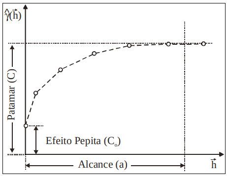
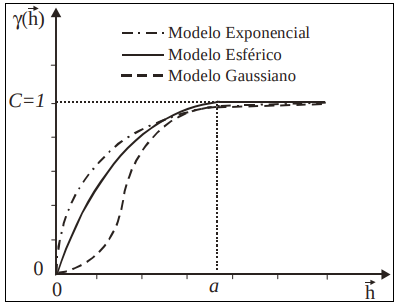
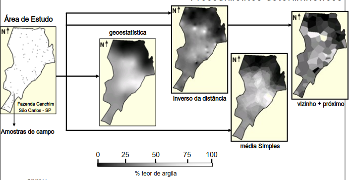
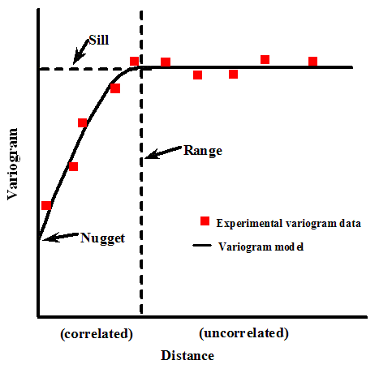

# Dados Geoestatísticos

::: {.callout-tip}
## Objetivos do Capítulo
Ao final deste capítulo, o estudante deverá ser capaz de:

- Compreender o conceito de variograma e semivariograma;
- Ajustar modelos teóricos de variograma (linear, exponencial, gaussiano, wave);
- Realizar interpolação espacial por krigagem;
- Avaliar a qualidade do ajuste por validação cruzada.
:::

::: {.callout-note}
## Slides do Capítulo 5 - Dados Geoestatísticos
[Clique aqui para acessar a apresentação em Slides](apresentacoes/05-geoestatistica_slides.html){target="_blank"}
:::

A geoestatística lida com variáveis que são medidas em localizações contínuas ou irregulares no espaço, como temperatura, precipitação, concentração de poluentes ou altitude. A premissa fundamental é que observações próximas tendem a ser mais similares do que observações distantes — princípio conhecido como **dependência espacial** ou **autocorrelação espacial**.

## **Aplicação VII:** Geoestatística com dados de pluviosidade na cidade do Rio de Janeiro/RJ

Nesta aplicação, utilizaremos técnicas de geoestatística para analisar os dados de chuva acumulada provenientes das estações pluviométricas do sistema Alerta Rio. Os dados referem-se à média da precipitação acumulada em 7 dias, com base nos totais das últimas 24h e 96h, permitindo uma visão mais abrangente da distribuição espacial da chuva no município.

Através do uso de bibliotecas do R específicas para análise espacial e interpolação, o objetivo é construir modelos geoestatísticos que possibilitem a interpolação dos valores de precipitação em regiões não monitoradas diretamente por estações. Esse tipo de abordagem pode auxiliar tanto no planejamento urbano quanto na prevenção de desastres naturais.

#### Uma breve introdução a Geoestística

##### Semivariograma: a base da análise espacial

Uma das principais ferramentas da geoestatística é o semivariograma, que mede o quanto dois pontos próximos no espaço se parecem (ou se diferem) com relação ao valor de uma variável.

::: box-dica2
**A ideia central é**: Se dois pontos estão muito próximos, é esperado que seus valores sejam parecidos. Já se estiverem distantes, a diferença entre os valores tende a aumentar.

:::
  
A versão experimental do semivariograma é calculada para diferentes distâncias entre os pontos, usando a seguinte fórmula:
  

$$\hat{\gamma}(h) = \dfrac{1}{2N(h)}\sum^{N(h)}_{i=1}[z(x_i) - z(x_i + h)]^2 $$
Sabendo que:
  
- $\hat{\gamma}(h)$: valor estimado do fenômeno para a distância $h$;

- $N(h)$: número de pares de pontos separados por uma distância $h$;

- $z(x_i)$: valor observado da variável na localização $x_i$;

- $z(x_i + h)$: valor observado da variável em um ponto a uma distância $h$ de $x_i$.

* A expressão representa a \textbf{diferença média ao quadrado} entre os valores da variável observada em pares de pontos separados pela distância $h$.


```{r echo=F, fig.align="center", out.width= "40%", fig.show='hold'}

```

::: box-dica1

📌 **Efeito Pepita (C₀)**: É a variação observada mesmo quando a distância entre os pontos é muito pequena ou zero. 

📌 **Patamar (C)**: É o valor em que o variograma se estabiliza, indicando que a partir de certa distância, a variabilidade entre os pontos não aumenta mais. 

📌 **Alcance (a)**: É a distância a partir da qual dois pontos deixam de estar correlacionados. Até essa distância, os valores ainda apresentam semelhança espacial, ou seja, após essa distância, tornam-se independentes.

:::
  
  
Apesar de útil, essa fórmula não é robusta em todas as situações. Em alguns casos, a variabilidade não é constante ao longo da área estudada, o que chamamos de heterocedasticidade. Nesses cenários, modelos diferentes podem ser utilizados para representar o comportamento do semivariograma. Por exemplo:
  
i) **Modelo Exponencial**
  
ii) **Modelo Esférico**
  
iii) **Modelo Gaussiano**
  
iv) **Outros**
  
```{r echo=F, fig.align="center", out.width= "40%", fig.show='hold'}

```

* **Exemplo:** Mapa sobre o teor de argila no solo.

```{r echo=F, fig.align="center", out.width= "70%", fig.show='hold'}

```

A imagem mostra a interpolação do teor de argila em uma área agrícola da Fazenda Canchim (SP), a partir de amostras de solo coletadas em campo. Diversos métodos são comparados: **a geoestatística (krigagem)**, que utiliza a estrutura de dependência espacial dos dados via semivariograma e produz um mapa suavizado e estatisticamente robusto; o método do **inverso da distância (IDW)**, que pondera os pontos mais próximos com maior influência, resultando em maior detalhamento local, mas com risco de exagerar variações; a **média simples**, que suaviza os dados sem considerar plenamente a variabilidade espacial; e o método do **vizinho mais próximo**, que gera áreas abruptas ao atribuir a cada região o valor da amostra mais próxima, sem suavização. O exemplo evidencia como a escolha do método de interpolação impacta diretamente a qualidade e continuidade do mapa final.


[*Fonte: Referência científica: Druck, S.; Carvalho, M.S.; Câmara, G.; Monteiro, A.V.M. (eds) "Análise Espacial de Dados Geográficos". Brasília, EMBRAPA, 2004](http://www.dpi.inpe.br/gilberto/livro/analise/cap3-superficies.pdf)

#### Biliotecas do R que serão utilizadas

```{r, echo=T}
library(sf)
library(sp)
library(dplyr)
library(gstat)
library(lattice)
library(automap)
library(raster)
library(leaflet)
library(leaflet.extras2)
library(leafem)

```

#### Importando a tabela com a chuva acumulada média de 7 dias das últimas 24hs e 96hs das estações pluviométricas da cidade do Rio de Janeiro

[Descrição das Estações (Alerta Rio)](http://www.sistema-alerta-rio.com.br/dados-meteorologicos/info-estacoes/)

[Download Dados Pluviométricos (Alerta Rio)](http://www.sistema-alerta-rio.com.br/dados-meteorologicos/download/dados-pluviometricos/)

* Como esses dados já foram baixados, iremos ler direto no R:

```{r, echo=T}
# 
pluvio <- read.csv("dados/chuva/pluviosidade.csv", sep=";")
```

#### Análise Gráfica Descritiva 

```{r, echo=T}
quantil <- quantile(pluvio$acumulado_24h, seq(0,1,0.2))
quantil
```

#### Transformar os dados em um objeto espacial do R

* x - Longitude
* y - Latitude

```{r, echo=T}
sp::coordinates(pluvio) = ~ x + y
```

#### Análise Gráfica Descritiva com os dados espaciais

```{r, echo=T,  out.width="90%"}
# Bubble plot
bubble(pluvio, "acumulado_24h", key.entries = quantil, pch=19, col="blue")
```

```{r, echo=T,  out.width="90%"}
# Point plot
spplot(pluvio['acumulado_24h'], scales=list(draw=T), key.space="right", colorkey=T)
```

#### 📌 Variograma Experimental (ou empírico)

O variograma experimental (ou empírico) é uma ferramenta usada em geoestatística para medir como a semelhança entre os valores de uma variável muda com a distância entre os pontos amostrados. Nesse caso, o variograma experimental vai nos ajudar a entender quão relacionados estão os valores de chuva conforme a distância entre as estações pluviométricas aumenta.

🧪 Como é construído ?

1. Para vários pares de pontos, calcula-se a diferença entre os valores medidos (por exemplo, de chuva em 24h).

2. Agrupa-se esses pares por faixas de distância (os "lags").

3. Para cada faixa, calcula-se a média da variância entre os pares.

🧠 Por que é importante ?

1. O variograma experimental é a base para escolher e ajustar um modelo geoestatístico.

2. Ele permite aplicar métodos como krigagem, para estimar valores em locais sem medição.


```{r, echo=T}
variogram.emp = variogram(acumulado_24h ~x+y, pluvio, width=1000, cutoff=20000)
variogram.emp
```

::: box-dica2

- `acumulado_24h ~ x + y`: estamos analisando como a variável chuva acumulada varia no espaço (coordenadas x e y).

- `width = 1000`: define que os pares de pontos serão agrupados em intervalos de 1000 metros, ou seja, é aistância média entre amostras ou distância dos lags.

- `cutoff = 20000`: só serão considerados pares de pontos com até 20 km de distância (Distância máxima entre os pontos amostrados).
:::


```{r, echo=T}
# Variogram plot
plot(variogram.emp, main = "Empirical variogram", pch = 19, col = "darkblue")
```

::: box-dica2

Esse código plota o variograma experimental (ou empírico), que foi criado anteriormente com o objeto `variogram.emp`.

:::

O variograma empírico mostra que há uma autocorrelação espacial positiva entre os pontos amostrados até aproximadamente 10.000 unidades de distância. Após esse ponto, a semivariância se estabiliza, sugerindo que a dependência espacial se dissipa. Oscilações em maiores distâncias podem indicar variação não explicada (efeito pepita) ou padrões espaciais mais complexos.

#### 📌 Semivariograma Teórico

É uma função matemática ajustada sobre o variograma experimental. Ele serve para modelar a relação espacial entre os dados (ex: chuva), e é usado para realizar interpolações com krigagem.

🟡 **Nugget (efeito pepita)**:  É o valor do variograma no ponto zero da distância ($x = 0$).

⚫ **Sill (patamar ou limite da variância)**: É o valor máximo da semivariância (eixo $Y$), onde a curva estabiliza. Indica o ponto em que os dados deixam de estar correlacionados espacialmente.

📏 **Range (alcance)**: É a distância (eixo $X$) até onde os dados ainda estão correlacionados. Depois do range, os pontos não têm mais relação espacial entre si.

🤔 Por que isso importa ?

Esses três parâmetros (nugget, sill e range) definem como a variável se comporta no espaço, e são essenciais para:

* Interpolar dados em locais sem observação (krigagem),

* Planejar amostragem eficiente,

* Entender o grau de continuidade espacial de um fenômeno.


```{r echo=F, fig.align="center", out.width= "70%", fig.show='hold'}

```

[Fonte do gráfico](https://vsp.pnnl.gov/help/Vsample/Kriging_Variogram_Model.htm)

📌 Alguns modelos mais usuais para o ajuste do variograma teorico:

```{r variograma-teorico, echo=FALSE, message=FALSE, warning=FALSE}
library(gstat)
library(ggplot2)
library(dplyr)

psill <- 80
range <- 12000
nugget <- 15
h <- seq(1, 20000, length.out = 200)

lin <- variogramLine(vgm(psill, "Lin", range, nugget), dist_vector = h) |> mutate(Modelo = "Linear")
exp <- variogramLine(vgm(psill, "Exp", range, nugget), dist_vector = h) |> mutate(Modelo = "Exponencial")
gau <- variogramLine(vgm(psill, "Gau", range, nugget), dist_vector = h) |> mutate(Modelo = "Gaussiano")
wav <- suppressWarnings(na.omit(variogramLine(vgm(psill, "Wav", range, nugget), dist_vector = h))) |> mutate(Modelo = "Wave")

p0 <- data.frame(dist = 0, gamma = nugget)
p0_list <- lapply(c("Linear", "Exponencial", "Gaussiano", "Wave"), \(m) cbind(p0, Modelo = m))

dados <- bind_rows(p0_list[[1]], p0_list[[2]], p0_list[[3]], p0_list[[4]],
                   lin, exp, gau, wav)

dados <- dados %>% filter(!is.na(gamma) & is.finite(gamma))

ggplot(dados, aes(x = dist, y = gamma, color = Modelo, linetype = Modelo)) +
  geom_line(size = 1.2) +
  labs(title = "Modelos Teóricos de Variograma",
       x = "Distância", y = "Semivariância") +
  theme_minimal(base_size = 14) +
  theme(
    legend.position = "bottom",
    legend.title = element_blank(),
    plot.title = element_text(face = "bold", hjust = 0.5),
    axis.line = element_line(color = "black"),
    panel.grid = element_line(color = "gray90"),
    panel.grid.minor = element_blank()
  )
```


📌 Parâmetros sugeridos para ajuste do variograma teórico:

Observando o Variograma Empírico, é possível sugerir os três parâmetros principais que definem a estrutura espacial dos dados:

| Parâmetro                  | Significado                                                                        | Interpretação visual no seu gráfico                                                                          |
| -------------------------- | ---------------------------------------------------------------------------------- | ------------------------------------------------------------------------------------------------------------ |
| **Nugget (efeito pepita)** | Variação a distância zero (ruído, erro de medição, microvariação)                  | O valor de semivariância onde o gráfico começa. Visualmente está entre **10 e 15**                           |
| **Range (alcance)**        | Distância onde a semivariância se estabiliza (pontos além disso são independentes) | A estabilização parece ocorrer por volta de **10.000 a 12.000 unidades de distância**                        |
| **Sill (platô)**           | Valor máximo da semivariância (nugget + psill)                                     | O platô está próximo de **80 a 100**, portanto o `psill` seria algo como **70 a 90** (psill = sill - nugget) |


```{r, echo=T}
## 1) Modelo Linear
lin.fit  = fit.variogram(variogram.emp, 
                         model = vgm(psill = 80, model = "Lin",
                                     range = 12000, nugget = 15))

## 2) Modelo exponencial
exp.fit  = fit.variogram(variogram.emp, 
                         model = vgm(psill = 80, model = "Exp",
                                     range = 12000, nugget = 15))

## 3) Modelo gaussiano
gau.fit  = fit.variogram(variogram.emp, 
                         model = vgm(psill = 80, model = "Gau",
                                     range = 12000, nugget = 15))

## 4) Modelo wave
wav.fit  = fit.variogram(variogram.emp, 
                         model = vgm(psill = 80, model = "Wav",
                                     range = 12000, nugget = 15))

```

::: box-dica2

Os comandos usam a função `fit.variogram()` do pacote `gstat` no R para ajustar modelos teóricos ao variograma empírico (representado pelo objeto `variogram.emp` da figura acima). Isso é essencial para modelar a dependência espacial entre os dados.

Os modelos ajustados foram: Modelo Linear (`Lin`), Exponencial (`Exp`), Gaussiano (`Gau`) e Wave (`Wav`). Para o ajuste dos mpdels, foram utilizados os seguintes parâmentros que definem a estrutura espacial dos dados:

- `model`: tipo de modelo teórico (forma da curva).

- `psill`: efeito de platô (sill parcial).

- `range`: alcance da dependência espacial.

- `nugget`: efeito pepita (variação não explicada, ruído ou erro de medição).

:::

```{r echo=T, out.width="90%"}
# Layout: 2 linhas, 2 colunas
par(mfrow = c(2, 2))

# Plota cada modelo com linha vermelha
plot(variogram.emp, lin.fit, main = "Modelo Linear", col.line = "red")
plot(variogram.emp, exp.fit, main = "Modelo Exponencial", col.line = "red")
plot(variogram.emp, gau.fit, main = "Modelo Gaussiano", col.line = "red")
plot(variogram.emp, wav.fit, main = "Modelo Wave", col.line = "red")

# Restaura o layout padrão
par(mfrow = c(1, 1))
```


#### 🧪 Validação Cruzada 

A validação cruzada é um processo utilizado para avaliar o desempenho do modelo de krigagem. No contexto espacial, ela consiste em retirar um ponto por vez da malha de dados, utilizar os demais pontos para prever o valor naquele local removido, comparar a previsão com o valor real observado e repetir esse procedimento para todos os pontos da amostra. Esse método permite estimar a capacidade do modelo em gerar boas predições em locais onde não há observações diretas.

🧮 O que é o **RMSE (Root Mean Squared Error)**: é um dos indicadores que resume a performance do modelo. É a "a raiz quadrática média" dos erros entre valores observados (reais) e predições (hipóteses).

$$\text{RMSE} = \sqrt{ \frac{1}{n} \sum_{i=1}^{n} (y_i - \hat{y}_i)^2 }$$

#### Modelo Linear

```{r, echo=T}
## 1) Modelo Linear
cv.lin <- krige.cv(acumulado_24h ~x+y, locations = pluvio, model = lin.fit)
summary(cv.lin)
```

::: cox-dica2

- Executando a validação cruzada do modelo de krigagem linear (`lin.fit`) aplicado aos dados de precipitação `acumulado_24h` com base nas coordenadas `x` e `y`.

- `krige.cv()`: função do pacote `gstat` que realiza a validação cruzada.

- `locations = pluvio`, indica que os pontos estão no objeto espacial pluvio.

- Armazena o resultado (resíduos, predições, observações, etc.) no objeto `cv.lin`.

- `summary(cv.lin)`: Mostra estatísticas descritivas da predição (`var1.pred`), valor observado (`observed`) e resíduo (`residual`).
:::

```{r, echo=T}
plot(cv.lin$var1.pred ~ cv.lin$observed, cex = 1.2, lwd = 2)
abline(0, 1, col = "lightgrey", lwd = 2)
lm_lin <- lm(cv.lin$var1.pred ~ cv.lin$observed)
abline(lm_lin, col = "red", lwd = 2)
r2_lin = summary(lm_lin)$r.squared
rmse_lin = hydroGOF::rmse(cv.lin$var1.pred, cv.lin$observed)
```


::: cox-dica2

- Plota os valores preditos em função dos valores observados. Serve para visualizar a qualidade das previsões. 

- Ajusta um modelo linear entre predito e observado. Adiciona essa linha ao gráfico em vermelho, indicando o ajuste real das predições. Quanto mais próximos da linha cinza $45°$ <span style="color:#808080;">●</span>, melhor o modelo.

:::

#### Modelo Exponencial

```{r, echo=T}
## 2) Modelo exponencial
cv.exp <- krige.cv(acumulado_24h ~x+y, locations = pluvio, model = exp.fit)
summary(cv.exp)
```

```{r, echo=T}
plot(cv.exp$var1.pred ~ cv.exp$observed, cex = 1.2, lwd = 2)
abline(0, 1, col = "lightgrey", lwd = 2)
lm_exp <- lm(cv.exp$var1.pred ~ cv.exp$observed)
abline(lm_exp, col = "red", lwd = 2)
r2_exp = summary(lm_exp)$r.squared
rmse_exp = hydroGOF::rmse(cv.exp$var1.pred, cv.exp$observed)

```

#### Modelo Gaussiano


```{r, echo=T}
## 3) Modelo Gaussiano
cv.gau <- krige.cv(acumulado_24h ~x+y, locations = pluvio, model = gau.fit)
summary(cv.gau)

```


```{r, echo=T}
plot(cv.gau$var1.pred ~ cv.gau$observed, cex = 1.2, lwd = 2)
abline(0, 1, col = "lightgrey", lwd = 2)
lm_gau <- lm(cv.gau$var1.pred ~ cv.gau$observed)
abline(lm_gau, col = "red", lwd = 2)
r2_gau = summary(lm_gau)$r.squared
rmse_gau = hydroGOF::rmse(cv.gau$var1.pred, cv.gau$observed)

```

#### Modelo Wave

```{r}
## 4) Modelo Wave
cv.wav <- krige.cv(acumulado_24h ~x+y, locations = pluvio, model = wav.fit)
summary(cv.wav)
```


```{r, echo=T}
plot(cv.wav$var1.pred ~ cv.wav$observed, cex = 1.2, lwd = 2)
abline(0, 1, col = "lightgrey", lwd = 2)
lm_wav <- lm(cv.wav$var1.pred ~ cv.wav$observed)
abline(lm_wav, col = "red", lwd = 2)
r2_wav = summary(lm_wav)$r.squared
rmse_wav = hydroGOF::rmse(cv.wav$var1.pred, cv.wav$observed)
```

#### Tabela das estatística de $R^2$ e $RMSE$

```{r, echo=T}
# Criando um data frame com os nomes dos modelos
modelos <- c("Linear", "Exponencial", "Gaussiano", "Wave")

# Combinando os valores de R² e RMSE em um único data frame
tabela_desempenho <- data.frame(
  Modelo = modelos,
  R2 = c(r2_lin, r2_exp, r2_gau, r2_wav),
  RMSE = c(rmse_lin, rmse_exp, rmse_gau, rmse_wav)
)

# Visualizando a tabela
print(tabela_desempenho)

```

Apesar de todos os modelos apresentarem $R^2$ baixos (indicando que os modelos explicam uma parcela limitada da variabilidade dos dados), o modelo linear se destacou como o mais eficiente nesse conjunto de dados, tanto por explicar mais da variância da variável resposta (acumulado de chuva) quanto por apresentar o menor erro médio de previsão.


#### Criando os grids do contorno da cidade do Rio de Janeiro para intermpolação

```{r, echo=T, message=FALSE, warning=FALSE, results='hide'}
# Importando o contorno do Rio
contorno.rio <- shapefile("dados/chuva/MUNIC_2K_2022_IPP_SIRGAS.shp")

# Ou usar o comando

# contorno.rio <- st_geometry(read_municipality(code_muni = 3304557, year = 2022))
```

::: box-dica2

Criando um objeto com apenas o contorno do polígono da cidade do Rio de Janeiro.
:::

```{r, echo=T, echo=T, message=FALSE, warning=FALSE, results='hide'}
# Criando grade para interpolacao com a  resolucao de 50m
r <- raster(contorno.rio, res = 50)

# Criando um objeto formato raster
rp <- rasterize(contorno.rio, r, 0) 

# Trasnsformando o objeto raster no formato SpatialPixelsDataFrame
grid <- as(rp, "SpatialPixelsDataFrame") 
sp::plot(grid)
```

::: box-dica2

- Cria um objeto `RasterLayer` baseado no **contorno geográfico do Rio de Janeiro** (`contorno.rio`).

- `res = 50` define a **resolução da grade**: cada célula do raster terá **50 metros por 50 metros**.

- Esse raster ainda **não contém valores** — é só uma grade espacial com a extensão e projeção do contorno.

:::


#### Krigagem {.tabset}

##### Visualização via `plot`

```{r, echo=T, echo=T, message=FALSE, warning=FALSE, results='hide'}
# Colocando os dados de chuva e o grid na mesma projecao
sp::proj4string(pluvio) = CRS(proj4string(contorno.rio))

# Executando a interpolação espacial por krigagem 
# usando diferentes modelos de variograma.
mapa_chuva_lin <- krige(acumulado_24h ~1, pluvio, grid, model =lin.fit)
mapa_chuva_exp <- krige(acumulado_24h ~1, pluvio, grid, model =exp.fit)
mapa_chuva_gau <- krige(acumulado_24h ~1, pluvio, grid, model =gau.fit)
mapa_chuva_wav <- krige(acumulado_24h ~1, pluvio, grid, model =wav.fit)
```


```{r, echo=T, out.width= "100%"}
plot.lin <- plot(mapa_chuva_lin, main = "Modelo Linear")
plot.exp <- plot(mapa_chuva_exp, main = "Modelo Exponencial")
plot.gau <- plot(mapa_chuva_gau, main = "Modelo Gaussiano")
plot.wav <- plot(mapa_chuva_wav, main = "Modelo Wave")

```

##### Visualização via `spplot`

```{r, echo=T, out.width= "90%"}
###############################
# Outra opção de gerar o mapa:#
##############################
library(viridis)
# Paleta personalizada: tons frios (azul/verde claro) para baixos, quente (vermelho) para altos
paleta_cor <- rev(viridis(100, option = "A"))  # opção "A" = magma (vermelho escuro a amarelo claro)

# Opções de paleta da função viridis():
# option = "A"  → magma     (preto → roxo → vermelho → laranja → amarelo claro)
# option = "B"  → inferno   (preto → vermelho → laranja → amarelo claro, com mais contraste)
# option = "C"  → plasma    (roxo → rosa → laranja → amarelo claro)
# option = "D"  → viridis   (verde escuro → azul → roxo → amarelo claro) [padrão]
# option = "E"  → cividis   (azul acinzentado → amarelo pálido, acessível para daltônicos)
# option = "F"  → rocket    (roxo escuro → rosa → branco amarelado)
# option = "G"  → mako      (azul escuro → ciano → verde-água, tons frios)
# option = "H"  → turbo     (azul → verde → amarelo → laranja → vermelho, vibrante estilo Google)


# Plots com a nova paleta
spplot(mapa_chuva_lin, "var1.pred", main = "Modelo Linear", col.regions = paleta_cor)
spplot(mapa_chuva_exp, "var1.pred", main = "Modelo Exponencial", col.regions = paleta_cor)
spplot(mapa_chuva_gau, "var1.pred", main = "Modelo Gaussiano", col.regions = paleta_cor)
spplot(mapa_chuva_wav, "var1.pred", main = "Modelo Wave", col.regions = paleta_cor)
```


#### 🔧 Auto Krige 

A função `autoKrige()` do pacote `automap` é utilizada para realizar a krigagem de forma automatizada, combinando os passos de ajuste do variograma e interpolação espacial em um único processo. Ela permite que o usuário defina uma variável de interesse e as coordenadas espaciais associadas, e então calcula o variograma experimental, ajusta automaticamente (ou conforme especificado) um modelo teórico de variograma — como exponencial, gaussiano ou esférico — e executa a krigagem ordinária sobre uma grade de predição. O resultado é um objeto que contém os valores interpolados, a variância da predição e os parâmetros do modelo ajustado, o que facilita a geração de mapas e a análise espacial de forma prática e eficiente, mesmo para usuários com pouca familiaridade com o ajuste manual de variogramas.

```{r, echo=T, message=FALSE, warning=FALSE}
# Modelando
auto.krige = autoKrige(acumulado_24h~x+y, pluvio, grid, model = 'Exp')
summary(auto.krige)
```

::: box-dica2

- `acumulado_24h ~ x + y`: fórmula indicando que será feito um modelo espacial com base nas coordenadas x e y para a variável de interesse acumulado_24h (precipitação).

- `pluvio`: dados observados de precipitação (classe SpatialPointsDataFrame).

- `grid`: grade de predição (onde queremos estimar os valores).

- `modelmodel = "Exp"`: especifica o tipo de modelo de variograma a ser ajustado — neste caso, exponencial.
:::

```{r, echo=T, message=FALSE, warning=FALSE}
# Validação cruzada
auto.krige.cv <- autoKrige.cv(acumulado_24h~x+y, pluvio, model = 'Exp')
summary(auto.krige.cv)
```

#### Convertendo para o formato raster - auto krige

```{r, echo=T, echo=T, message=FALSE, warning=FALSE}
raster_chuva <- raster(auto.krige$krige_output)
plot(raster_chuva)
```
```{r, echo=T, echo=T, message=FALSE, warning=FALSE}
# Outra opção de plotar o raster
sp::spplot(auto.krige$krige_output, "var1.pred", main = "AutoKrige - Modelo Exponencial")

```

- Caso queira salvar a imagem raster em um arquivo formato geotiff para ler em algum SIG por exemplo:
  
```{r, echo=T, message=FALSE, warning=FALSE}
# Exportando o objeto da imagem
writeRaster(raster_chuva,
            filename = 'dados/chuva/chuva_auto.tiff',
            format = 'GTiff',
            overwrite = T)

# Importando de volta para o R
raster_chuva <- raster("dados/chuva/chuva_auto.tiff")
```

#### 🔍 Fazendo o mapa interativo com as estações

```{r, echo=T, message=FALSE, warning=FALSE}
# 1. Importando e transformando as estações pluviométricas
estacoes.sf <- read_sf("dados/chuva/Estac_C3_B5es_Alerta_Rio.shp")
estacoes.longlat <- st_transform(estacoes.sf, 4326)  # EPSG:4326 = WGS84
estacoes.longlat$coords <- st_coordinates(estacoes.longlat)
estacoes.longlat$X <- estacoes.longlat$coords[, 1]
estacoes.longlat$Y <- estacoes.longlat$coords[, 2]
```

```{r, echo=T, message=FALSE, warning=FALSE}
# 2. Importando e transformando a malha de bairros
bairros.sf <- read_sf("dados/chuva/BAIRROS_2K_2022_IPP_SIRGAS.shp")
bairros.longlat <- st_transform(bairros.sf, 4326)
bairros.longlat <- st_make_valid(bairros.longlat)  # Corrige geometrias se necessário
```


```{r, echo=T, message=FALSE, warning=FALSE}
# 3. Convertendo o resultado da krigagem para raster
raster_chuva <- raster(auto.krige$krige_output["var1.pred"])

# 4. Projetando o raster para WGS84
raster_chuva_longlat <- projectRaster(raster_chuva, crs = CRS("+proj=longlat +datum=WGS84"))
```


```{r, echo=T, message=FALSE, warning=FALSE, results='hide'}
# 5. Definindo a paleta de cores da superfície interpolada
pal <- colorNumeric(
  palette = c("#000066", "#00c8f8", "#F0E68C", "#FFFF00", "#FF8C00"),
  domain = values(raster_chuva_longlat),
  na.color = "transparent",
  reverse = TRUE
)
```

```{r, echo=T, echo=T, message=FALSE, warning=FALSE, out.width= "100%"}
# 6. Construindo o mapa interativo
# NOTA IMPORTANTE: Este código deve ser executado interativamente no RStudio
# A renderização em documento Quarto pode causar conflitos com dependências jQuery do leaflet
# Para usar este código, copie e execute diretamente no console do R

leaflet(data = estacoes.longlat, options = leafletOptions(attributionControl = FALSE)) |>
  addProviderTiles("CartoDB.Positron", group = "Ruas") |>
  addProviderTiles("Esri.WorldImagery", options = providerTileOptions(opacity = 0.7), group = "Satélite") |>
  addProviderTiles("CartoDB.Voyager", group = "Voyager") |>
  # Escala (distância)
  addScaleBar(position = "bottomleft") |>
  # Coordenadas do mouse
  addMouseCoordinates() |>
  # Define a visualização inicial
  setView(lng = -43.42, lat = -22.90, zoom = 10.4) |>
  # Adicionando os marcadores das estações
  addMarkers(~X, ~Y, popup = ~as.character(est), label = ~as.character(est), group = "Estações") |>
  # Adicionando a malha de bairros
  addPolygons(data = bairros.longlat,
              weight = 3,
              color = "darkblue",
              smoothFactor = 1,
              fill = FALSE,
              labelOptions = labelOptions(
                style = list("font-weight" = "normal", padding = "3px 8px"),
                textsize = "13px",
                direction = "auto"),
              group = "Bairros") |>
  # Adicionando o raster de chuva interpolada
  addRasterImage(raster_chuva_longlat, colors = pal, opacity = 0.8, group = "Chuva: 1 semana") |>
  # Legenda
  addLegend(pal = pal, values = values(raster_chuva_longlat),
            title = "Chuva Acumulada - 1 semana",
            group = "Chuva: 1 semana") |>
  # Controle das camadas
  addLayersControl(
    baseGroups = c("Voyager", "Ruas", "Satélite"),
    overlayGroups = c("Estações", "Bairros", "Chuva: 1 semana"),
    options = layersControlOptions(collapsed = FALSE),
    position = "bottomleft") |>
  # Oculta os bairros inicialmente
  hideGroup(group = c("Bairros"))
```

