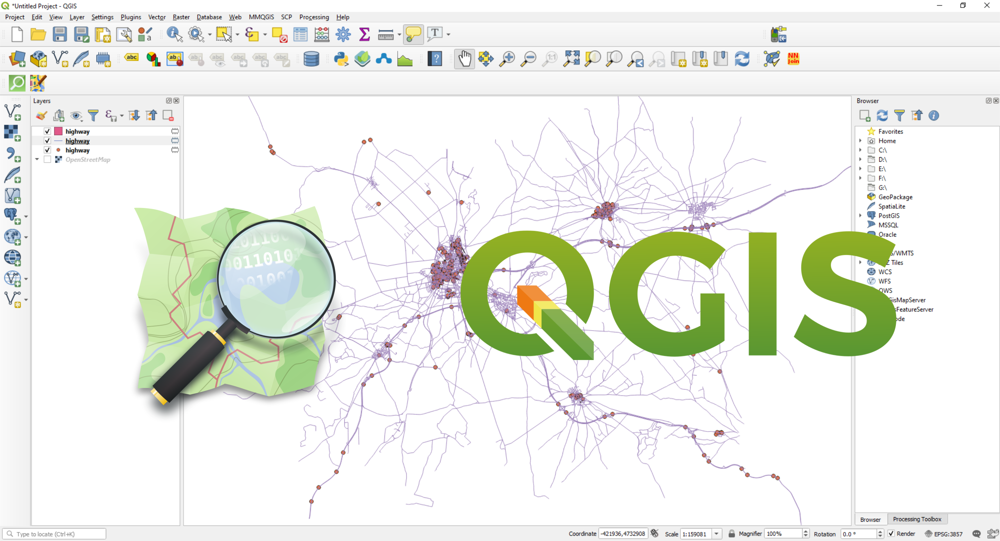
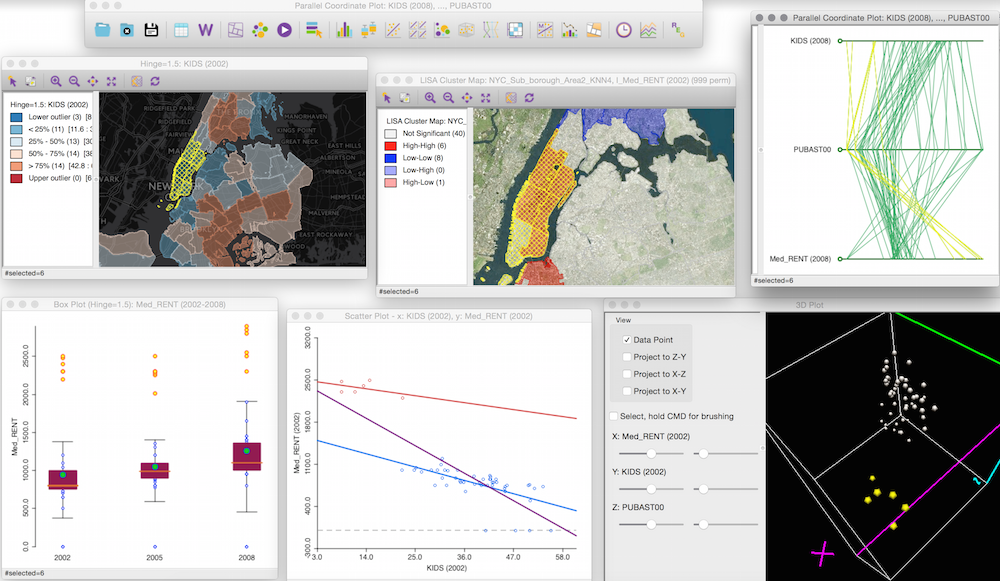

## O que é Análise Estatística Espacial?

- São métodos estatísticos que levam em consideração a localização espacial do fenômeno estudado.
- Segundo Bailey & Gatrell (1995): 
  > *"A análise estatística espacial é aplicada quando os dados possuem localização geográfica e quando o arranjo espacial desses dados é considerado relevante para a análise e interpretação dos resultados."*

## Padrões Espaciais

A primeira questão a ser considerada é: os dados seguem um padrão aleatório ou indicam a presença de agregações bem definidas (*clusters*)?

{fig-align="center" width="80%"}

Fonte: Elaboração própria com auxílio do ChatGPT (OpenAI, 2026).

## Origem da Estatística Espacial

 O uso de dados espaciais na saúde teve um marco histórico com **John Snow**, que em 1854 mapeou um surto de cólera em Londres.

{fig-align="center" width="60%"}

Mapeamento dos casos de cólera ($\bullet$) e as bombas de água (X) em Londres, 1854.

## Homenagens a John Snow

{fig-align="center" width="40%"}

Retrato na fachada de um pub, réplica da bomba de água da Broad Street e placa marcando a descoberta da transmissão hídrica da cólera.

## Objetivos da Estatística Espacial

1. **Investigar padrões espaciais e espaço-temporais:**
   - Utilizar Análise Exploratória de Dados Espaciais (AEDE) e medidas de correlação espacial.
   - Identificar estruturas, agrupamentos e dependências nos dados geográficos.

2. **Modelar fenômenos espaciais:**
   - Controlar efeitos de vizinhança (dependência espacial) e heterogeneidade geográfica.
   - Utilizar modelos estatísticos apropriados (ex: SAR, CAR, GWR).

## Dependência ou Autocorrelação Espacial

- Valores próximos no espaço tendem a ser mais semelhantes entre si do que valores distantes.
- A dependência ocorre em múltiplas direções e diminui conforme aumenta a distância.
- Modelos que incorporam *dependência estatística* costumam ser mais realistas em contextos espaciais (Cressie, 1991).

> *"Todas as coisas se parecem, porém coisas mais próximas tendem a ser mais semelhantes do que aquelas mais distantes."* (Tobler, 1979). 

Também conhecida como 1ª Lei da Geografia

## Ferramentas para Estatística Espacial

### SiG QGIS
{fig-align="center" width="70%"}

[QGIS: Um Sistema de Informação Geográfica livre e aberto](https://www.qgis.org/pt_BR/site/)

## Ferramentas para Estatística Espacial

### GEODA
{fig-align="center" width="70%"}

[GEODA: An Introduction to Spatial Data Analysis](https://spatial.uchicago.edu/geoda)

## Ferramentas de Programação

### R

{fig-align="center" width="60%"}

Fonte: Elaboração própria com auxílio do modelo de IA Gemini (GOOGLE, 2026).

[R Cran](https://cran.r-project.org/)

## Ferramentas de Programação

### Python

{fig-align="center" width="50%"}

[Github Geopandas](https://geopandas.org/en/stable/)

## Bibliografia Básica Sugerida

- Waller, L.A.; Gotway, C.A. (2004). *Applied Spatial Statistics for Public Health Data*.
- Bivand, R.S. et al. (2013). *Applied Spatial Data Analysis with R*.
- Cressie, N. (1993). *Statistics for Spatial Data*.
- Druck, S. et al. (2004). *Análise Espacial de Dados Geográficos*.
- Lovelace, R. et al. (2021). *Geocomputation with R*.
