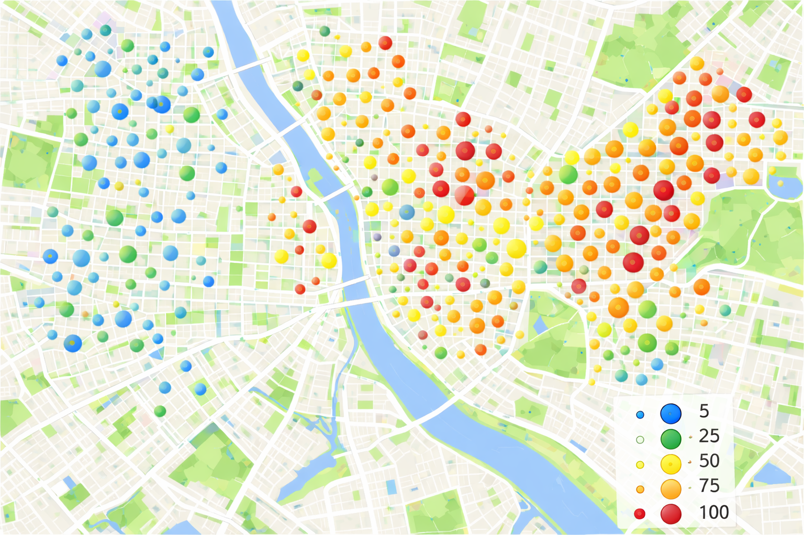
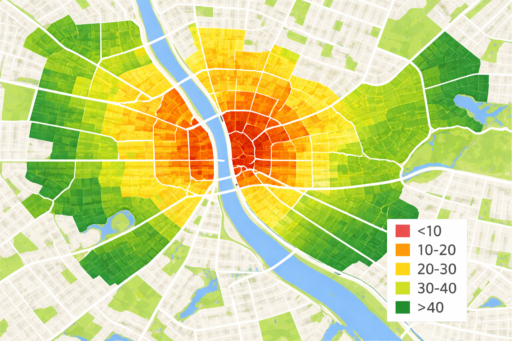

## Tipologia dos Dados Espaciais

### Classificação Segundo Cressie (1993)

A estatística espacial pode ser dividida em **três grandes áreas**:

::: {.large}
1. **Padrões Pontuais** (Point Patterns)
2. **Geoestatística** (Geostatistical Data)
3. **Dados de Área** (Areal Data)
:::

---

## 1. Padrões Pontuais

### Definição

::: {.large}
As observações ocorrem de maneira **aleatória no espaço**, representando a localização exata de eventos.
:::

### Características

- O interesse está nas **coordenadas geográficas exatas** (latitude, longitude).
- Objetivo: Entender padrões de **agrupamento, dispersão ou aleatoriedade**.

## 1. Padrões Pontuais

### Exemplos de Aplicação

::: {.large}
- 🏥 Localização de casos de uma doença notificados em uma cidade
- 🌳 Distribuição espacial de árvores em um parque urbano
- 🐾 Registros de avistamentos de animais silvestres em uma reserva
- 🔥 Focos de incêndio florestal detectados por satélite
- 🔫 Registros de ocorrências de crimes em uma área urbana
:::

---

## Estrutura de Dados: Padrões Pontuais

### Formato dos Dados

| Latitude | Longitude |
|----------|-----------|
| -22.90 | -43.20 |
| -22.91 | -43.22 |
| -22.92 | -43.18 |
| ... | ... |

---

## Visualização: Padrões Pontuais

{fig-align="center" width="70%"}

<div style="text-align: center; font-size: 14px;">
Exemplo: Focos de queimadas no Rio de Janeiro
</div>

---

## Padrões Pontuais no R

```{r, echo=T, out.width='90%'}
# Lendo os dados
library(readxl)

dados_pontos <- read_excel("dados/queimadas/queimadas_pontos.xlsx")

head(dados_pontos)
```

## Padrões Pontuais no R

```{r, echo=T, out.width='110%'}
# Transformando em objeto espacial
library(sf)

pontos_sf <- st_as_sf(dados_pontos, 
                      coords = c("longitude", "latitude"),
                      crs = 4326)

plot(pontos_sf$geometry, pch = 16, col = "red", main = "Focos de Queimadas")
```


## Entendendo o Código R

### Funções principais

::: {.small}
- `st_as_sf()`: Converte um data frame comum em um objeto espacial do tipo **sf** (Simple Features)
- `coords = c("longitude", "latitude")`: Indica quais colunas representam as coordenadas geográficas
- `crs = 4326`: Define o Sistema de Referência de Coordenadas (**WGS 84** - padrão do GPS)
:::

---

## O que é CRS (Sistema de Referência de Coordenadas)

O CRS é como uma **"regra de tradução"** entre o que está em um mapa e o mundo real.

- Define como as coordenadas se relacionam com locais reais na Terra.
- Sem um CRS, uma coordenada não tem significado geográfico.

<small>- **WGS 84 (EPSG:4326)**: Usado por GPS e Google Maps (em graus)</small>

<small>- **UTM**: Usado para mapas locais (em metros)</small>

---

## 2. Geoestatística

### Definição

::: {.large}
Dados com **atributo mensurável** em localizações contínuas ou irregulares no espaço.
:::

### Características

- Cada ponto tem uma **variável medida** associada.
- Objetivo: Analisar **dependência espacial** e **interpolar valores** para locais não amostrados.

### Exemplos de Aplicação

::: {.large}
- 🌧️ Medição da quantidade de chuva em diferentes locais
- 🦟 Contagem de ovos de Aedes aegypti em ovitrampas
- 🌫️ Concentração de poluentes no ar em pontos georreferenciados
- 🌽 Análise da produtividade agrícola em diferentes talhões
:::

---

## Estrutura de Dados: Geoestatística

### Formato dos Dados

| Latitude | Longitude | Atributo Mensurado |
|----------|-----------|-------------------|
| -22.90 | -43.20 | 5.4 |
| -22.91 | -43.22 | 6.1 |
| -22.92 | -43.18 | 5.9 |
| ... | ... | ... |

---

## Visualização: Geoestatística

{fig-align="center" width="70%"}

<div style="text-align: center; font-size: 14px;">
Exemplo: Distribuição espacial de FRP (Fire Radiative Power)
</div>

---

## Trabalhando com Dados Geoestatísticos em R

### Lendo os dados

```r
library(readxl)

# Carregar o arquivo
dados_geo <- read_excel("dados/queimadas/queimadas_geo.xlsx")
```

### Transformando em objeto espacial

```r
library(sp)

sp::coordinates(dados_geo) <- ~ longitude + latitude
proj4string(dados_geo) <- CRS("+init=epsg:4326")  # WGS84
```

---

## Visualização com Gradiente de Cores

```r
library(ggplot2)
library(sf)

# Converter objetos sp para sf
dados_sf <- st_as_sf(dados_geo)

# Plotar com gradiente de cor
ggplot() +
  geom_sf(data = rj_contorno, fill = "gray90", color = "black") +
  geom_sf(data = dados_sf, aes(color = frp), size = 2, alpha = 0.7) +
  scale_color_viridis_c(name = "FRP", option = "plasma") +
  labs(title = "Distribuição Espacial do FRP") +
  theme_minimal()
```

---

## 3. Dados de Área

### Definição

::: {.large}
Fenômenos **agregados por unidades geográficas** bem definidas, representados por **polígonos**.
:::

### Características

- Dados agregados dentro de unidades administrativas (municípios, bairros, setores censitários).
- Objetivo: Identificar **autocorrelação espacial** e aplicar **modelos de regressão espacial**.

### Exemplos de Aplicação

::: {.large}
- 📊 Taxa de mortalidade por município
- 🏥 Número de casos de dengue por bairro
- 💰 Renda média por setor censitário
- 🎓 Taxa de alfabetização por região administrativa
:::

---

## Estrutura de Dados: Dados de Área

### Formato dos Dados

| Polígono | Nome do Polígono | Atributo Mensurado |
|----------|------------------|-------------------|
| 110920 | Alta Esperança | 1000.50 |
| 123690 | Divino | 963.56 |
| 130269 | Dourados | 801.01 |
| ... | ... | ... |

---

## Visualização: Dados de Área

{fig-align="center" width="70%"}

<div style="text-align: center; font-size: 14px;">
Exemplo: Mapa temático com dados agregados por município
</div>

---

## Trabalhando com Dados de Área em R

### Lendo o shapefile

```r
library(sf)

# Ler arquivo shapefile
municipios <- st_read("malhas/municipios.shp")
```

### Ou baixando via geobr

```r
library(geobr)

# Baixar polígono do RJ (código IBGE = 33)
rj_municipios <- read_municipality(code_state = 33, year = 2020)
```

---

## Visualizando Dados de Área

```r
library(ggplot2)

# Plotar mapa temático
ggplot(rj_municipios) +
  geom_sf(aes(fill = taxa_mortalidade), color = "black") +
  scale_fill_viridis_c(name = "Taxa de Mortalidade") +
  labs(title = "Taxa de Mortalidade por Município - RJ") +
  theme_minimal()
```

---

## Resumo da Tipologia

| Tipo de Dado | Característica | Estrutura | Exemplo |
|---|---|---|---|
| **Pontual** | Localização exata | (x, y) | Casos de dengue |
| **Geoestatístico** | Variável contínua | (x, y, z) | Temperatura |
| **Área** | Dados agregados | Polígonos | Taxa de mortalidade |

---

## Escolhendo o Tipo de Análise

### Pergunta-chave:

::: {.large}
**Qual é a natureza dos meus dados?**

- Tenho **pontos exatos** de eventos? → **Padrões Pontuais**
- Tenho **medições contínuas** em locais? → **Geoestatística**
- Tenho dados **agregados por região**? → **Dados de Área**
:::

---

## Próximos Passos

### Capítulos seguintes:

::: {.large}
1. **Padrões Pontuais** - Análise detalhada e métodos
2. **Dados de Área** - Autocorrelação e regressão espacial
3. **Geoestatística** - Variogramas e krigagem
:::

---

## Referências

- Cressie, N. (1993). *Statistics for Spatial Data*. Wiley.
- Bivand, R.S. et al. (2013). *Applied Spatial Data Analysis with R*. Springer.
- Lovelace, R. et al. (2021). *Geocomputation with R*. CRC Press.
