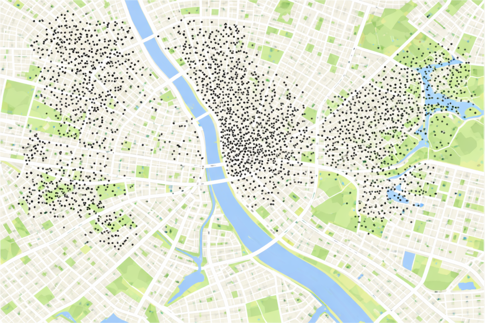

## Objetivos da Aula

- Classificar os dados espaciais segundo a tipologia de Cressie (1993);
- Distinguir entre padrões pontuais, dados geoestatísticos e dados de área;
- Identificar a estrutura de dados adequada para cada tipo de análise;
- Realizar a leitura e visualização básica de dados espaciais em R.

## Tipologia dos Dados Espaciais

A estatística espacial pode ser dividida em três grandes áreas (Cressie, 1993):

1. **Padrões Pontuais**
2. **Geoestatística**
3. **Dados de Área**

## 1. Padrões Pontuais

- Observações ocorrem de maneira aleatória no espaço.
- **Exemplos:** Casos de uma doença, localização de crimes, focos de queimadas.
- **Objetivo:** Entender padrões de agrupamento, dispersão ou aleatoriedade.

## Estrutura de Padrões Pontuais

- O interesse está nas coordenadas geográficas exatas.
- **Exemplo de dados:**
  - Latitude: -22.90, Longitude: -43.20
  - Latitude: -22.91, Longitude: -43.22

{fig-align="center" width="60%"}

## 2. Geoestatística

- Observações com atributo mensurável em localizações contínuas ou irregulares.
- **Exemplos:** Temperatura, poluição, altitude, teor de argila.
- **Objetivo:** Analisar dependência espacial e interpolar valores para locais não amostrados (krigagem).

## 3. Dados de Área

- Fenômenos agregados por unidades geográficas.
- **Exemplos:** Municípios, distritos, setores censitários.
- **Objetivo:** Autocorrelação espacial (I de Moran) e modelos de regressão espacial adaptados a dados agregados.

## Trabalhando com Dados Espaciais no R

### O pacote `sf` (Simple Features)

- Padrão moderno para dados espaciais no R.
- Converte data frames comuns em objetos espaciais.

```r
library(sf)

pontos_sf <- st_as_sf(dados_pontos, 
                      coords = c("longitude", "latitude"),
                      crs = 4326)
```

## O que é CRS?

**Coordinate Reference System (Sistema de Referência de Coordenadas)**

- Define como as coordenadas se relacionam com locais reais na Terra.
- O código **4326** corresponde ao *datum* **WGS 84** (padrão do GPS).
- Sem um CRS, uma coordenada não tem significado geográfico.

## Resumo da Tipologia

| Tipo de Dado | Característica Principal | Exemplo |
|--------------|--------------------------|---------|
| **Pontual** | Localização exata (x,y) | Casos de Dengue |
| **Geoestatístico** | Variável contínua no espaço | Temperatura |
| **Área** | Dados agregados por polígonos | Taxa de mortalidade por município |
