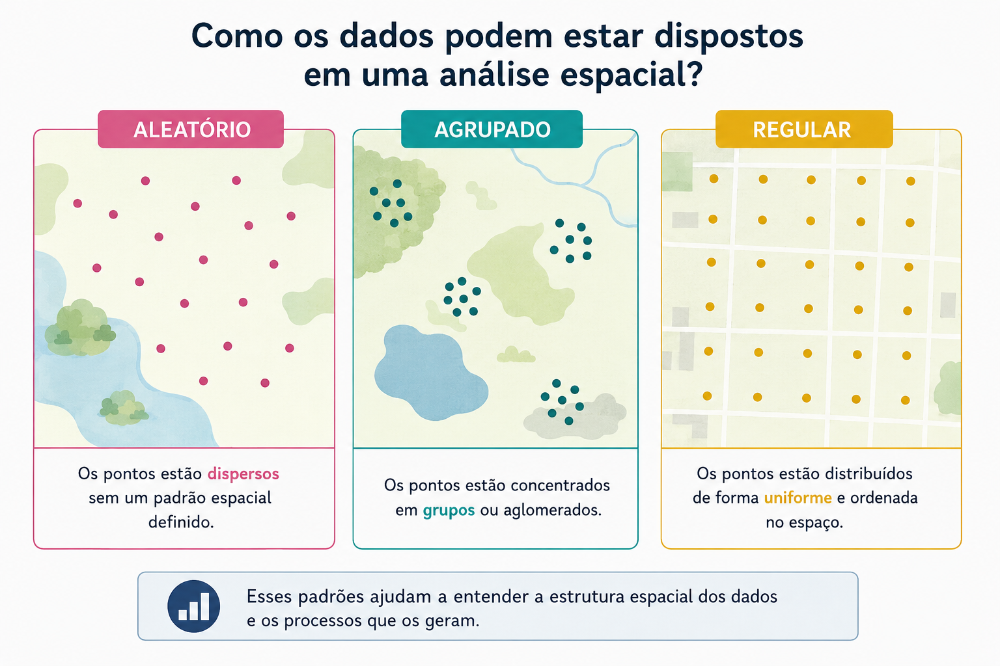
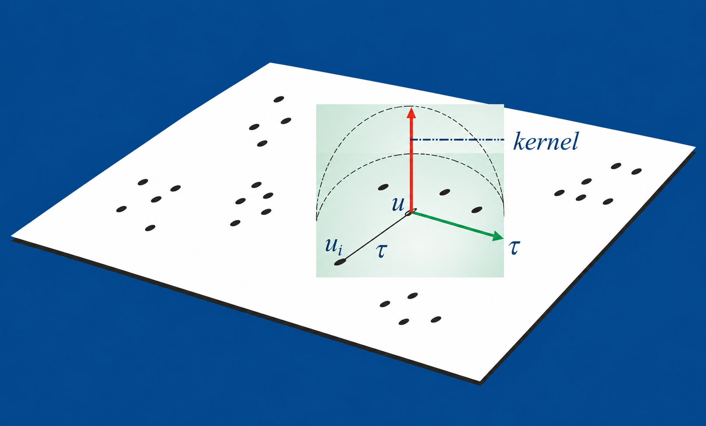
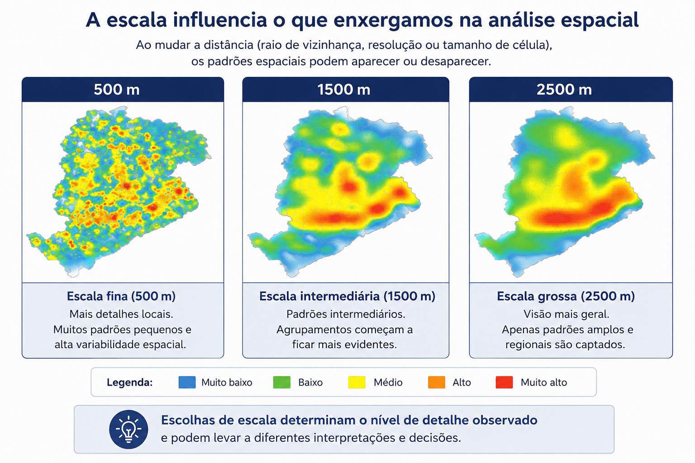

<!-- ## Objetivos do Capítulo -->

<!-- Ao final deste capítulo, você será capaz de: -->

<!-- ::: {.large} -->
<!-- 1. Compreender a estrutura dos **dados de padrões pontuais**. -->
<!-- 2. Testar hipóteses sobre a **aleatoriedade espacial completa (CSR)**. -->
<!-- 3. Aplicar **estimativas de densidade de Kernel** (mapas de calor). -->
<!-- 4. Utilizar a **Função K de Ripley** para análise de padrões. -->
<!-- 5. Realizar **análises de padrões pontuais com dados reais**. -->
<!-- ::: -->

<!-- --- -->

## O que são Padrões Pontuais?

### Definição

Eventos que ocorrem em localizações **discretas e aleatórias** no espaço, como casos de doenças, crimes, acidentes ou ocorrências ambientais.

### Características

- O interesse está nas **coordenadas geográficas exatas** (latitude, longitude).
- Objetivo: Investigar se os eventos seguem um padrão **aleatório**, **regular** ou **agrupado** (clustered).

---

## Exemplos de Aplicação

- 🏥 Localização de casos de uma doença notificados em uma cidade
- 🌳 Distribuição espacial de árvores em um parque urbano
- 🐾 Registros de avistamentos de animais silvestres em uma reserva
- 🔥 Focos de incêndio florestal detectados por satélite
- 🔫 Registros de ocorrências de crimes em uma área urbana

---

## Possíveis Distribuições dos Pontos

{fig-align="center" width="90%"}
<div style="text-align: center; font-size: 12px;">Fonte: Elaboração própria com auxílio do ChatGPT (OpenAI, 2026).</div>

---

## Processos Pontuais

<div style="font-size: 80%;">
### I) Processo de Primeira Ordem
Variações no **valor médio do processo** no espaço (larga escala). Representado pela **intensidade** ou **densidade** dos pontos.

**Exemplo:** Estimativa de Kernel (mapas de calor)


### II) Processo de Segunda Ordem
**Interação entre pontos** (pequena escala). Mede a **dependência espacial** baseada na distância entre os pontos.

**Exemplo:** Função K de Ripley, Vizinhos mais próximos
</div>

---

## Estimativas de Kernel (Mapas de Calor)

<div style="font-size: 80%;">

### O que é?

Técnica para **representar visualmente a concentração espacial** de eventos pontuais, transformando um conjunto de pontos em uma **superfície contínua de intensidade**.


$$\hat{\lambda}_{\tau}(u) = \frac{1}{\tau^2}\sum k\left(\frac{d(u_i , u)}{\tau}\right)$$
</div>

---

### Como Funciona o Kernel?

{fig-align="center" width="50%"}

<div style="font-size: 55%;">
Para cada ponto no espaço:

1. Aplica-se um **"funil de suavização"** (kernel)
2. Distribui **"peso"** ao redor do ponto
3. Maior peso ao pontos mais próximos.
4. Resultado: **superfície contínua de densidade**

**Analogia:** O kernel atua como um limpador de para-brisa, pesando mais os eventos próximos e menos os eventos mais distantes.
</div>

---

### Largura de Banda (Bandwidth)

<div style="font-size: 60%;">

A escolha do parâmetro $\tau$ (largura de banda) influencia o grau de suavização:

<!-- - **Pequena** (ex: 500m) → Mais detalhado, maior variação local -->
<!-- - **Média** (ex: 1500m) → Padrões contínuos e estáveis -->
<!-- - **Grande** (ex: 2500m) → Apenas grandes zonas de concentração -->

{fig-align="center" width="80%"}
</div>

<div style="text-align: center; font-size: 12px;">Fonte: Elaboração própria com auxílio do ChatGPT (OpenAI, 2026).</div>
---

## Completa Aleatoriedade Espacial (CSR)

<div style="font-size: 80%;">
### Definição

Assume que os pontos seguem um **processo de Poisson homogêneo** na área de estudo.

### Hipóteses do Teste

- **H₀:** Os pontos estão distribuídos aleatoriamente no espaço
- **H₁:** Os pontos não seguem um padrão aleatório 

</div>

---

## Teste de Quadrantes

<div style="font-size: 80%;">
Avalia as hipóteses comparando as **contagens observadas** de pontos em subáreas (quadrantes) com aquelas **esperadas sob CSR**:

$$X^2 = \sum_{i=1}^{k}\frac{(O_i - E_i)^2}{E_i}$$

Onde:

- $O_i$ = número observado de pontos no quadrante $i$

- $E_i$ = número esperado sob aleatoriedade

</div>

---

## Simulando Padrões Pontuais

<div style="font-size: 80%;">

```{r}
#| eval: false  # não executa o código
#| echo: true   # mostra o código

library(splancs)
library(spatstat)

set.seed(9999)
caixa <- rbind(c(0,0), c(0,1), c(1,1), c(1,0), c(0,0))

# Padrão aleatório
alea.spp <- csr(caixa, 100)

# Padrão regular
uni.spp <- jitter(gridpts(caixa, 100), 2)

# Padrão clusterizado
clu.spp <- pcp.sim(rho=20, m=10, s2=0.005, region.poly=caixa)

# Plotando os pontos
par(mfrow=c(1, 3))
plot(alea.spp, main="Aleatório")
plot(uni.spp, main="Regular")
plot(clu.spp, main="Agregado")
```

</div>

## Visualizando os Padrões

```{r}
#| fig-width: 12
#| fig-height: 8
#| out-width: 100%
#| fig-align: center
#| 
library(splancs)
library(spatstat)

set.seed(9999)
caixa <- rbind(c(0,0), c(0,1), c(1,1), c(1,0), c(0,0))

# Padrão aleatório
alea.spp <- csr(caixa, 100)

# Padrão clusterizado
clu.spp <- pcp.sim(rho=20, m=10, s2=0.005, region.poly=caixa)

# Padrão regular
uni.spp <- jitter(gridpts(caixa, 100), 2)

par(mfrow=c(1, 3))
plot(alea.spp, main="Aleatório")
plot(uni.spp, main="Regular")
plot(clu.spp, main="Agregado")
```

<div style="font-size: 70%; margin-top: 20px;">
- **Aleatório:** Pontos sem padrão aparente
- **Regular:** Distribuição mais uniforme
- **Agregado:** Presença de clusters e agrupamentos
</div>

---

## Contagem por Quadrantes

<div style="font-size: 80%;">

```{r}
#| eval: false  # não executa o código
#| echo: true   # mostra o código
# Convertendo para a class ppp
library(spatstat)
alea.ppp <- as.ppp(alea.spp, c(0,1,0,1))
uni.ppp <- as.ppp(uni.spp, c(0,1,0,1))
clu.ppp <- as.ppp(clu.spp, c(0,1,0,1))

# Construindo os quadrantes com as respectivas contagens
aleatorioQ <- quadratcount(alea.ppp, nx = 4, ny = 4)
regularQ <- quadratcount(uni.ppp, nx = 4, ny = 4)
agregadoQ <- quadratcount(clu.ppp, nx = 4, ny = 4)


par(mfrow=c(1, 3))
plot(aleatorioQ, main="Aleatório")
plot(alea.ppp, add = TRUE)

plot(regularQ, main="Regular")
plot(uni.ppp, add = TRUE)

plot(agregadoQ, main="Agregado")
plot(clu.ppp, add = TRUE)
```
</div>

## Contagem por Quadrantes

<div style="font-size: 80%;">
```{r}
#| fig-width: 12
#| fig-height: 8
#| out-width: 100%
#| fig-align: center
#| 
# Convertendo para a class ppp
library(spatstat)
alea.ppp <- as.ppp(alea.spp, c(0,1,0,1))
uni.ppp <- as.ppp(uni.spp, c(0,1,0,1))
clu.ppp <- as.ppp(clu.spp, c(0,1,0,1))

# Construindo os quadrantes com as respectivas contagens
aleatorioQ <- quadratcount(alea.ppp, nx = 4, ny = 4)
regularQ <- quadratcount(uni.ppp, nx = 4, ny = 4)
agregadoQ <- quadratcount(clu.ppp, nx = 4, ny = 4)


par(mfrow=c(1, 3))
plot(aleatorioQ, main="Aleatório")
plot(alea.ppp, add = TRUE)

plot(regularQ, main="Regular")
plot(uni.ppp, add = TRUE)

plot(agregadoQ, main="Agregado")
plot(clu.ppp, add = TRUE)
```

</div>
---

## Testando a CSR

<div style="font-size: 70%;">
```{r}
#| eval: true  # não executa o código
#| echo: true   # mostra o código

quadrat.test(aleatorioQ)
quadrat.test(agregadoQ)
quadrat.test(regularQ)
```
</div>


## Interpretação da Contagem por Quadrantes

| Padrão | Contagens | Interpretação |
|--------|-----------|---------------|
| **Aleatório** | Variam sem padrão | Flutuações ao acaso |
| **Regular** | Semelhantes | Distribuição homogênea|
| **Agregado** | Muito desiguais | Clusterização |

---

## Função K de Ripley

<div style="font-size: 65%;">
### O que é?

Mede o **número médio de pontos** dentro de uma distância $h$ de um ponto qualquer, ajustado pela intensidade do processo.

$$K(h) = \frac{1}{\lambda} \, E[\text{número de pontos a distância } \leq h]$$

**Sob Aleatoriedade (CSR)** $\rightarrow K(h) = \pi h^2$

Comparando a função estimada com a teórica:

| Resultado | Interpretação |
|-----------|---------------|
| $\hat{K}(h) \approx \pi h^2$ | **Aleatório** - Padrão compatível com CSR |
| $\hat{K}(h) < \pi h^2$ | **Regular** - Menos pontos próximos (repulsão) |
| $\hat{K}(h) > \pi h^2$ | **Agregado** - Mais pontos próximos (clusters) |
</div>
---

## Função K de Ripley: Raciocínio Prático

<div style="font-size: 70%;">
1. Escolhe-se um ponto
2. Desenha-se um círculo de raio $h$ ao redor dele
3. Conta-se quantos outros pontos caem dentro desse círculo
4. Repete-se para todos os pontos
5. Calcula-se uma média
</div>

---

## Exemplo: Comparação de Funções K

<div style="font-size: 70%;">

```{r}
#| eval: false  # não executa o código
#| echo: true   # mostra o código

# Estimar a função K para cada padrão
K.alea <- Kest(alea.ppp, correction="border")
K.uni <- Kest(uni.ppp, correction="border")
K.clu <- Kest(clu.ppp, correction="border")

# Função teórica para CSR
K.teor <- function(r) { pi * r^2 }

# Plotar as funções K
par(mfrow=c(1, 3), mar=c(5, 5, 3, 1))

# Layout: 3 gráficos na primeira linha e legenda na segunda
layout(matrix(c(1,2,3,4,4,4), nrow = 2, byrow = TRUE),
       heights = c(10,1))

# Margens dos gráficos
par(mar = c(5,5,3,1))

# Gráfico 1: Processo Aleatório
plot(K.alea$r, K.alea$border,
     type="l", lwd=2,
     xlim=c(0,0.35), ylim=c(0,0.08),
     xlab="Distância (r)", ylab="K(r)",
     main="Padrão Aleatório")
curve(K.teor, add=TRUE, col="red", lty=2, lwd=2)
grid()

# Gráfico 2: Processo Regular
plot(K.uni$r, K.uni$border,
     type="l", lwd=2,
     xlim=c(0,0.35), ylim=c(0,0.08),
     xlab="Distância (r)", ylab="K(r)",
     main="Padrão Regular")
curve(K.teor, add=TRUE, col="red", lty=2, lwd=2)
grid()

# Gráfico 3: Processo Agregado
plot(K.clu$r, K.clu$border,
     type="l", lwd=2,
     xlim=c(0,0.35), ylim=c(0,0.08),
     xlab="Distância (r)", ylab="K(r)",
     main="Padrão Agregado")
curve(K.teor, add=TRUE, col="red", lty=2, lwd=2)
grid()

# Painel da legenda
par(mar = c(0,0,0,0))
plot.new()

legend("center",
       legend = c("K estimada", "K teórica (CSR)"),
       col = c("black", "red"),
       lty = c(1,2),
       lwd = 2,
       horiz = TRUE,
       bty = "n",
       cex = 1.2)

```
</div>

---

## Exemplo: Comparação de Funções K

<div style="font-size: 70%;">

```{r}
#| fig-width: 12
#| fig-height: 8
#| out-width: 90%
#| fig-align: center
#| 
# Estimar a função K para cada padrão
K.alea <- Kest(alea.ppp, correction="border")
K.uni <- Kest(uni.ppp, correction="border")
K.clu <- Kest(clu.ppp, correction="border")

# Função teórica para CSR
K.teor <- function(r) { pi * r^2 }

# Plotar as funções K
par(mfrow=c(1, 3), mar=c(5, 5, 3, 1))

# Layout: 3 gráficos na primeira linha e legenda na segunda
layout(matrix(c(1,2,3,4,4,4), nrow = 2, byrow = TRUE),
       heights = c(10,1))

# Margens dos gráficos
par(mar = c(5,5,3,1))

# Gráfico 1: Processo Aleatório
plot(K.alea$r, K.alea$border,
     type="l", lwd=2,
     xlim=c(0,0.35), ylim=c(0,0.08),
     xlab="Distância (r)", ylab="K(r)",
     main="Padrão Aleatório")
curve(K.teor, add=TRUE, col="red", lty=2, lwd=2)
grid()

# Gráfico 2: Processo Regular
plot(K.uni$r, K.uni$border,
     type="l", lwd=2,
     xlim=c(0,0.35), ylim=c(0,0.08),
     xlab="Distância (r)", ylab="K(r)",
     main="Padrão Regular")
curve(K.teor, add=TRUE, col="red", lty=2, lwd=2)
grid()

# Gráfico 3: Processo Agregado
plot(K.clu$r, K.clu$border,
     type="l", lwd=2,
     xlim=c(0,0.35), ylim=c(0,0.08),
     xlab="Distância (r)", ylab="K(r)",
     main="Padrão Agregado")
curve(K.teor, add=TRUE, col="red", lty=2, lwd=2)
grid()

# Painel da legenda
par(mar = c(0,0,0,0))
plot.new()

legend("center",
       legend = c("K estimada", "K teórica (CSR)"),
       col = c("black", "red"),
       lty = c(1,2),
       lwd = 2,
       horiz = TRUE,
       bty = "n",
       cex = 1.2)
```
</div>

---

## Por que Usar a Função K?

<div style="font-size: 70%;">
✅ Analisa padrões em **múltiplas escalas** (vários valores de $h$)

✅ Não depende de dividir o espaço em quadrantes

✅ Detecta tanto **agregação quanto dispersão**

✅ Oferece uma visão mais completa da estrutura espacial

</div>

---

## Aplicação Prática: Focos de Queimadas no RJ

### Lendo os Dados

```{r, eval=FALSE, echo=TRUE}
library(readxl)
library(sf)

# Carregar dados
dados_pontos <- read_excel("dados/queimadas/queimadas_pontos.xlsx")

# Converter para objeto espacial
pontos_sf <- st_as_sf(dados_pontos, 
                      coords = c("longitude", "latitude"),
                      crs = 4326)

plot(pontos_sf)
```

---

## Aplicação Prática: Focos de Queimadas no RJ

### Lendo os Dados

```{r}
#| fig-width: 12
#| fig-height: 8
#| out-width: 90%
#| fig-align: center

# Carregar dados
library(readxl)
library(sf)

dados_pontos <- read_excel("dados/queimadas/queimadas_pontos.xlsx")

# Converter para objeto espacial
# Informando o CRS original dos pontos
pontos_sf <- st_as_sf(dados_pontos, 
                      coords = c("longitude", "latitude"),
                      crs = 4326)

plot(pontos_sf)
```


---

## Visualizando os Focos

```{r, eval=FALSE, echo=TRUE}
library(ggplot2)
library(geobr)

# Baixar mapa do RJ
rj <- read_state(code_state = 33, year = 2020)

# Reprojetando para um sistema métrico em UTM (em metros)
# UTM 23S (SIRGAS 2000) - adequado para o RJ
utm_crs <- 31983

rj_utm <- st_transform(rj, crs = utm_crs)
pontos_utm <- st_transform(pontos_sf, crs = utm_crs)

# Extrair coordenadas UTM dos pontos (em metros)
coords_utm <- st_coordinates(pontos_utm)

queimadas_coords <- data.frame(
  x = coords_utm[, 1],
  y = coords_utm[, 2]
)

# Plotar
ggplot() +
  geom_sf(data = rj, fill = "lightgreen", color = "black") +
  geom_sf(data = pontos_sf, color = "red", size = 1, alpha = 0.7) +
  labs(title = "Focos de Queimadas - Rio de Janeiro") +
  theme_minimal()
```

---

## Visualizando os Focos

```{r}
#| fig-width: 12
#| fig-height: 8
#| out-width: 90%
#| fig-align: center

library(ggplot2)
library(geobr)

# Baixar mapa do RJ
rj <- read_state(code_state = 33, year = 2020)

# Reprojetando para um sistema métrico em UTM (em metros)
# UTM 23S (SIRGAS 2000) - adequado para o RJ
utm_crs <- 31983

rj_utm <- st_transform(rj, crs = utm_crs)
pontos_utm <- st_transform(pontos_sf, crs = utm_crs)

# Extrair coordenadas UTM dos pontos (em metros)
coords_utm <- st_coordinates(pontos_utm)

queimadas_coords <- data.frame(
  x = coords_utm[, 1],
  y = coords_utm[, 2]
)

# Plotar
ggplot() +
  geom_sf(data = rj, fill = "lightgreen", color = "black") +
  geom_sf(data = pontos_sf, color = "red", size = 1, alpha = 0.7) +
  labs(title = "Focos de Queimadas - Rio de Janeiro") +
  theme_minimal()
```


---

## Estimativas de Kernel para Queimadas

<div style="font-size: 70%;">

```{r, eval=FALSE, echo=TRUE}
library(MASS)  # para kde2d
library(terra) # para raster
library(viridis) # para cores

# PASSO 1: Calcular o kernel com bandwidth de 10, 50 e 100km (metros)
kernel_10km <- kde2d(
  queimadas_coords$x,
  queimadas_coords$y,
  h = 10000,  # 10 km em metros
  n = 150,
  lims = c(range(queimadas_coords$x), range(queimadas_coords$y))
)

kernel_50km <- kde2d(
  queimadas_coords$x,
  queimadas_coords$y,
  h = 50000,  # 50 km em metros
  n = 150,
  lims = c(range(queimadas_coords$x), range(queimadas_coords$y))
)

kernel_100km <- kde2d(
  queimadas_coords$x,
  queimadas_coords$y,
  h = 100000,  # 100 km em metros
  n = 150,
  lims = c(range(queimadas_coords$x), range(queimadas_coords$y))
)

# PASSO 2: Converter para raster
r_10km <- rast(
  list(
    x = kernel_10km$x,
    y = kernel_10km$y,
    z = kernel_10km$z
  )
)

r_50km <- rast(list(
  x = kernel_50km$x,
  y = kernel_50km$y,
  z = kernel_50km$z
))

r_100km <- rast(list(
  x = kernel_100km$x,
  y = kernel_100km$y,
  z = kernel_100km$z
))

# CORREÇÃO: Atribuir o CRS correto aos rasters
crs(r_10km) <- paste0("EPSG:", utm_crs)
crs(r_50km) <- paste0("EPSG:", utm_crs)
crs(r_100km) <- paste0("EPSG:", utm_crs)

# PASSO 3: Recortar para área do RJ
# crop(): recorta pelo retângulo envolvente (bounding box)
# mask(): remove pixels fora do polígono
rj_vect <- vect(rj_utm)  # converte para spatvector

r_10km_crop <- crop(r_10km, rj_vect)
r_10km_mask <- mask(r_10km_crop, rj_vect)

r_50km_crop <- crop(r_50km, rj_vect)
r_50km_mask <- mask(r_50km_crop, rj_vect)

r_100km_crop <- crop(r_100km, rj_vect)
r_100km_mask <- mask(r_100km_crop, rj_vect)

# PASSO 4: Plotar
par(mfrow = c(1, 3))

# Plot 10 km
plot(r_10km_mask, 
     main = "Kernel Density - 10 km", 
     col = viridis(50), 
     legend = FALSE)
lines(rj_vect, lwd = 1.5)
points(queimadas_coords$x, queimadas_coords$y, pch = ".", cex = 0.5)

# Plot 50 km
plot(r_50km_mask, 
     main = "Kernel Density - 50 km", 
     col = viridis(50), 
     legend = FALSE)
lines(rj_vect, lwd = 1.5)
points(queimadas_coords$x, queimadas_coords$y, pch = ".", cex = 0.5)

# Plot 100 km
plot(r_100km_mask, 
     main = "Kernel Density - 100 km", 
     col = viridis(50),
     legend = FALSE)
lines(rj_vect, lwd = 1.5)
points(queimadas_coords$x, queimadas_coords$y, pch = ".", cex = 0.5)

par(mfrow = c(1, 1))
```

</div>

---

## Estimativas de Kernel para Queimadas

```{r}
#| fig-width: 12
#| fig-height: 8
#| out-width: 120%
#| fig-align: center
#| 
library(MASS)  # para kde2d
library(terra) # para raster
library(viridis) # para cores

# PASSO 1: Calcular o kernel com bandwidth de 10, 50 e 100km (metros)
kernel_10km <- kde2d(
  queimadas_coords$x,
  queimadas_coords$y,
  h = 10000,  # 10 km em metros
  n = 150,
  lims = c(range(queimadas_coords$x), range(queimadas_coords$y))
)

kernel_50km <- kde2d(
  queimadas_coords$x,
  queimadas_coords$y,
  h = 50000,  # 50 km em metros
  n = 150,
  lims = c(range(queimadas_coords$x), range(queimadas_coords$y))
)

kernel_100km <- kde2d(
  queimadas_coords$x,
  queimadas_coords$y,
  h = 100000,  # 100 km em metros
  n = 150,
  lims = c(range(queimadas_coords$x), range(queimadas_coords$y))
)

# PASSO 2: Converter para raster
r_10km <- rast(
  list(
    x = kernel_10km$x,
    y = kernel_10km$y,
    z = kernel_10km$z
  )
)

r_50km <- rast(list(
  x = kernel_50km$x,
  y = kernel_50km$y,
  z = kernel_50km$z
))

r_100km <- rast(list(
  x = kernel_100km$x,
  y = kernel_100km$y,
  z = kernel_100km$z
))

# CORREÇÃO: Atribuir o CRS correto aos rasters
crs(r_10km) <- paste0("EPSG:", utm_crs)
crs(r_50km) <- paste0("EPSG:", utm_crs)
crs(r_100km) <- paste0("EPSG:", utm_crs)

# PASSO 3: Recortar para área do RJ
# crop(): recorta pelo retângulo envolvente (bounding box)
# mask(): remove pixels fora do polígono
rj_vect <- vect(rj_utm)  # converte para spatvector

r_10km_crop <- crop(r_10km, rj_vect)
r_10km_mask <- mask(r_10km_crop, rj_vect)

r_50km_crop <- crop(r_50km, rj_vect)
r_50km_mask <- mask(r_50km_crop, rj_vect)

r_100km_crop <- crop(r_100km, rj_vect)
r_100km_mask <- mask(r_100km_crop, rj_vect)

# PASSO 4: Plotar
par(mfrow = c(1, 3))

# Plot 10 km
plot(r_10km_mask, 
     main = "Kernel Density - 10 km", 
     col = viridis(50), 
     legend = FALSE)
lines(rj_vect, lwd = 1.5)
points(queimadas_coords$x, queimadas_coords$y, pch = ".", cex = 0.5)

# Plot 50 km
plot(r_50km_mask, 
     main = "Kernel Density - 50 km", 
     col = viridis(50), 
     legend = FALSE)
lines(rj_vect, lwd = 1.5)
points(queimadas_coords$x, queimadas_coords$y, pch = ".", cex = 0.5)

# Plot 100 km
plot(r_100km_mask, 
     main = "Kernel Density - 100 km", 
     col = viridis(50),
     legend = FALSE)
lines(rj_vect, lwd = 1.5)
points(queimadas_coords$x, queimadas_coords$y, pch = ".", cex = 0.5)

par(mfrow = c(1, 1))
```

---

### Investigando os processos de segunda ordem

<div style="font-size: 70%;">

```{r, eval=FALSE, echo=TRUE}
# Convertendo para o formato do spacestat (ppp)

# Janela espacial
rj_window <- as.owin(rj_utm)

# Processo pontual
queimadas_ppp <- ppp(
  x = queimadas_coords$x,
  y = queimadas_coords$y,
  window = rj_window
)

# Visualizar os quadrantes

quad_count <- quadratcount(queimadas_ppp, nx = 4, ny = 4)
plot(quad_count, main = "Contagem por Quadrante")
plot(queimadas_ppp, add = TRUE, pch = 16, cex = 0.5, col = "red")

# Teste CSR (Complete Spatial Randomness)

# Teste Qui-quadrado por quadrats
chi_test <- quadrat.test(
  queimadas_ppp,
  nx = 4,
  ny = 4
)

# Resultado
print(chi_test)
```

</div>

---

### Investigando os processos de segunda ordem

<div style="font-size: 100%;">

```{r}
#| fig-width: 12
#| fig-height: 8
#| out-width: 120%
#| fig-align: center
#| 
# Convertendo para o formato do spacestat (ppp)

# Janela espacial
rj_window <- as.owin(rj_utm)

# Processo pontual
queimadas_ppp <- ppp(
  x = queimadas_coords$x,
  y = queimadas_coords$y,
  window = rj_window
)

# Visualizar os quadrantes

quad_count <- quadratcount(queimadas_ppp, nx = 4, ny = 4)
plot(quad_count, main = "Contagem por Quadrante")
plot(queimadas_ppp, add = TRUE, pch = 16, cex = 0.5, col = "red")
```

</div>

---

### Teste CSR (Complete Spatial Randomness)

<div style="font-size: 100%;">

```{r}
# Teste CSR (Complete Spatial Randomness)

# Teste Qui-quadrado por quadrats
chi_test <- quadrat.test(
  queimadas_ppp,
  nx = 4,
  ny = 4
)

# Resultado
print(chi_test)
```
</div>

<div style="font-size: 70%;">

No teste de CSR (*Complete Spatial Randomness*) mostra evidências muito fortes de que os focos de queimadas **NÃO estão distribuídos aleatoriamente** no estado do Rio de Janeiro $(p-value < 0.05)$.

</div>

---

### Função K de Ripley

<div style="font-size: 80%;">

```{r, eval=FALSE, echo=TRUE}
library(spatstat.explore)

# Calcular K observada
K <- Kest(
  queimadas_ppp,
  correction = "border"
)

plot(
  K,
  main = "Função K de Ripley",
  legend = FALSE
)

```

</div>

---

### Função K de Ripley

<div style="font-size: 100%;">

```{r}
library(spatstat.explore)

# Calcular K observada
K <- Kest(
  queimadas_ppp,
  correction = "border"
)

plot(
  K,
  main = "Função K de Ripley",
  legend = FALSE
)

```

</div>

---

### Função K de Ripley com Envelope

<div style="font-size: 80%;">

```{r, eval=FALSE, echo=TRUE}
env_K <- envelope(
  queimadas_ppp,
  fun = Kest,
  nsim = 9, # numero de simulações
  correction = "border"
)


plot(
  env_K,
  main = "Função K de Ripley com envelopes CSR",
  legend = FALSE
)

```

</div>

---

### Função K de Ripley com Envelope

<div style="font-size: 100%;">

```{r, message= F, warning = F} 
env_K <- envelope(
  queimadas_ppp,
  fun = Kest,
  nsim = 9, # numero de simulações
  correction = "border",
  verbose = FALSE  # adicional: silencia mensagens de progresso do envelope()
)


plot(
  env_K,
  main = "Função K de Ripley com envelopes CSR",
  legend = FALSE
)

```

</div>

---


### Função K de Ripley

<div style="font-size: 75%;">

- A análise da função K de Ripley evidenciou forte agrupamento espacial das queimadas em curtas e médias distâncias, indicando que os focos não estão distribuídos aleatoriamente no território. Esse padrão sugere a existência de regiões com dependência espacial entre os eventos.

- Em torno de 40 km, observou-se uma descontinuidade na curva da função K, possivelmente associada a efeitos de borda, à geometria irregular do estado do Rio de Janeiro e à redução do número de pares de pontos disponíveis em distâncias maiores.

- Para distâncias superiores a aproximadamente 45-50 km, a interpretação dos resultados torna-se menos confiável devido à instabilidade do estimador, provavelmente relacionada ao baixo número de combinações entre pares de eventos e à maior influência das bordas da área de estudo.

</div>


## Resumo do Capítulo

<div style="font-size: 81%;">

1. **Padrões Pontuais** representam eventos em localizações discretas no espaço.

2. Padrões podem ser **aleatórios**, **regulares** ou **agregados**.

3. **Kernel** transforma pontos em superfícies contínuas de densidade (mapas de calor).

4. **CSR** é a hipótese nula: os pontos são distribuídos aleatoriamente.

5. **Função K** mede a estrutura espacial em diferentes escalas de distância.

</div>


