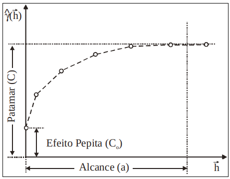
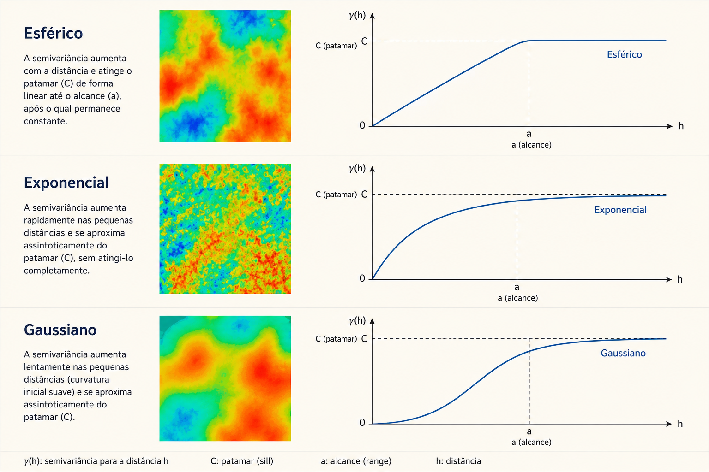
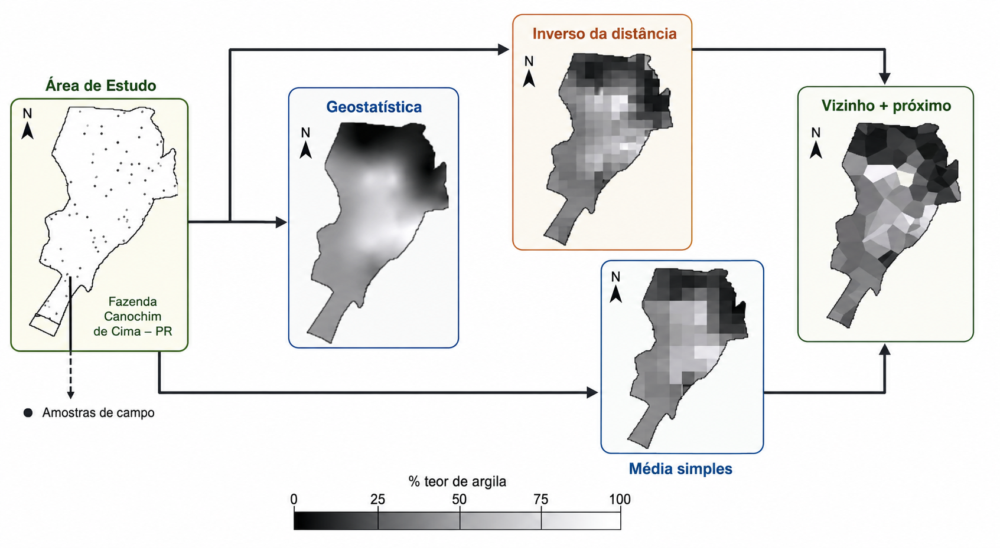

## O que é Geoestatística?

<div style="font-size: 80%;">

### Definição

A geoestatística lida com variáveis que são medidas em localizações **contínuas ou irregulares** no espaço, como temperatura, precipitação, concentração de poluentes ou altitude.

### Premissa Fundamental

**Autocorrelação Espacial (Dependência Espacial)**: Observações próximas no espaço tendem a ser mais similares do que observações distantes.

> "Todas as coisas se parecem, porém coisas mais próximas tendem a ser mais semelhantes do que aquelas mais distantes." — Waldo Tobler (1979) - **1ª Lei da Geografia**

</div>

---

## Exemplos de Aplicação

<div style="font-size: 80%;">

- 🌧️ **Meteorologia**: Medição da quantidade de chuva em diferentes locais de uma cidade
- 🌡️ **Climatologia**: Distribuição de temperatura em uma região
- 🏭 **Meio Ambiente**: Concentração de poluentes no ar em pontos georreferenciados
- 🌽 **Agricultura de Precisão**: Análise da produtividade agrícola em diferentes áreas de cultivo
- 🧪 **Pedologia**: Teor de elementos químicos (ex: argila, fósforo) no solo
- 🏥 **Epidemiologia**: Incidência de doenças em diferentes áreas

</div>
---

## Diferenças entre Tipos de Dados Espaciais

<div style="font-size: 70%;">

| Tipo | Característica | O que analisamos? | Exemplo |
|------|----------------|-------------------|---------|
| **Padrões Pontuais** | Localização exata de eventos | A própria localização dos pontos | Casos de doença, crimes |
| **Geoestatística** | Variável contínua medida em pontos | O valor do atributo no espaço | Temperatura, precipitação |
| **Dados de Área** | Agregado por unidades geográficas | O valor agregado na região | Casos por município |

</div>

---

## O Semivariograma: A Base da Análise

<div style="font-size: 80%;">

### O que é?

Uma das principais ferramentas da geoestatística. Ele mede o quanto dois pontos próximos no espaço se parecem (ou se diferem) com relação ao valor de uma variável.

### A Ideia Central

Se dois pontos estão **muito próximos**, é esperado que seus valores sejam **parecidos**. Já se estiverem **distantes**, a diferença entre os valores tende a **aumentar**.

</div>
---

## O Semivariograma Experimental (ou empírico)

<div style="font-size: 70%;">

Calculado para diferentes distâncias entre os pontos, usando a fórmula:

$$\hat{\gamma}(h) = \frac{1}{2N(h)}\sum_{i=1}^{N(h)}[z(x_i) - z(x_i + h)]^2$$

Onde:

- $\hat{\gamma}(h)$: valor estimado da semivariância para a distância $h$

- $N(h)$: número de pares de pontos separados por uma distância $h$

- $z(x_i)$: valor observado da variável na localização $x_i$

- $z(x_i + h)$: valor observado em um ponto a uma distância $h$ de $x_i$

> **Em resumo:** Representa a *diferença média ao quadrado* entre os valores da variável em pares de pontos separados pela distância $h$.

</div>

---

## Componentes do Semivariograma

{fig-align="center" width="60%"}

<div style="font-size: 65%;">

📌 **Efeito Pepita ($C_0$)**: É a variação observada mesmo quando a distância entre os pontos é muito pequena ou zero. Pode indicar erro de medição ou variação em microescala.

📌 **Patamar ($C$)**: Corresponde ao valor em que o semivariograma atinge a estabilização, indicando que, a partir dessa distância, não há mais dependência espacial entre as observações. Nesse ponto podemos dizer que a semivariância atinge seu valor máximo.

📌 **Alcance ($a$)**: É a distância até a qual existe dependência espacial entre as observações. Após essa distância, as observações tornam-se independentes.

</div>

---

## Modelos Teóricos de Semivariograma

<div style="font-size: 70%;">

O semivariograma experimental é apenas um conjunto de pontos (uma estimativa). Para realizar interpolações (como a krigagem), precisamos ajustar uma função matemática contínua, chamada de **modelo teórico**.

### Modelos Mais Comuns:

1. **Modelo Exponencial**: Cresce rapidamente no início e se aproxima do patamar de forma assintótica.
2. **Modelo Esférico**: Cresce de forma linear no início e atinge o patamar exatamente no alcance.
3. **Modelo Gaussiano**: Apresenta comportamento parabólico na origem (muito suave a curtas distâncias).

A escolha do modelo depende do comportamento da variável estudada.

</div>

---

## Comparação Visual dos Modelos

<div style="font-size: 70%;">

{fig-align="center" width="60%"}
</div>

<div style="font-size: 60%; text-align: center;">
Diferentes modelos teóricos (Esférico, Exponencial, Gaussiano) ajustados aos mesmos dados experimentais. A escolha do modelo afeta diretamente os resultados da interpolação espacial.
</div>

---

### Interpolação Espacial: Krigagem (Kriging)

<div style="font-size: 50%;">

**O que é ?**

Método geoestatístico de interpolação que utiliza a estrutura de dependência espacial dos dados (via semivariograma) para estimar valores em locais não amostrados.

</div>

{fig-align="center" width="120%"}


<div style="font-size: 40%; text-align: center;">
> Fonte: Elaboração própria com auxílio de IA (ChatGPT), baseada em Isaaks e Srivastava (1989) e Webster e Oliver (2007).

</div>

---

### Interpolação Espacial: Krigagem (Kriging)

<div style="font-size: 70%;">

#### Vantagens sobre outros métodos:

- É o **melhor estimador linear não viciado**.
- Produz um mapa suavizado e estatisticamente robusto.
- Fornece não apenas a estimativa, mas também a **variância do erro de predição** (uma medida de incerteza).


#### Comparação de alguns métodos de interpolação:

- **Krigagem (geoestatística)**: Suavizado e robusto, considera a dependência espacial.

- **Inverso da Distância (IDW)**: Maior detalhamento local, mas pode gerar "olhos de boi" ao redor das amostras.

- **Média Simples**: Suaviza demais, perde a variabilidade local.

- **Vizinho Mais Próximo**: Gera polígonos abruptos (Polígonos de Thiessen/Voronoi).
</div>

---

### Interpolação Espacial: Krigagem (Kriging)

{fig-align="center" width="90%"}
<div style="font-size: 40%; text-align: center;">
> Fonte: Elaboração própria com auxílio do ChatGPT, adaptada de Lima (2007, Laboratório 5 – Geoestatística Linear, INPE).

</div>

---

## Bibliotecas do R para Geoestatística

<div style="font-size: 70%;">

```{r}
#| eval: false
#| echo: true

# Manipulação de dados espaciais
library(sf)           # Simple Features (moderno)
library(sp)           # Classes espaciais (clássico)

# Geoestatística e Interpolação
library(gstat)        # Funções principais de krigagem
library(automap)      # Ajuste automático de variogramas

# Dados matriciais (Rasters)
library(raster)       # Trabalhar com rasters
library(terra)        # Sucessor mais rápido do raster

# Visualização
library(ggplot2)      # Gráficos elegantes
library(lattice)      # Gráficos treliçados (usado pelo sp)
library(leaflet)      # Mapas interativos
```

</div>

---

## Aplicação Prática: Pluviosidade no RJ

<div style="font-size: 80%;">

### O Problema

Temos dados de chuva acumulada (em 24h) de estações pluviométricas do sistema Alerta Rio espalhadas pela cidade do Rio de Janeiro. 

**Objetivo:** Interpolar esses valores para estimar a precipitação em toda a cidade, criando um mapa contínuo de chuva.

</div>

---

## 1. Importando e Explorando os Dados

<div style="font-size: 80%;">

```{r}
#| eval: true
#| echo: true

# Ler os dados
pluvio <- read.csv("dados/chuva/pluviosidade.csv", sep=";")
head(pluvio)

# Analisar a distribuição da chuva em 24h
summary(pluvio$acumulado_24h)


# Pelos quantis
quantil <- quantile(pluvio$acumulado_24h, seq(0,1,0.2))
quantil
```

</div>

---

## 2. Transformando em Objeto Espacial

<div style="font-size: 80%;">

```{r}
#| eval: true
#| echo: true

# Informar ao R quais colunas são as coordenadas
sp::coordinates(pluvio) <- ~ x + y

# Definir o Sistema de Referência de Coordenadas (CRS)
# EPSG:31983 = SIRGAS 2000 / UTM zone 23S (adequado para o RJ)
sp::proj4string(pluvio) <- sp::CRS("+init=epsg:31983")

# Verificar a classe do objeto
class(pluvio)
# [1] "SpatialPointsDataFrame"
```

</div>

---

## 3. Visualização Espacial Exploratória

<div style="font-size: 70%;">

```{r}
#| eval: true
#| echo: true

# Bubble plot: tamanho do círculo proporcional à chuva
sp::bubble(pluvio, "acumulado_24h", 
       key.entries = quantil, 
       pch = 19, 
       col = "blue",
       main = "Precipitação Acumulada (24h) nas Estações")
```

</div>

---

## 3. Visualização Espacial Exploratória

<div style="font-size: 70%;">

```{r}
#| eval: true
#| echo: true

# Mapa de pontos com escala de cores
sp::spplot(pluvio['acumulado_24h'], 
       scales = list(draw = TRUE), 
       key.space = "right", 
       colorkey = TRUE,
       main = "Distribuição Espacial da Chuva")
```

</div>

---

## 4. O Semivariograma Experimental

<div style="font-size: 70%;">

```{r}
#| eval: false
#| echo: true

library(gstat)

# Calcular o variograma experimental
# A fórmula 'acumulado_24h ~ 1' indica que estamos assumindo
# uma média constante em toda a área (Krigagem Ordinária)
var_exp <- variogram(acumulado_24h ~ 1, 
                     data = pluvio,
                     cutoff = 40000,  # Distância máxima de 40km
                     width = 3000)    # Intervalos (lags) de 3km

# Visualizar
plot(var_exp, 
     main = "Semivariograma Experimental - Chuva RJ",
     xlab = "Distância (m)",
     ylab = "Semivariância", pch = 19, col = "darkblue")
```

</div>

---

## 4. O Semivariograma Experimental

<div style="font-size: 70%;">

```{r}
#| eval: true
#| echo: false

library(gstat)

# Calcular o variograma experimental
# A fórmula 'acumulado_24h ~ 1' indica que estamos assumindo
# uma média constante em toda a área (Krigagem Ordinária)
var_exp <- variogram(acumulado_24h ~ 1, 
                     data = pluvio,
                     cutoff = 40000,  # Distância máxima de 40km
                     width = 3000)    # Intervalos (lags) de 3km

# Visualizar
plot(var_exp, 
     main = "Semivariograma Experimental - Chuva RJ",
     xlab = "Distância (m)",
     ylab = "Semivariância", pch = 19, col = "darkblue")
```

</div>

---

### 5. Ajustando o Modelo Teórico (Forma Manual)

<div style="font-size: 60%;">

Observando os parâmetros do semivariograma experimental (no slide anterior), vamos escolher um modelo teórico (ex: exponencial) e ajustar seus parâmetros (nugget = efeito pepita, sill = contribuição, range = alcance) de forma manual para obter uma curva que se encaixe bem aos pontos experimentais.
</div>

```{r}
#==============================================================================
# SEMIVARIOGRAMA TEÓRICO - MODELO EXPONENCIAL
# Versão simples e didática - foco nos parâmetros essenciais
#==============================================================================

# Parâmetros do modelo
nugget <- 15      # Efeito pepita (C0)
psill  <- 80      # Contribuição estrutural (C1)  
range  <- 12000   # Alcance (a)

# Cálculos
sill <- nugget + psill           # Patamar total = 95
alcance_pratico <- 3 * range     # 36000 m (95% do patamar)

# Criar curva
h <- seq(0, 45000, by = 100)
gamma <- nugget + psill * (1 - exp(-h / range))

# Gráfico simples
par(mar = c(4.5, 4.5, 3, 2), bg = "white", family = "sans")

plot(h, gamma, 
     type = "l", 
     lwd = 2.5,
     col = "#2E86AB",
     xlab = "Distância (h) em metros", 
     ylab = expression(gamma(h)),
     main = "Semivariograma Teorico - Modelo Exponencial",
     xlim = c(0, 45000),
     ylim = c(0, sill + 10),
     cex.lab = 1.2,
     cex.main = 1.4,
     font.main = 2)

# Linha do patamar
abline(h = sill, col = "#D64933", lwd = 2, lty = 2)

# Linha do alcance prático
abline(v = alcance_pratico, col = "#F18F01", lwd = 2, lty = 2)

# Efeito pepita (linha vertical na origem)
segments(x0 = 0, y0 = 0, x1 = 0, y1 = nugget, col = "#58586B", lwd = 2)

# Legendas simples
text(alcance_pratico + 2000, 15, 
     labels = paste0("Alcance ~ ", round(alcance_pratico/1000), " km"), 
     col = "#F18F01", font = 2, cex = 0.9)

text(20000, sill + 3, 
     labels = paste0("Patamar = ", sill), 
     col = "#D64933", font = 2, cex = 0.9)

text(5000, nugget/2, 
     labels = paste0("Efeito Pepita = ", nugget), 
     col = "#58586B", font = 2, cex = 0.9)

# Destacar o ponto onde começa o patamar (opcional)
points(alcance_pratico, 
       nugget + psill * (1 - exp(-alcance_pratico / range)), 
       pch = 19, cex = 1.5, col = "#F18F01")

# Grid suave
grid(col = "gray90", lty = 1)

# Colocar a curva por cima do grid
lines(h, gamma, lwd = 2.5, col = "#2E86AB")


```


---

### 5. Ajustando o Modelo Teórico (Forma Manual)

<div style="font-size: 80%;">


```{r}
#| eval: true
#| echo: true

## 2) Modelo exponencial
exp.fit  = fit.variogram(var_exp, 
                         model = vgm(psill = 80, model = "Exp",
                                     range = 12000, nugget = 15))

plot(var_exp, exp.fit, main = "Modelo Exponencial", col.line = "red", pch = 19, col = "darkblue")

```

</div>

---

### 6. Preparando a Grade para Interpolação
    
<div style="font-size: 65%;">
    
Para criar um mapa contínuo, precisamos definir uma grade (grid) de pontos onde a krigagem fará as estimativas.

```{r}
#| eval: false
#| echo: true

# Importando o contorno do Rio
library(sf)
contorno.rio_sf <- st_read("dados/chuva/MUNIC_2K_2022_IPP_SIRGAS.shp")
# Convertendo para sp
contorno.rio <- as(contorno.rio_sf, "Spatial")

# Criando grade para interpolacao com a  resolucao de 50m
library(raster)
r <- raster(contorno.rio, res = 50)

# Criando um objeto formato raster
rp <- rasterize(contorno.rio, r, 0) 

# Trasnsformando o objeto raster no formato SpatialPixelsDataFrame
grid <- as(rp, "SpatialPixelsDataFrame") 
plot(grid)
  
```

</div>

---

### 6. Preparando a Grade para Interpolação
    
<div style="font-size: 65%;">
    
```{r}
# Importando o contorno do Rio
library(sf)
contorno.rio_sf <- st_read("dados/chuva/MUNIC_2K_2022_IPP_SIRGAS.shp", quiet = TRUE)
# Convertendo para sp
contorno.rio <- as(contorno.rio_sf, "Spatial")

# Criando grade para interpolacao com a  resolucao de 50m
library(raster)
r <- raster(contorno.rio, res = 50)

# Criando um objeto formato raster
rp <- rasterize(contorno.rio, r, 0) 

# Trasnsformando o objeto raster no formato SpatialPixelsDataFrame
grid <- as(rp, "SpatialPixelsDataFrame") 
plot(grid)
  
```

</div>

---

### 7. Executando a Krigagem Ordinária
  
<div style="font-size: 80%;">
    
```{r}
#| eval: false
#| echo: true

# Colocando os dados de chuva e o grid na mesma projecao
library(sp)
proj4string(pluvio) = CRS(proj4string(contorno.rio))

# Executando a interpolação espacial por krigagem 
mapa_chuva_exp <- krige(acumulado_24h ~1, pluvio, grid, model =exp.fit)
plot.exp <- plot(mapa_chuva_exp, main = "Modelo Exponencial")

```
  
</div>

---
    
### 7. Executando a Krigagem Ordinária
  

    
```{r}
# Colocando os dados de chuva e o grid na mesma projecao
library(sp)
proj4string(pluvio) = CRS(proj4string(contorno.rio))

# Executando a interpolação espacial por krigagem 
mapa_chuva_exp <- krige(acumulado_24h ~1, pluvio, grid, model =exp.fit)
plot.exp <- plot(mapa_chuva_exp, main = "Modelo Exponencial")
```

<div style="font-size: 65%;">

**Interpretação:** O mapa mostra a superfície contínua de chuva. As áreas mais escuras representam maior volume de chuva. Os pontos pretos são as estações originais.
  
</div>

---

#### 8. Ajustando o Modelo Teórico (Forma Automática)

<div style="font-size: 70%;">

A função `autoKrige()` do pacote automap é utilizada para realizar a krigagem de forma automatizada, combinando os passos de ajuste do variograma e interpolação espacial em um único processo.

```{r}
#| eval: false
#| echo: true

# Modelo Exponencial automático
library(automap)
auto.krige <- autoKrige(acumulado_24h ~ x + y, pluvio, grid, model = 'Exp')

# Extraindo os valores
auto.krige$var_model
```

</div>

---

#### 8. Ajustando o Modelo Teórico (Forma Automática)

<div style="font-size: 60%;">

```{r}
# Modelo Exponencial automático
library(automap)
auto.krige <- autoKrige(acumulado_24h ~ x + y, pluvio, grid, model = 'Exp')

# Extraindo os valores
auto.krige$var_model
```

A primeira linha (`Nug`) corresponde ao efeito pepita, com valor de 0, indicando que não há variabilidade não explicada ou erro de medição, ou seja, pontos muito próximos têm valores extremamente similares, sugerindo alta continuidade espacial nos dados de chuva.

A segunda linha (`Exp`) representa o modelo exponencial ajustado, com patamar parcial de 176,53 (variabilidade estrutural) e alcance de aproximadamente 33 km. Isso significa que a correlação espacial entre as estações se mantém até cerca de 33 km de distância; além disso, os valores se tornam independentes. O patamar total (soma do efeito pepita com o patamar parcial) é também 176,53, indicando a variância total do processo de chuva na região.

</div>

---

#### 9. Executando a Krigagem Ordinária (Automática)
  
<div style="font-size: 80%;">
    
```{r}
#| eval: false
#| echo: true

# O autoKrige já executou a krigagem e armazenou o resultado
mapa_chuva_exp2 <- auto.krige$krige_output

# Plotar o resultado
plot(mapa_chuva_exp2, main = "Modelo Exponencial - Krigagem Automática")

```
</div>

---

#### 9. Executando a Krigagem Ordinária (Automática)
  
<div style="font-size: 80%;">
    
```{r}
# O autoKrige já executou a krigagem e armazenou o resultado
mapa_chuva_exp2 <- auto.krige$krige_output

# Plotar o resultado
plot(mapa_chuva_exp2, main = "Modelo Exponencial - Krigagem Automática")

```

</div>

---

#### Fazendo o mapa interativo da krigagem com as estações

<div style="font-size: 60%;">

```{r}
#| eval: false
#| echo: true

library(leaflet)
library(leaflet.extras2)


# 1. Importando e transformando as estações pluviométricas
estacoes.sf <- read_sf("dados/chuva/Estac_C3_B5es_Alerta_Rio.shp")
estacoes.longlat <- st_transform(estacoes.sf, 4326)  # EPSG:4326 = WGS84
estacoes.longlat$coords <- st_coordinates(estacoes.longlat)
estacoes.longlat$X <- estacoes.longlat$coords[, 1]
estacoes.longlat$Y <- estacoes.longlat$coords[, 2]

# 2. Importando e transformando a malha de bairros
bairros.sf <- read_sf("dados/chuva/BAIRROS_2K_2022_IPP_SIRGAS.shp")
bairros.longlat <- st_transform(bairros.sf, 4326)
bairros.longlat <- st_make_valid(bairros.longlat)  # Corrige geometrias se necessário

# 3. Convertendo o resultado da krigagem para raster
raster_chuva <- raster(auto.krige$krige_output["var1.pred"])

# 4. Projetando o raster para WGS84
raster_chuva_longlat <- projectRaster(raster_chuva, crs = CRS("+proj=longlat +datum=WGS84"))

# 5. Definindo a paleta de cores da superfície interpolada
pal <- colorNumeric(
  palette = c("#000066", "#00c8f8", "#F0E68C", "#FFFF00", "#FF8C00"),
  domain = values(raster_chuva_longlat),
  na.color = "transparent",
  reverse = TRUE
)

# 6. Construindo o mapa interativo
leaflet(data = estacoes.longlat, options = leafletOptions(attributionControl = FALSE)) |>
  addProviderTiles("CartoDB.Positron", group = "Ruas") |>
  addProviderTiles("Esri.WorldImagery", options = providerTileOptions(opacity = 0.7), group = "Satélite") |>
  addProviderTiles("CartoDB.Voyager", group = "Voyager") |>
  # Escala (distância)
  addScaleBar(position = "bottomleft") |>
  # Define a visualização inicial
  setView(lng = -43.42, lat = -22.90, zoom = 10.4) |>
  # Adicionando os marcadores das estações
  addMarkers(~X, ~Y, popup = ~as.character(est), label = ~as.character(est), group = "Estações") |>
  # Adicionando a malha de bairros
  addPolygons(data = bairros.longlat,
              weight = 3,
              color = "darkblue",
              smoothFactor = 1,
              fill = FALSE,
              labelOptions = labelOptions(
                style = list("font-weight" = "normal", padding = "3px 8px"),
                textsize = "13px",
                direction = "auto"),
              group = "Bairros") |>
  # Adicionando o raster de chuva interpolada
  addRasterImage(raster_chuva_longlat, colors = pal, opacity = 0.8, group = "Chuva: 1 semana") |>
  # Legenda
  addLegend(pal = pal, values = values(raster_chuva_longlat),
            title = "Chuva Acumulada - 1 semana",
            group = "Chuva: 1 semana") |>
  # Controle das camadas
  addLayersControl(
    baseGroups = c("Voyager", "Ruas", "Satélite"),
    overlayGroups = c("Estações", "Bairros", "Chuva: 1 semana"),
    options = layersControlOptions(collapsed = FALSE),
    position = "bottomleft") |>
  # Oculta os bairros inicialmente
  hideGroup(group = c("Bairros"))

```

</div>

---

#### Fazendo o mapa interativo da krigagem com as estações

<div style="font-size: 90%;">

```{r}
library(leaflet)
library(leaflet.extras2)


# 1. Importando e transformando as estações pluviométricas
estacoes.sf <- read_sf("dados/chuva/Estac_C3_B5es_Alerta_Rio.shp")
estacoes.longlat <- st_transform(estacoes.sf, 4326)  # EPSG:4326 = WGS84
estacoes.longlat$coords <- st_coordinates(estacoes.longlat)
estacoes.longlat$X <- estacoes.longlat$coords[, 1]
estacoes.longlat$Y <- estacoes.longlat$coords[, 2]

# 2. Importando e transformando a malha de bairros
bairros.sf <- read_sf("dados/chuva/BAIRROS_2K_2022_IPP_SIRGAS.shp")
bairros.longlat <- st_transform(bairros.sf, 4326)
bairros.longlat <- st_make_valid(bairros.longlat)  # Corrige geometrias se necessário

# 3. Convertendo o resultado da krigagem para raster
raster_chuva <- raster(auto.krige$krige_output["var1.pred"])

# 4. Projetando o raster para WGS84
raster_chuva_longlat <- projectRaster(raster_chuva, crs = CRS("+proj=longlat +datum=WGS84"))

# 5. Definindo a paleta de cores da superfície interpolada
pal <- colorNumeric(
  palette = c("#000066", "#00c8f8", "#F0E68C", "#FFFF00", "#FF8C00"),
  domain = values(raster_chuva_longlat),
  na.color = "transparent",
  reverse = TRUE
)

# 6. Construindo o mapa interativo
leaflet(data = estacoes.longlat, options = leafletOptions(attributionControl = FALSE)) |>
  addProviderTiles("CartoDB.Positron", group = "Ruas") |>
  addProviderTiles("Esri.WorldImagery", options = providerTileOptions(opacity = 0.7), group = "Satélite") |>
  addProviderTiles("CartoDB.Voyager", group = "Voyager") |>
  # Escala (distância)
  addScaleBar(position = "bottomleft") |>
  # Define a visualização inicial
  setView(lng = -43.42, lat = -22.90, zoom = 10.4) |>
  # Adicionando os marcadores das estações
  addMarkers(~X, ~Y, popup = ~as.character(est), label = ~as.character(est), group = "Estações") |>
  # Adicionando a malha de bairros
  addPolygons(data = bairros.longlat,
              weight = 3,
              color = "darkblue",
              smoothFactor = 1,
              fill = FALSE,
              labelOptions = labelOptions(
                style = list("font-weight" = "normal", padding = "3px 8px"),
                textsize = "13px",
                direction = "auto"),
              group = "Bairros") |>
  # Adicionando o raster de chuva interpolada
  addRasterImage(raster_chuva_longlat, colors = pal, opacity = 0.8, group = "Chuva: 1 semana") |>
  # Legenda
  addLegend(pal = pal, values = values(raster_chuva_longlat),
            title = "Chuva Acumulada - 1 semana",
            group = "Chuva: 1 semana") |>
  # Controle das camadas
  addLayersControl(
    baseGroups = c("Voyager", "Ruas", "Satélite"),
    overlayGroups = c("Estações", "Bairros", "Chuva: 1 semana"),
    options = layersControlOptions(collapsed = FALSE),
    position = "bottomleft") |>
  # Oculta os bairros inicialmente
  hideGroup(group = c("Bairros"))

```

</div>